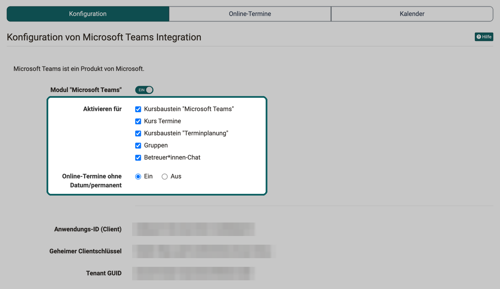
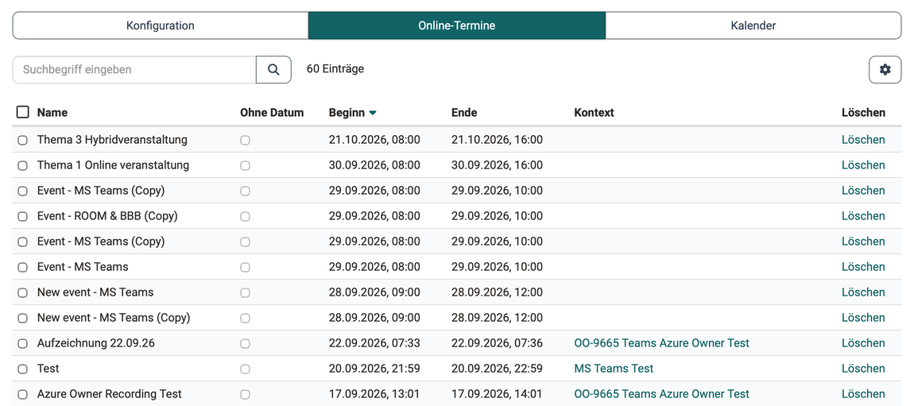
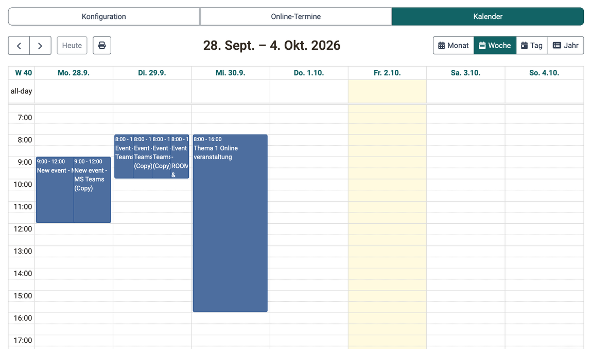

# Modul Microsoft Teams {: #teams_module}

Microsoft Teams ist die Webkonferenz-Lösung von Microsoft. In Kursen und Gruppen legen Besitzer:innen und Betreuer:innen damit Online-Termine an, zu denen die Teilnehmenden aus OpenOlat heraus beitreten. Welche Arten von Online-Terminen dabei zur Wahl stehen, legen Administrator:innen für die ganze Instanz fest, zum Beispiel ob jeder Termin ein Datum braucht und damit im Kalender erscheint.

Sie konfigurieren das Modul in der System-Administration unter: 
`Administration > Externe Werkzeuge > Microsoft Teams`

Die Voraussetzungen für die Anbindung an Microsoft 365 beschreibt die Seite [Externe Werkzeuge: Übersicht](External_Tools_-_Administration.de.md#_microsoft_teams). Wie Besitzer:innen und Betreuer:innen einzelne Online-Termine anlegen, steht im Benutzerhandbuch im Kapitel [Kursbaustein "Microsoft Teams"](../../manual_user/learningresources/Course_Element_Microsoft_Teams.de.md).

---

## Tab "Konfiguration" [:octicons-tag-16:{ title="ab Release 15.4 (OO-5124)" }](https://track.frentix.com/issue/OO-5124) {: #tab_config}

Im Tab "Konfiguration" schalten Sie Microsoft Teams für die Instanz ein und bestimmen, wo und mit welchen Varianten Online-Termine entstehen dürfen und ob OpenOlat ihre Aufzeichnungen übernimmt.

### Konfiguration von Microsoft Teams Integration {: #teams_config}

Die Felder "Aktivieren für" und "Online-Termine ohne Datum/permanent" erscheinen erst, wenn das Modul eingeschaltet ist.

{ class="shadow lightbox" title="Tab Konfiguration im Modul Microsoft Teams · 2026.10.02" }

#### Modul "Microsoft Teams" {: #module_enabled}

Schaltet Microsoft Teams für die ganze Instanz ein oder aus. Ist das Modul ausgeschaltet, steht der Kursbaustein "Microsoft Teams" im Kurseditor nicht zur Auswahl.

#### Aktivieren für {: #activate_for}

Gibt Microsoft Teams einzeln für die Orte frei, an denen Online-Termine entstehen: Kursbaustein "Microsoft Teams", Kurs Termine, Kursbaustein "Terminplanung", Gruppen und Betreuer:innen-Chat.

#### Online-Termine ohne Datum/permanent [:octicons-tag-16:{ title="ab Release 21.1.0 (OO-9666)" }](https://track.frentix.com/issue/OO-9666) {: #permanent_meetings}

Bestimmt, ob in Kursen und Gruppen permanente Reservierungen entstehen dürfen. Eine permanente Reservierung ist ein Online-Termin ohne Beginn und Ende: Der Raum steht dauerhaft offen, erscheint aber in keinem Kalender.

Mit "Ein" (Standard) bietet die Auswahl "Online-Termin hinzufügen" die Variante "Permanente Reservierung hinzufügen" an. Mit "Aus" fehlt diese Variante im Kursbaustein "Microsoft Teams", im Gruppenwerkzeug "Microsoft Teams" und im Kurswerkzeug "Teams". Jeder neue Online-Termin braucht dann Beginn und Ende und erscheint im Kalender. Das hilft Organisationen, die alle Online-Termine planen und im Kalender überblicken wollen.

Bestehende permanente Reservierungen bleiben erhalten, wenn Sie die Option auf "Aus" stellen. Sie lassen sich weiterhin öffnen, bearbeiten und ohne Datum speichern. Die Option verhindert nur, dass neue permanente Reservierungen entstehen.

Das Modul BigBlueButton kennt dieselbe Einstellung unter dem Namen "Online-Termine ohne Datum", siehe [Modul BigBlueButton](BigBlueButton_module.de.md#tab_config).

#### Anwendungs-ID (Client), Geheimer Clientschlüssel, Tenant GUID {: #tenant_credentials}

Sind in der Serverkonfiguration Zugangsdaten zum Microsoft 365 Tenant hinterlegt, zeigt der Tab sie in diesen drei Feldern zur Ansicht. Ändern lassen sie sich nur in der Serverkonfiguration. frentix-Kund:innen wenden sich für eine Änderung an den frentix Support: [support@frentix.com](mailto:support@frentix.com)

### Terminaufzeichnung [:octicons-tag-16:{ title="ab Release 21.1 (OO-9665)" }](https://track.frentix.com/issue/OO-9665) {: #meeting_recording}

Soll eine Organisation Aufzeichnungen von Online-Terminen in OpenOlat bereitstellen und nach Plan wieder löschen, schalten Sie hier die Terminaufzeichnung ein. OpenOlat holt dann die fertigen Aufzeichnungen aus Microsoft Teams ab, legt sie beim Online-Termin ab und zeigt sie den gewählten Rollen. Ohne die Funktion bleibt eine Aufzeichnung in Microsoft Teams. Was Besitzer:innen und Betreuer:innen je Online-Termin einstellen, steht im Benutzerhandbuch im Abschnitt [Terminaufzeichnung](../../manual_user/learningresources/Course_Element_Microsoft_Teams.de.md#meeting_recording).

Der Abschnitt erscheint erst, wenn das Modul eingeschaltet ist. Die vier Einstellungen nach dem Schalter erscheinen erst, wenn die Funktion "Terminaufzeichnung" eingeschaltet ist.

#### Funktion "Terminaufzeichnung" {: #recording_enabled}

Schaltet die Terminaufzeichnung für die ganze Instanz ein oder aus. Ist sie ausgeschaltet, fehlen die Einstellungen zur Aufzeichnung in jedem Online-Termin, und OpenOlat holt keine Aufzeichnung ab, auch für Online-Termine, die früher mit eingeschalteter Terminaufzeichnung gespeichert wurden.

Zum Einschalten braucht OpenOlat in der Serverkonfiguration einen Schlüssel zum Schutz der Zugriffs-Token. Fehlt er, zeigt der Abschnitt eine Warnung, der Schalter lässt sich nicht einschalten, und OpenOlat lädt keine Aufzeichnungen herunter. frentix-Kund:innen wenden sich für die Einrichtung an den frentix Support: [support@frentix.com](mailto:support@frentix.com)

#### Terminaufzeichnung (Standard) {: #recording_default}

Standardwert für neue Online-Termine, "Ein" oder "Aus". Ab Werk ist "Aus" gewählt. Besitzer:innen und Betreuer:innen können den Standardwert je Online-Termin ändern.

#### Aufnahme starten (Standard) {: #recording_auto_start}

Standardwert, wann die Aufzeichnung beginnt: "Automatisch, sobald das Meeting beginnt" oder "Manuell durch die Sitzungsleitung". Ab Werk ist "Manuell durch die Sitzungsleitung" gewählt.

#### Aufnahme automatisch veröffentlichen für (Standard) {: #recording_publishing}

Standardwert, für welche Rollen eine Aufzeichnung nach dem Online-Termin sichtbar ist: "Besitzer:innen / Betreuer:innen", "Teilnehmer:innen des Kurses / der Gruppe", "Alle Teilnehmer:innen des Meetings (ausser Gäste)" und "Gäste". Ist keine Rolle angekreuzt, veröffentlicht OpenOlat neue Aufzeichnungen nicht automatisch, sie werden nach dem Online-Termin von Hand publiziert.

#### Terminaufzeichnung automatisch löschen {: #recording_deletion}

Anzahl Tage nach Termin-Ende, nach denen OpenOlat eine Aufzeichnung löscht. OpenOlat prüft das einmal täglich in der Nacht. Bleibt das Feld leer, löscht OpenOlat keine Aufzeichnung automatisch.

Gelöscht wird nur die Aufzeichnung, nie der Online-Termin. Aufzeichnungen, die Besitzer:innen oder Betreuer:innen als "Aufzeichnung nicht löschbar" markiert haben, bleiben erhalten.

---

## Tab "Online-Termine" {: #tab_online-meetings}

Im Tab "Online-Termine" behalten Sie alle Online-Termine von Microsoft Teams in der Instanz im Blick und räumen nicht mehr benötigte Termine auf.

Die Tabelle zeigt je Termin "Name", "Ohne Datum", "Beginn", "Ende" und "Kontext". Ein Klick auf den Kontext öffnet die Gruppe oder den Kurs, in dem der Termin angelegt ist, bei einem Termin aus einem Kursbaustein direkt diesen Kursbaustein. Hängt ein Online-Termin weder an einem Kurs noch an einer Gruppe, bleibt die Spalte "Kontext" leer und bietet keinen Link. Das gilt für die Online-Termine, die über die Option "Kurs Termine" an einem Termin entstehen. Über die Suche finden Sie einzelne Termine. Mit "Löschen" entfernen Sie einen Termin, oder mehrere markierte Termine gesammelt.

{ class="shadow lightbox" title="Tab Online-Termine im Modul Microsoft Teams · 2026.10.02" }

---

## Tab "Kalender" {: #tab_calendar}

Im Tab "Kalender" sehen Sie, wann viele Online-Termine gleichzeitig stattfinden, und erkennen Engpässe früh. Die Ansicht öffnet in der Woche und zeigt alle Online-Termine von Microsoft Teams mit Beginn und Ende. Permanente Reservierungen erscheinen hier nicht, weil sie kein Datum haben.

Über "Monat", "Woche", "Tag" und "Jahr" wechseln Sie die Ansicht, "Jahr" listet die Online-Termine des Jahres untereinander auf. Mit den Pfeilen und "Heute" blättern Sie durch die Zeit.

{ class="shadow lightbox" title="Tab Kalender im Modul Microsoft Teams · 2026.10.02" }

---

## Weiterführende Informationen {: #further_information}

**Auf dieser Seite erwähnt** 
[Externe Werkzeuge: Übersicht >](External_Tools_-_Administration.de.md) 
[Kursbaustein "Microsoft Teams" >](../../manual_user/learningresources/Course_Element_Microsoft_Teams.de.md) 
[Modul BigBlueButton >](BigBlueButton_module.de.md)

**Weiterführend** 
[Gruppenwerkzeuge nutzen >](../../manual_user/groups/Using_Group_Tools.de.md) 
[Virtuelle Klassenzimmer >](../../manual_user/basic_concepts/Virtual_classrooms.de.md)

[Zum Seitenanfang ^](#teams_module)
