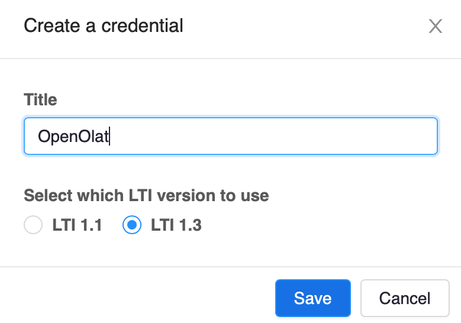
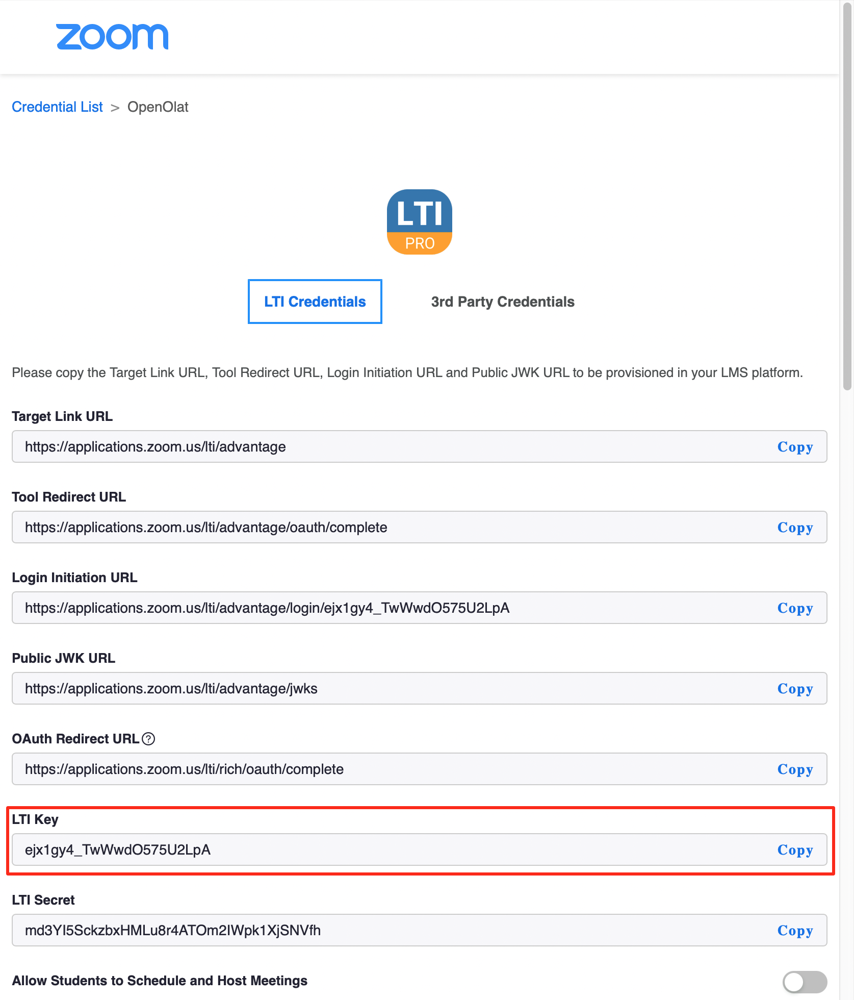
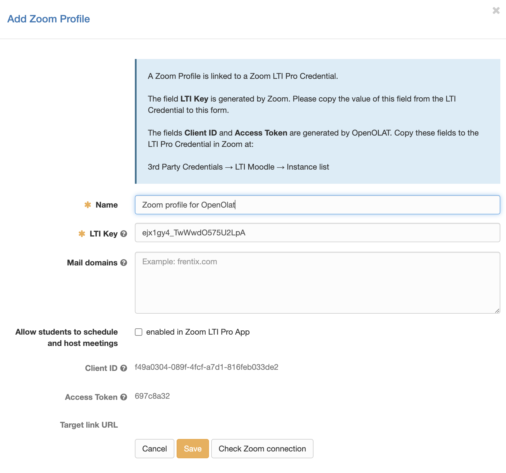
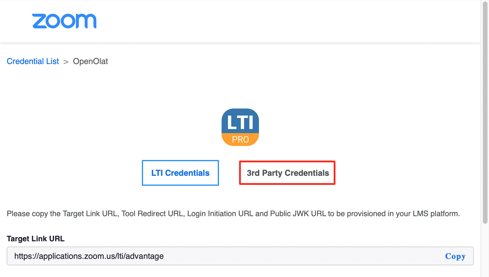
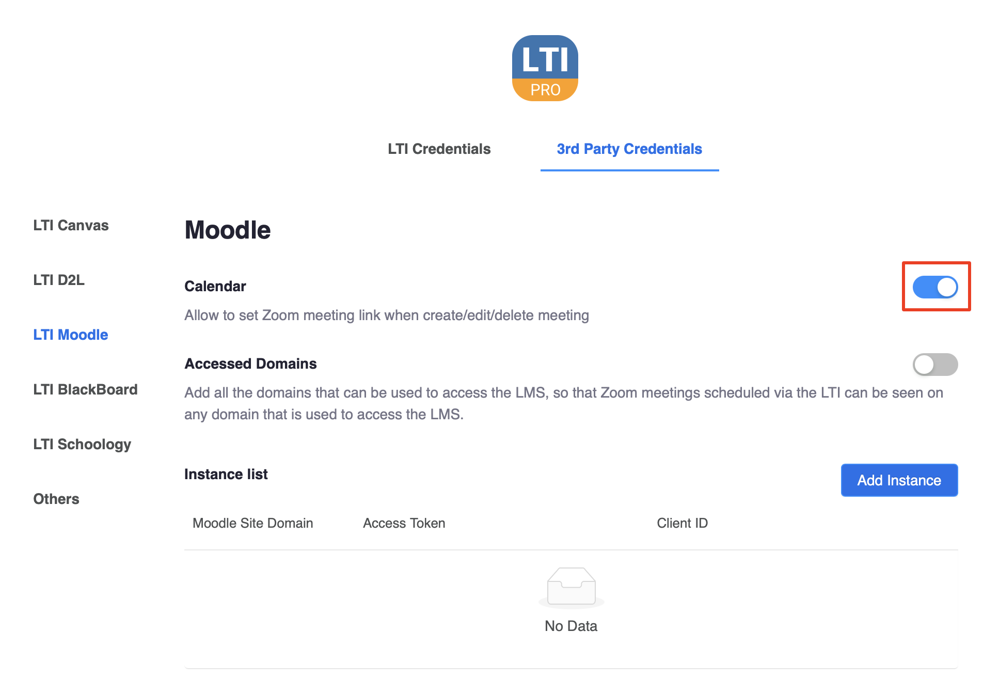
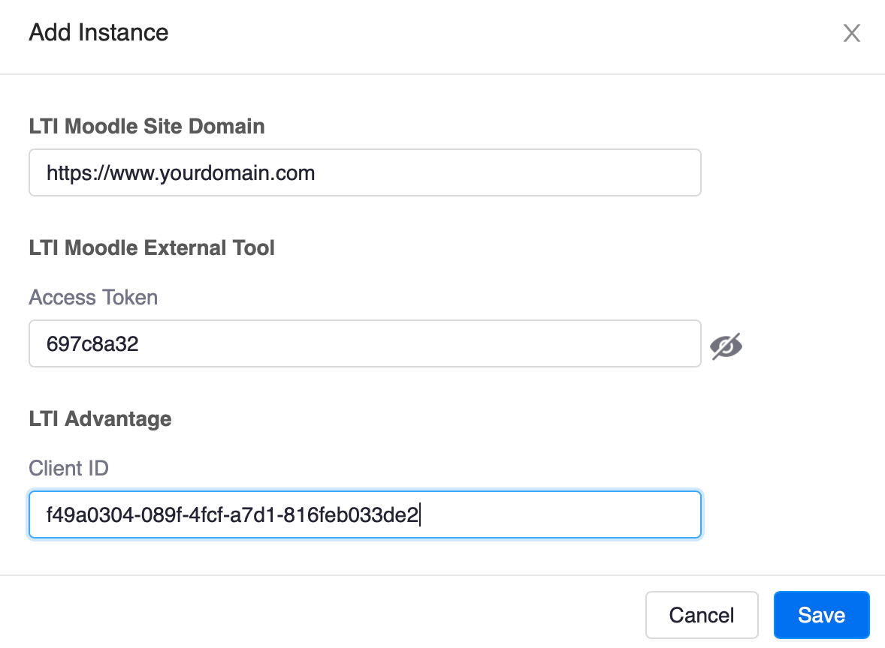

# Zoom

Zoom ist ein kommerzielles Web-Konferenzsystem. Bitte besuchen Sie die [Zoom-Homepage](https://zoom.us) für weitere Informationen.

Mit der Zoom-Integration können Sie Zoom-Profile verwalten und Zoom-Meetings in OpenOlat als Kurselemente,
Kurswerkzeuge und Gruppenwerkzeuge verwenden.

Ein Zoom-Profil ist eine Verbindung zu einem Zoom-Konto und zu einem Zoom LTI Pro Credential. 
Ein LTI Pro Credential ist ein Schlüssel, mit dem Zoom von einer anderen Anwendung aus ohne Authentifizierung
und unter Verwendung eines bestehenden Zoom-Kontos gestartet werden kann.

## Voraussetzungen

* Sie müssen eine Zoom Education- oder Enterprise-Lizenz besitzen. 
* Sie benötigen die Rolle **Zoom Administrator** in Ihrem Zoom-Konto.
* Sie benötigen die Administratorrolle in Ihrem OpenOlat-Konto.
* Die Zoom-Integration verwendet die LTI Pro App aus dem [Zoom App Marketplace](https://marketplace.zoom.us/).
  Sie müssen diese App zu Ihrem Zoom-Konto im Zoom Marketplace hinzufügen
  
!!! important
	Die Zoom Integration ist nur möglich, wenn OpenOlat auf dem Root-Context betrieben wird, also direkt unter `https://<openolat_instance>/` und nicht
	etwa unter `https://<openolat_instance>/olat/` oder so ähnlich. Ebenso muss sichergestellt sein, dass eine allfällige Firewall die Adressen
	`https://<openolat_instance>/mod/lti/auth.php`, `https://<openolat_instance>/mod/lti/token.php` und `https://<openolat_instance>/mod/lti/certs.php` nicht blockiert, 
	da diese von Zoom während des the OAuth Handshakes aufgerufen werden. 	

## Konfigurations-Schritte

### Schritte auf der Verwaltungsseite der LTI Pro App

* Gehen Sie zu [Zoom App Marketplace](https://marketplace.zoom.us/).
* Installieren Sie die LTI Pro App (dies ist nur beim ersten Besuch des Marketplace erforderlich).
* Klicken Sie in der oberen Symbolleiste auf **Manage**.
* Klicken Sie im linken Menü auf **Added Apps**.
* Wählen Sie die LTI Pro App.
* Scrollen Sie zum Ende und klicken Sie auf **Configure**.

Sie befinden sich nun im Bereich Credential Management der LTI Pro App.

### Schritte in LTI Pro

Klicken Sie auf **Create a new credential** und erstellen Sie ein LTI 1.3 Credential und geben Sie ihm einen Namen:

{ class="shadow lightbox thumbnail-xl" }

Jetzt haben Sie ein neues Credential in LTI Pro.

Die Informationen, an denen wir am meisten interessiert sind und die wir
im nächsten Schritt verwenden werden, ist der Wert des Feldes **LTI Key**:

{ class="shadow lightbox" }

### Schritte in OpenOlat

* Öffnen Sie die Zoom-Verwaltungsseite in OpenOlat, indem Sie zu **Administration &rarr; Externe Werkzeuge &rarr; Zoom** 
  navigieren.
* Aktivieren Sie Zoom und aktivieren Sie es für alle Anwendungen: Kursbaustein "Zoom", Kurswerkzeug und Gruppenwerkzeug.
* Klicken Sie auf **Zoom LTI Pro Konfiguration hinzufügen**.

Dies öffnet den Dialog Zoom-Profil:

{ class="shadow lightbox" }

Dieser Dialog erstellt ein OpenOlat Zoom-Profil für das Zoom LTI Pro Credential. 

* Wählen Sie einen Namen für das Zoom-Profil.
* Das Feld **LTI Key** wird von Zoom generiert. Kopieren Sie den Wert dieses Feldes aus Zoom LTI Pro in dieses Formular.
  Klicken Sie dazu auf **Copy** neben dem Feld in LTI Pro, um den Feldwert in der Zwischenablage zu speichern, 
  und fügen Sie den Wert in das Feld in OpenOlat ein.
* Klicken Sie auf **Speichern**, um das neue OpenOlat-Zoom-Profil zu speichern.

### Kopieren von Informationen zurück zu LTI Pro

Nachdem wir ein Zoom-Profil erstellt haben, müssen wir zwei generierte Werte von OpenOlat
nach LTI Pro kopieren.

* **Client ID**: Dies ist eine eindeutige, von OpenOlat generierte ID, die Zoom benötigt, um OpenOlat die Erlaubnis
  zu geben, sich bei Zoom anzumelden.
* **Access Token**: Dies ist ein Sicherheits-Token, das Zoom mit Nachrichten an OpenOlat sendet.
  Es erlaubt OpenOlat zu überprüfen, dass die Nachricht von Zoom stammt.

Klicken Sie auf der Seite LTI Pro Credentials auf **3rd party Credentials**:

{ class="shadow lightbox" }

Wählen Sie **LTI Moodle** auf der linken Seite. OpenOlat verwendet die LTI Moodle-Integration.

Zuerst aktivieren wir die Kalenderfunktion. Dadurch wird Zoom angewiesen, OpenOlat über neue Meetings und
Meeting-Aktualisierungen zu informieren:

{ class="shadow lightbox" }

Klicken Sie auf "Add Instance", um den Dialog für Serverinstanzen zu öffnen:

{ class="shadow lightbox thumbnail-xl" }

Zusätzlich zu den von OpenOlat generierten Informationen (**Client Id** und **Access Token**), müssen Sie auch die
URL Ihrer OpenOlat-Server-Instanz angeben.

### Testen der Zoom-Integration

Nun ist es Zeit, zurück in OpenOlat zu gehen und die Zoom-Integration zu testen.

Klicken Sie auf **Editieren** für Ihr Zoom-Profil in OpenOlat. Klicken Sie im Zoom-Profil-Editor 
auf **Zoom-Verbindung prüfen**. Wenn Zoom LTI Pro und OpenOlat richtig konfiguriert sind, sollte dieser 
Test erfolgreich sein.
