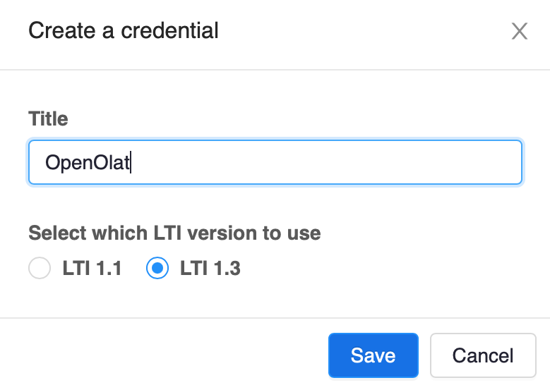
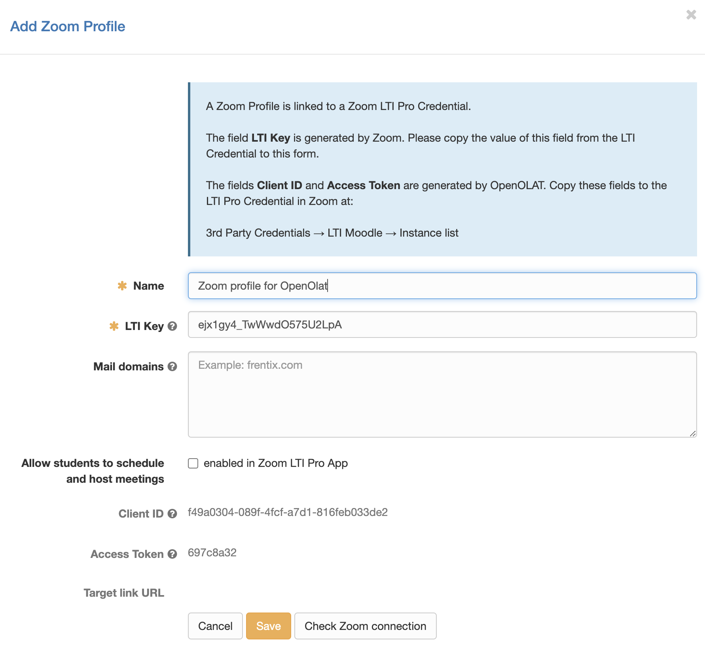
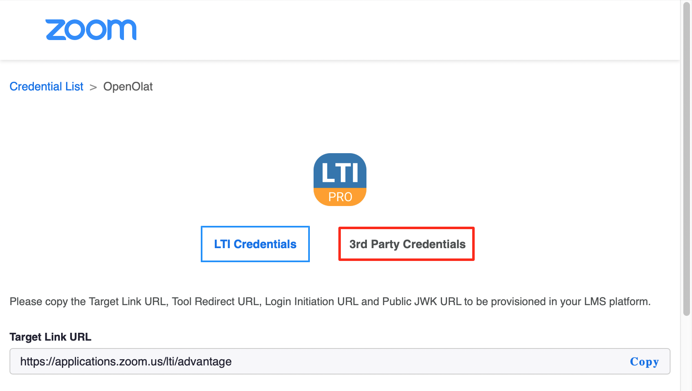
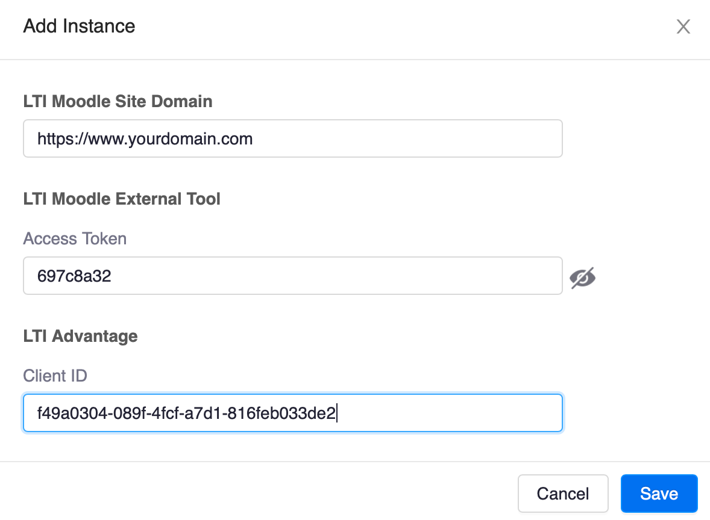

# Zoom

Zoom is a commercial Web Conferencing System. Please visit the [Zoom homepage](https://zoom.us) for more information.

The Zoom integration lets you manage Zoom profiles and use Zoom Meetings as OpenOlat course elements, 
course tools, and group tools.

A Zoom profile is a connection to a Zoom account and to a Zoom LTI Pro Credential. An LTI Pro Credential is a
key that allows Zoom to be launched from another application without authentication and using an existing Zoom account.

## Prerequisites

* You must have a Zoom Education or Enterprise license. 
* You need the Zoom administrator role in your Zoom account.
* You need the administrator role in your OpenOlat account.
* The Zoom integration uses the LTI Pro App from the [Zoom App Marketplace](https://marketplace.zoom.us/).
  You need to add this App to your Zoom account in the Zoom Marketplace.
  
!!! important
	The Zoom integration is only possible if OpenOlat is running in the root context, i.e. directly at `https://<openolat_instance>/` and
	not at `https://<openolat_instance>/olat/` or something like that. You also have to make sure that any firewall will not block the addresses
	`https://<openolat_instance>/mod/lti/auth.php`, `https://<openolat_instance>/mod/lti/token.php` and `https://<openolat_instance>/mod/lti/certs.php`, 
	because they are called by Zoom during the OAuth Handshake. 

## Configuration steps

### Go to the management page of the LTI Pro App

* Go to [Zoom App Marketplace](https://marketplace.zoom.us/).
* Install the LTI Pro App (this is only required the first time you visit the marketplace).
* Click **Manage** in the top toolbar.
* Click **Added Apps** in the left menu.
* Select the LTI Pro App.
* Scroll to the bottom and click **Configure**.

You are now in the Credential Management section of the LTI Pro App.

### Steps in LTI Pro

Click **Create a new credential** and create an LTI 1.3 credential and give it a name:

{ class="shadow lightbox thumbnail-xl" }
 
Now you have a new credential in LTI Pro. 

The information we are most interested in and will use
in the next step is the value of the **LTI Key** field:

{ class="shadow lightbox" }

### Steps in OpenOlat

* Open the Zoom administration page in OpenOlat by navigating to **Administration &rarr; External tools &rarr; Zoom**.
* Enable Zoom and enable it for all applications: Course element, course tool and group tool.
* Click **Add Zoom LTI Pro configuration**.

This opens the Zoom Profile dialog:

{ class="shadow lightbox" }

This dialog creates an OpenOlat Zoom profile for the Zoom LTI Pro Credential. 

* Choose a name for the Zoom profile.
* The field **LTI Key** is generated by Zoom. Copy the value of this field from Zoom LTI Pro to this form.
  To do this, click **Copy** next to the field in LTI Pro to save the field value to the clipboard, and paste the 
  value into the field in OpenOlat.
* Click **Save** to store the new OpenOlat Zoom Profile.

### Copy information back to LTI Pro

After creating a Zoom profile, we need to copy two generated values from OpenOlat
to LTI Pro.

* **Client ID**: This is a unique ID generated by OpenOlat that Zoom requires to give OpenOlat permission to log in to Zoom.
* **Access Token**: This is a security token that Zoom sends with messages to OpenOlat. 
  It allows OpenOlat to verify that the message originated from Zoom.

Click **3rd Party Credentials** on the LTI Pro Credential page:

{ class="shadow lightbox" }

Select **LTI Moodle** on the left. OpenOlat uses the LTI Moodle integration. 

We first activate the Calendar feature. This tells Zoom to inform OpenOlat about new meetings and meeting updates:

{ class="shadow lightbox" }

Click "Add Instance" to open server instance dialog:

{ class="shadow lightbox thumbnail-xl" }

In addition to the information generated by OpenOlat (**Client Id** and **Access Token**), you also need to provide the
URL of your OpenOlat server instance.

### Test the Zoom integration

Now it's time to go back into OpenOlat and test the Zoom integration.

Click **Edit** for your Zoom Profile in OpenOlat. In the Zoom Profile editor, click **Check Zoom connection**. If 
Zoom LTI Pro and OpenOlat are configured correctly, this test should succeed.
