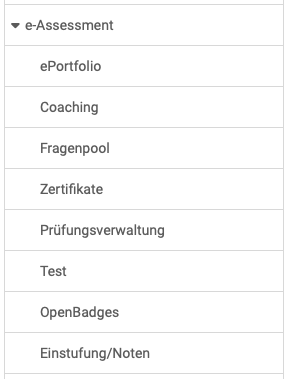

# e-Assessment Administration: Übersicht {: #e-assessments}

{ class="shadow lightbox aside-left-lg" }

Im Bereich e-Assessment können Administrator:innen folgende Einstellungen vornehmen:

## ePortfolio {: #portfolio}

Das ePortfolio kann von Administrator:innen ein- oder ausgeschaltet werden. Ist es aktiviert, können verschiedene Einstellungen zu den Nutzungsmöglichkeiten festgelegt werden.

[Zu den Details >](eAssessment_ePortfolio.de.md) 
[Zum Seitenanfang ^](#e-assessments)

## Coaching {: #coaching}

Hier wird das Coaching-Modul eingeschaltet.

[Zum Seitenanfang ^](#e-assessments)

## Fragenpool {: #questionpool}

Hier können Sie als Administrator:in die grundsätzlichen Einstellungen zum Fragenpool vornehmen. 

[Zu den Details >](../administration/eAssessment_Question_bank.de.md) 
[Zum Seitenanfang ^](#e-assessments)

## Zertifikate {: #certificates}

Hier kann eine E-Mail Adresse hinterlegt werden, an die Kopien der erstellten Zertifikate geschickt werden. Auch sind Kopien an Linienvorgesetze möglich. 

Der Upload externer Zertifikate kann ebenfalls hier freigeschaltet werden. 

Zusätzlich ist diese Funktion auch für Benutzerverwalter, Linienvorgesetzte derselben Organisation oder für verantwortliche Personen, die über eine Benutzer-zu-Benutzer-Beziehungen verbunden sind, verfügbar und kann jeweils separat konfiguriert werden.

[Zum Seitenanfang ^](#e-assessments)

## Prüfungsverwaltung {: #exam_admin}

An dieser Stelle können Administratoren den Prüfungsmodus für die OpenOlat Instanz grundsätzlich aktivieren und nach Prüfungen suchen.

[Zum Seitenanfang ^](#e-assessments)

## Test {: #test}

An dieser Stelle werden die Testquittung konfiguriert und Einstellungen für den Korrektur-Workflow  von Tests definiert. Mit Hilfe des Korrektur-Workflows können Sie persönliche Korrekturaufträge generieren und diese definierten Korrektor:innen zuweisen. Die Korrektur über das Bewertungswerkzeug im Kurs ist dann nicht mehr möglich.

[Zum Seitenanfang ^](#e-assessments)

## OpenBadges {: #openbadges}

Hier kann die Verwendung von Badges ermöglicht werden. 
Auch die Erstellung und Verwaltung globaler Badges erfolgt hier durch Administrator:innen.

[Zu den Details >](../administration/e-Assessment_openBadges.de.md) 
[Zum Seitenanfang ^](#e-assessments)

  
## Einstufung/Noten {: #e-assessments}

Neben dem Bewertungssystem durch Punkte, kann das Modul "Einstufung/Noten" aktiviert werden. Dort können weitere Bewertungssysteme ergänzt und konfiguriert werden.

[Zu den Details >](../administration/Assessment_translate_points_in_grades_admin.de.md)  
[Zum Seitenanfang ^](#e-assessments)

