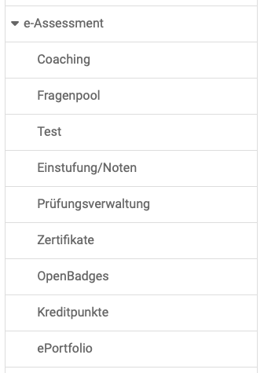

# e-Assessment Administration: Overview {: #e-assessments}

{ class="shadow lightbox aside-left-lg" }

Administrators can make the following settings in the e-Assessment area:

## Coaching {: #coaching}

Here, the coaching module is activated.

[To the top of the page ^](#e-assessments)

## Question Pool {: #questionpool}

As an administrator, you can make the basic settings for the question pool here. 

[See the details >](../administration/eAssessment_Question_bank.md) 
[To the top of the page ^](#e-assessments)

## Test {: #test}

This is where the test receipt is configured and settings for the correction flow of tests are defined. You can use the correction workflow to generate personal correction orders and assign them to defined correctors. Correction via the assessment tool in the course is then no longer possible.

[To the top of the page ^](#e-assessments)

## Grading {: #e-assessments}

In addition to the scoring system using points, the “Grading/grades” module can be activated. Further assessment systems can be added and configured there.

[See the details >](../administration/Assessment_translate_points_in_grades_admin.md)  
[To the top of the page ^](#e-assessments)

## Assessment management {: #exam_admin}

Here, administrators can enable exam mode and exam viewing for the OpenOlat instance and search for exams. They can also add and manage configuration templates for the Safe Exam Browser.

[See the details >](../administration/e-Assessment_AssessmentMgmt.md) 
[To the top of the page ^](#e-assessments)

## Certificates {: #certificates}

An email address can be stored here to which copies of the certificates created can be sent. Copies to line managers are also possible.

The upload of external certificates can also be enabled here.

In addition, this function is also available for user administrators, line managers in the same organization or for responsible persons who are connected via a user-to-user relationship and can be configured separately in each case.

[See the details >](../administration/e-Assessment_Certificates.md)  
[To the top of the page ^](#e-assessments)

## OpenBadges {: #openbadges}

Here, administrators can enable exam mode and exam viewing for the OpenOlat instance and search for exams. They can also add and manage configuration templates for the Safe Exam Browser.

[See the details >](../administration/e-Assessment_AssessmentMgmt.md) 
[To the top of the page ^](#e-assessments)

## Certificates {: #certificates}

You can enter an email address here to which copies of the generated certificates will be sent. Copies can also be sent to line managers. 

You can also enable the upload of external certificates here. 

In addition, this feature is also available to user administrators, line managers within the same organization, or responsible individuals linked via user-to-user relationships, and can be configured separately in each case.

[See the details >](../administration/e-Assessment_Certificates.md)  
[To the top of the page ^](#e-assessments)

## OpenBadges {: #openbadges}

Badges can be enabled here. 
Administrators are also responsible for creating and managing global badges here.

[See the details >](../administration/e-Assessment_openBadges.md) 
[To the top of the page ^](#e-assessments)

## Credit points {: #credit_points}

After activating credit points in the administration, course owners can award credit points to their course participants for successfully completing a course.

[See the details >](../administration/e-Assessment_Credit_Points.md) 
[To the top of the page ^](#e-assessments)

## ePortfolio {: #portfolio}

The ePortfolio can be switched on or off by administrators. If it is activated, various settings can be defined for the usage options.

[See the details >](eAssessment_ePortfolio.md) 
[To the top of the page ^](#e-assessments)

