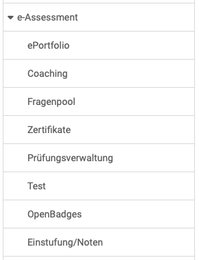

# e-Assessment Administration: Overview {: #e-assessments}

{ class="shadow lightbox aside-left-lg" }

Administrators can make the following settings in the e-Assessment area:

## ePortfolio {: #portfolio}

The ePortfolio can be switched on or off by administrators. If it is activated, various settings can be defined for the usage options.

[See the details >](eAssessment_ePortfolio.md) 
[To the top of the page ^](#e-assessments)

## Coaching

Here, the coaching module is activated.

[To the top of the page ^](#e-assessments)

## Question Pool {: #questionpool}

As an administrator, you can make the basic settings for the question pool here. 

[See the details >](../administration/eAssessment_Question_bank.md) 
[To the top of the page ^](#e-assessments)

## Certificates

An e-mail address can be stored here to which copies of the certificates created can be sent. Copies to line managers are also possible.

The upload of external certificates can also be enabled here.

In addition, this function is also available for user administrators, line managers in the same organization or for responsible persons who are connected via a user-to-user relationship and can be configured separately in each case.

[To the top of the page ^](#e-assessments)

## Assessment management {: #exam_admin}

At this point, administrators can generally activate the check mode for the OpenOlat instance and search for checks.

[To the top of the page ^](#e-assessments)

## Test {: #test}

This is where the test receipt is configured and settings for the correction flow of tests are defined. You can use the correction workflow to generate personal correction orders and assign them to defined correctors. Correction via the assessment tool in the course is then no longer possible.

[To the top of the page ^](#e-assessments)

## OpenBadges {: #openbadges}

The use of badges can be enabled here.
Global badges are also created and managed here by administrators.

[See the details >](../administration/e-Assessment_openBadges.md) 
[To the top of the page ^](#e-assessments)

## Grading {: #e-assessments}

In addition to the scoring system using points, the “Grading/grades” module can be activated. Further assessment systems can be added and configured there.

[See the details >](../administration/Assessment_translate_points_in_grades_admin.md)  
[To the top of the page ^](#e-assessments)

