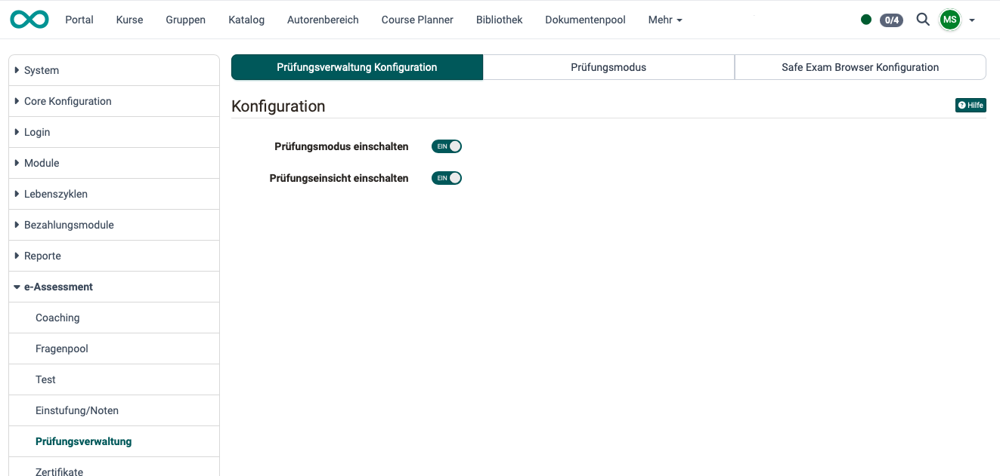
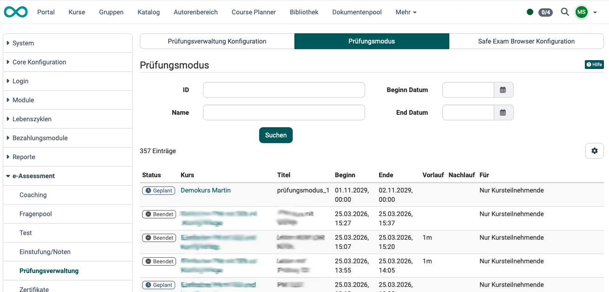
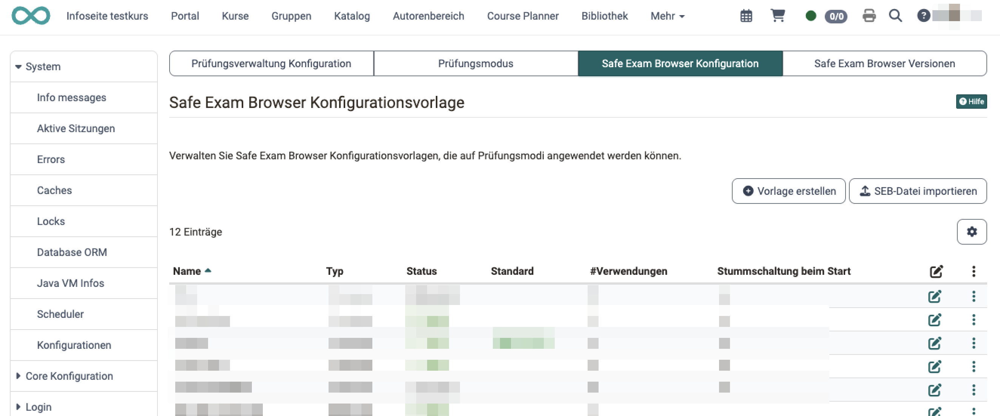
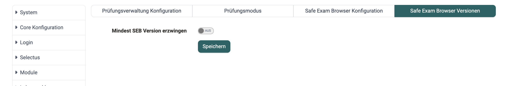
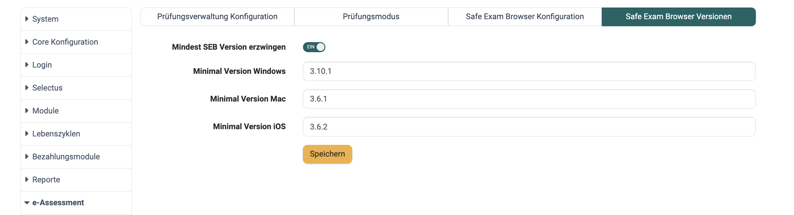

# e-Assessment Administration: Prüfungsverwaltung {: #assessment_mgmt}

## Tab Prüfungsverwaltung Konfiguration [:octicons-tag-16:{ title="ab Release 18.2.2 (OO-7637)" }](https://track.frentix.com/issue/OO-7637)  {: #tab_config}

Die Prüfungsverwaltung umfasst die Konfiguration des **Prüfungsmodus** und die Konfiguration der **Prüfungseinsicht**. Beides kann hier separat aktiviert/deaktiviert werden.

{ class="shadow lightbox" }

[Zum Seitenanfang ^](#assessment_mgmt)

---

## Tab Prüfungsmodus  {: #tab_mode}

Als Administrator:in können Sie sich einen Überblick über alle In Ihrer OpenOlat-Instanz angelegten Prüfungsmodi verschaffen. 

{ class="shadow lightbox" }

[Zum Seitenanfang ^](#assessment_mgmt)

---

## Tab Safe Exam Browser Konfiguration [:octicons-tag-16:{ title="ab Release 20.3 (OO-9159)" }](https://track.frentix.com/issue/OO-9159)  {: #tab_seb}

Verwalten Sie Safe Exam Browser Konfigurationsvorlagen, die auf Prüfungsmodi angewendet werden können.

{ class="shadow lightbox" }

### Die Vorlagenliste im Tab *SEB Konfiguration* 

Die Übersichtstabelle zeigt alle angelegten SEB-Konfigurationsvorlagen mit verschiedenen, über das Zahnradsymbol, persönlich konfigurierbaren Spalten.

Die Spalte **Typ** zeigt, ob eine Vorlage als **Formular** (in OpenOlat konfiguriert) oder als importierte **SEB-Datei** vorliegt.

Ist noch **keine Vorlage** vorhanden, erscheint der Hinweis: *«Es wurden noch keine Safe Exam Browser Konfigurationsvorlagen erstellt.»*

#### Vorlage hinzufügen / bearbeiten

Mit dem Button **"Vorlage erstellen"** legen Sie eine neue SEB-Konfigurationsvorlage an. Bestehende Vorlagen öffnen Sie mit **"Vorlage bearbeiten"** im 3Punkte Menu. Das Formular enthält alle bestehenden SEB-Konfigurationsoptionen sowie das Pflichtfeld:

- **Name**: Pflichtfeld zur Benennung der Vorlage.

Und die Statusanzeigen:

- **Aktiv oder inaktiv**: Legt fest, ob die Vorlage für Autor:innen auswählbar ist.

#### SEB-Datei importieren [:octicons-tag-16:{ title="ab Release 21.0 (OO-9571)" }](https://track.frentix.com/issue/OO-9571)

Wir unterscheiden zwei Arten von Vorlagen:

- **Formular**: Die Konfiguration wird über die einzelnen Formularoptionen in OpenOlat gepflegt (wie unter *"Vorlage erstellen"* beschrieben).
- **SEB-Datei**: Eine vollständige, unverschlüsselte `.seb-Konfigurationsdatei` wird importiert und deckt den vollen Funktionsumfang des Safe Exam Browser ab.

Für den Import verwenden Sie die Aktion **"SEB-Datei importieren"**. OpenOlat liest die Konfiguration aus der Datei, zeigt sie schreibgeschützt an und berechnet den Config Key automatisch. Die Datei darf nicht verschlüsselt oder passwortgeschützt sein.

Bei einer SEB-Datei-Vorlage stehen zusätzlich zur Verfügung:

- **SEB-Quelldatei**: die importierte `.seb`-Datei.
- **Hinweis für Autoren**: ein optionaler Text, der Autor:innen bei der Verwendung der Vorlage im Prüfungsmodus angezeigt wird.

#### Standardvorlage festlegen

Genau eine Vorlage muss als Standard markiert sein. Verwenden Sie die Aktion **"Als Standard setzen"**, um eine andere Vorlage als Standard zu definieren. Die Standardvorlage wird bei der SEB-Aktivierung im Prüfungsmodus automatisch vorausgewählt.

#### Vorlagen aktivieren / deaktivieren

Deaktivierte Vorlagen erscheinen nicht mehr in der Vorlagenauswahl bei der Konfiguration eines Prüfungsmodus.

!!! note "Vorlagen löschen"
    Eine Vorlage kann nur gelöscht werden, wenn diese nicht länger verwendet wird:
    **Spalte *Verwendung* = 0**. Ansonsten kann die Vorlage *deaktiviert* werden.

[Zum Seitenanfang ^](#assessment_mgmt)

---

## Tab Safe Exam Browser Versionen [:octicons-tag-16:{ title="ab Release 21.0 (OO-9579)" }](https://track.frentix.com/issue/OO-9579)  {: #tab_seb_versions}

#### Mindest SEB Version erzwingen

Über diesen Tab können Sie systemweit eine minimale Version des Safe Exam Browser verlangen. Das ist hilfreich, wenn Versionen unterhalb einer bestimmten SEB-Version nicht zugelassen werden sollen.

{ class="shadow lightbox" }

Aktivieren Sie dazu **"Mindest SEB Version erzwingen"**. Anschliessend legen Sie die geforderte Version je Betriebssystem getrennt fest:

- **Minimal Version Windows**
- **Minimal Version Mac**
- **Minimal Version iOS**

{ class="shadow lightbox" }

Startet ein:e Teilnehmer:in eine Prüfung mit einer älteren Version, wird die Prüfung nicht freigegeben; es erscheint die Aufforderung, den Safe Exam Browser zu aktualisieren.

[Zum Seitenanfang ^](#assessment_mgmt)

---

## Weiterführende Informationen  {: #further_information}

[Prüfungsverwaltung durch Kursbesitzer:innen und Betreuer:innen >](../../manual_user/learningresources/Assessment_Management.de.md) 
[Prüfungsmodus >](../../manual_user/learningresources/Assessment_mode.de.md) 
[Prüfungseinsicht >](../../manual_user/learningresources/Assessment_inspection.de.md) 

[Zum Seitenanfang ^](#assessment_mgmt)