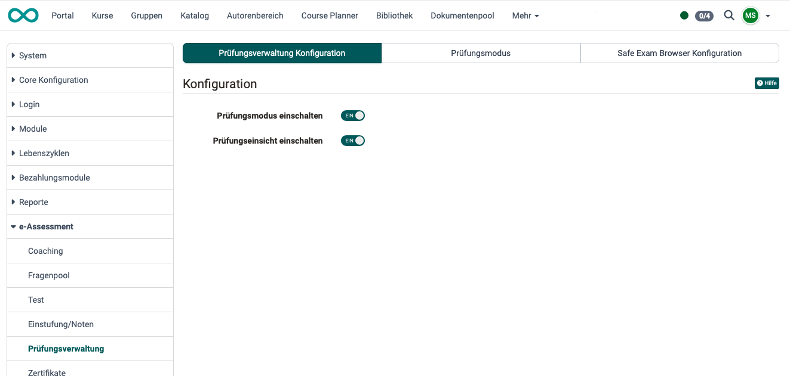
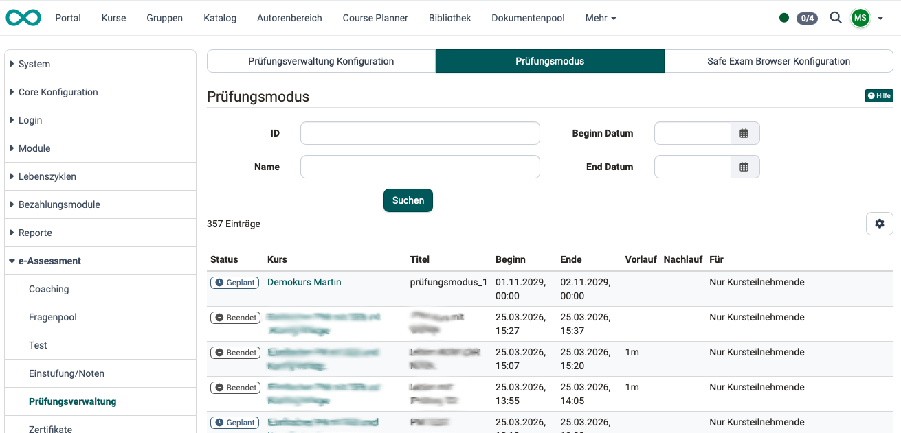
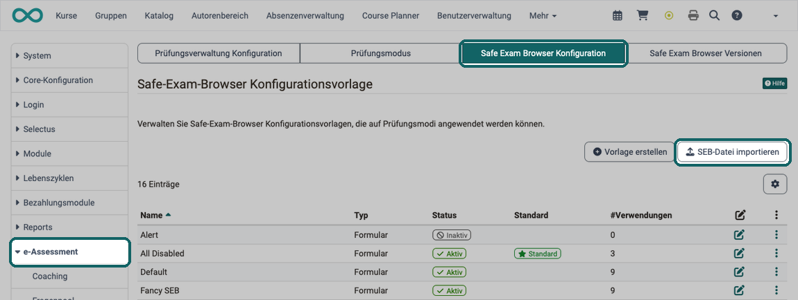
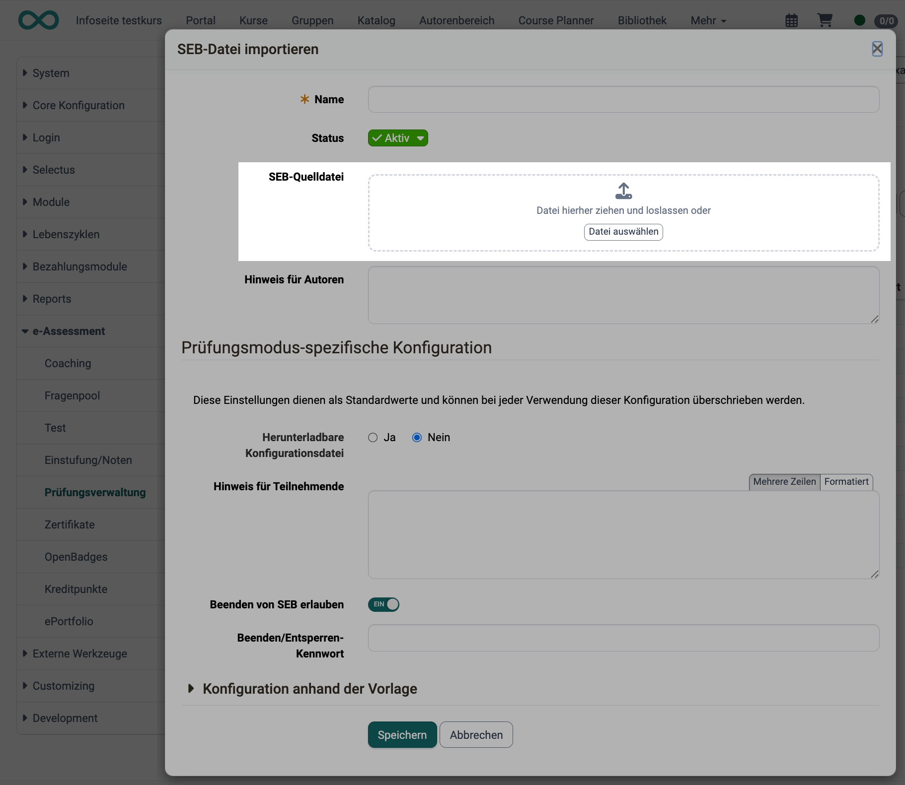
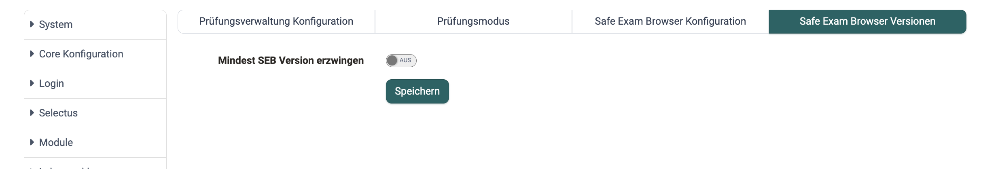
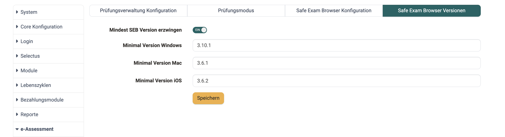

# e-Assessment Administration: Prüfungsverwaltung {: #assessment_mgmt}

Wer Prüfungen für die ganze Instanz betreut, schaltet hier Prüfungsmodus und Prüfungseinsicht ein, behält alle Prüfungsmodi im Blick und stellt die Vorlagen für den Safe Exam Browser bereit. Administrator:innen und Systemadministrator:innen finden die Prüfungsverwaltung in der System-Administration unter: 
`Administration > e-Assessment > Prüfungsverwaltung`

## Tab Prüfungsverwaltung Konfiguration [:octicons-tag-16:{ title="ab Release 18.2.2 (OO-7637)" }](https://track.frentix.com/issue/OO-7637)  {: #tab_config}

Die Prüfungsverwaltung umfasst die Konfiguration des **Prüfungsmodus** und die Konfiguration der **Prüfungseinsicht**. Beides kann hier separat aktiviert/deaktiviert werden.

Die übrigen Tabs hängen von diesen beiden Schaltern ab: Der Tab "Prüfungsmodus" erscheint nur bei eingeschaltetem Prüfungsmodus. Die Tabs "Safe Exam Browser Konfiguration" und "Safe Exam Browser Versionen" erscheinen, sobald der Prüfungsmodus oder die Prüfungseinsicht eingeschaltet ist.

{ class="shadow lightbox" title="Tab Prüfungsverwaltung Konfiguration in der System-Administration" }

[Zum Seitenanfang ^](#assessment_mgmt)

---

## Tab Prüfungsmodus  {: #tab_mode}

Als Administrator:in können Sie sich einen Überblick über alle in Ihrer OpenOlat-Instanz angelegten Prüfungsmodi verschaffen.

Die Suche filtert nach "ID", "Name", "Beginn Datum" und "End Datum". Die Tabelle zeigt je Prüfungsmodus die Spalten "Status", "Kurs", "Titel", "Beginn", "Ende", "Vorlauf", "Nachlauf" und "Für".

{ class="shadow lightbox" title="Tab Prüfungsmodus in der System-Administration" }

[Zum Seitenanfang ^](#assessment_mgmt)

---

## Tab Safe Exam Browser Konfiguration [:octicons-tag-16:{ title="ab Release 20.3 (OO-9159)" }](https://track.frentix.com/issue/OO-9159)  {: #tab_seb}

Verwalten Sie Safe-Exam-Browser Konfigurationsvorlagen, die auf Prüfungsmodi angewendet werden können.

{ class="shadow lightbox" title="Prüfungsverwaltung in der System-Administration · 2026.10.07" }

### Die Vorlagenliste im Tab *Safe Exam Browser Konfiguration*

Die Vorlagenliste zeigt alle angelegten SEB-Konfigurationsvorlagen mit verschiedenen, über das Zahnradsymbol, persönlich konfigurierbaren Spalten.

Die Spalte **Typ** zeigt, ob eine Vorlage als **Formular** (in OpenOlat konfiguriert) oder als importierte **SEB-Datei** vorliegt.

Ist noch **keine Vorlage** vorhanden, erscheint der Hinweis: *«Es wurden noch keine Safe-Exam-Browser-Konfigurationsvorlagen erstellt.»*

#### Vorlage hinzufügen / bearbeiten

Mit dem Button **"Vorlage erstellen"** legen Sie eine neue SEB-Konfigurationsvorlage an. Bestehende Vorlagen öffnen Sie mit **"Bearbeiten"** im 3-Punkte-Menü, der Dialog trägt dann den Titel "Vorlage bearbeiten". Das Formular enthält alle bestehenden Einstellungen des Safe Exam Browser sowie das Pflichtfeld:

#### Name {: #name }

Pflichtfeld zur Benennung der Vorlage.

#### Status {: #status }

Legt fest, ob die Vorlage für Autor:innen auswählbar ist: **Aktiv** oder **Inaktiv**.

#### SEB-Datei importieren [:octicons-tag-16:{ title="ab Release 21.0 (OO-9571)" }](https://track.frentix.com/issue/OO-9571)

Wir unterscheiden zwei Arten von Vorlagen:

- **Formular**: Die Konfiguration wird über die einzelnen Felder des Formulars in OpenOlat gepflegt (wie unter **"Vorlage erstellen"** beschrieben).
- **SEB-Datei**: Eine vollständige, unverschlüsselte `.seb`-Konfigurationsdatei wird importiert und deckt den vollen Funktionsumfang des Safe Exam Browser ab.

Für den Import verwenden Sie die Aktion **"SEB-Datei importieren"**. OpenOlat liest die Konfiguration aus der Datei, zeigt sie schreibgeschützt an und berechnet den Config Key automatisch. Die Datei darf nicht verschlüsselt oder passwortgeschützt sein.

Bei einer SEB-Datei-Vorlage stehen zusätzlich zur Verfügung:

#### SEB-Quelldatei {: #seb_source_file }

Die importierte `.seb`-Datei.

#### Hinweis für Autoren {: #hint_for_authors }

Ein optionaler Text, der Autor:innen bei der Verwendung der Vorlage im Prüfungsmodus angezeigt wird.

#### Prüfungsmodus-spezifische Konfiguration {: #mode_specific_configuration }

Die Felder "Herunterladbare Konfigurationsdatei", "Hinweis für Teilnehmende", "Beenden von SEB erlauben" und "Beenden/Entsperren-Kennwort" dienen als Standardwerte. Sie lassen sich bei jeder Verwendung der Vorlage überschreiben.

{ class="shadow lightbox" title="Dialog SEB-Datei importieren" }

#### Standardvorlage festlegen

Genau eine Vorlage muss als Standard markiert sein. Verwenden Sie die Aktion **"Als Standard setzen"**, um eine andere Vorlage als Standard zu definieren. Die Standardvorlage ist automatisch vorausgewählt, sobald der Safe Exam Browser im Prüfungsmodus eingeschaltet wird.

#### Vorlagen aktivieren / deaktivieren

Deaktivierte Vorlagen stehen bei der Konfiguration eines Prüfungsmodus nicht mehr zur Auswahl.

!!! info "Vorlagen löschen"
    Eine Vorlage lässt sich nur löschen, wenn die Spalte "#Verwendungen" den Wert 0 zeigt und die Vorlage nicht als Standard gesetzt ist. Eine verwendete Vorlage, die nicht Standard ist, können Sie stattdessen *deaktivieren*.

[Zum Seitenanfang ^](#assessment_mgmt)

---

## Tab Safe Exam Browser Versionen [:octicons-tag-16:{ title="ab Release 21.0 (OO-9579)" }](https://track.frentix.com/issue/OO-9579)  {: #tab_seb_versions}

#### Mindest SEB Version erzwingen {: #enforce_min_seb_version }

Über diesen Tab können Sie systemweit eine minimale Version des Safe Exam Browser verlangen. Das ist hilfreich, wenn Versionen unterhalb einer bestimmten SEB-Version nicht zugelassen werden sollen.

{ class="shadow lightbox" title="Tab Safe Exam Browser Versionen in der System-Administration" }

Aktivieren Sie dazu **"Mindest SEB Version erzwingen"**. Anschliessend legen Sie die geforderte Version je Betriebssystem getrennt fest:

#### Minimal Version Windows {: #min_version_windows }

Geforderte Mindestversion für Teilnehmende, die den Safe Exam Browser unter Windows starten.

#### Minimal Version Mac {: #min_version_mac }

Geforderte Mindestversion für Teilnehmende, die den Safe Exam Browser unter Mac starten.

#### Minimal Version iOS {: #min_version_ios }

Geforderte Mindestversion für Teilnehmende, die den Safe Exam Browser unter iOS starten.

{ class="shadow lightbox" title="Tab Safe Exam Browser Versionen, Mindestversion erzwungen" }

Startet ein:e Teilnehmer:in eine Prüfung mit einer älteren Version, wird die Prüfung nicht freigegeben; es erscheint die Aufforderung, den Safe Exam Browser zu aktualisieren.

[Zum Seitenanfang ^](#assessment_mgmt)

---

## Weiterführende Informationen {: #further_information}

[Prüfungsverwaltung: Übersicht >](../../manual_user/learningresources/Assessment_Management.de.md) 
[Prüfungsverwaltung: Prüfungsmodus >](../../manual_user/learningresources/Assessment_mode.de.md) 
[Prüfungsverwaltung: Prüfungseinsicht >](../../manual_user/learningresources/Assessment_inspection.de.md) 
[Wie richte ich als Administrator:in den Safe Exam Browser (SEB) systemweit ein? >](../../manual_how-to/SEB_Admin/SEB_Admin.de.md) 
[Modul Termine und Absenzen >](Modules_Events_and_Absences.de.md)

[Zum Seitenanfang ^](#assessment_mgmt)