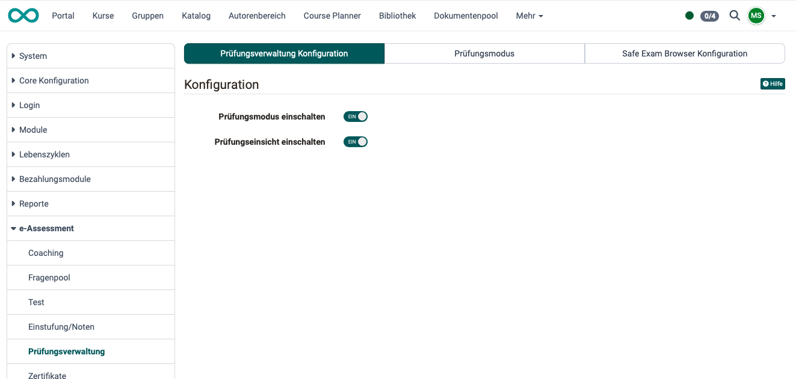
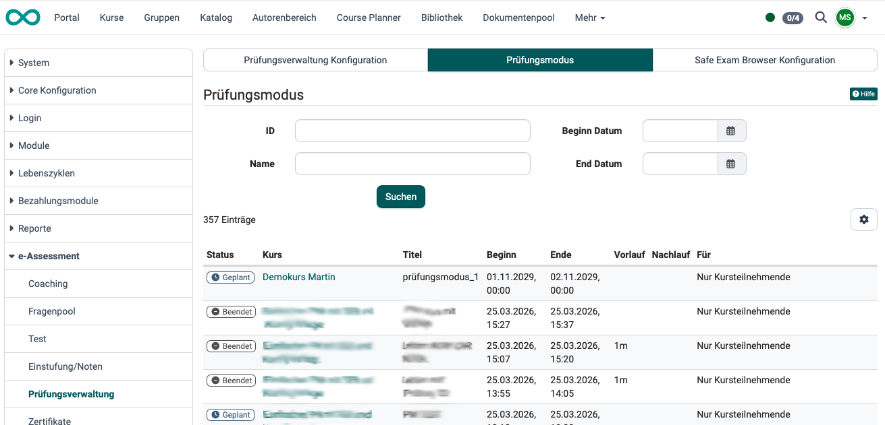
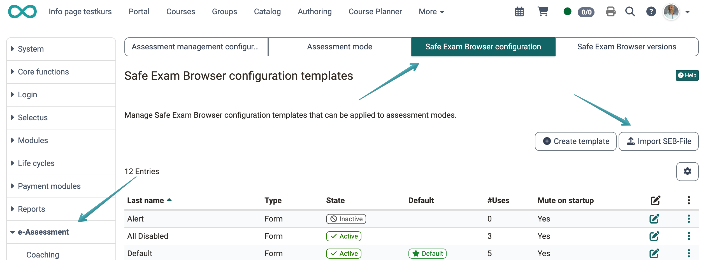
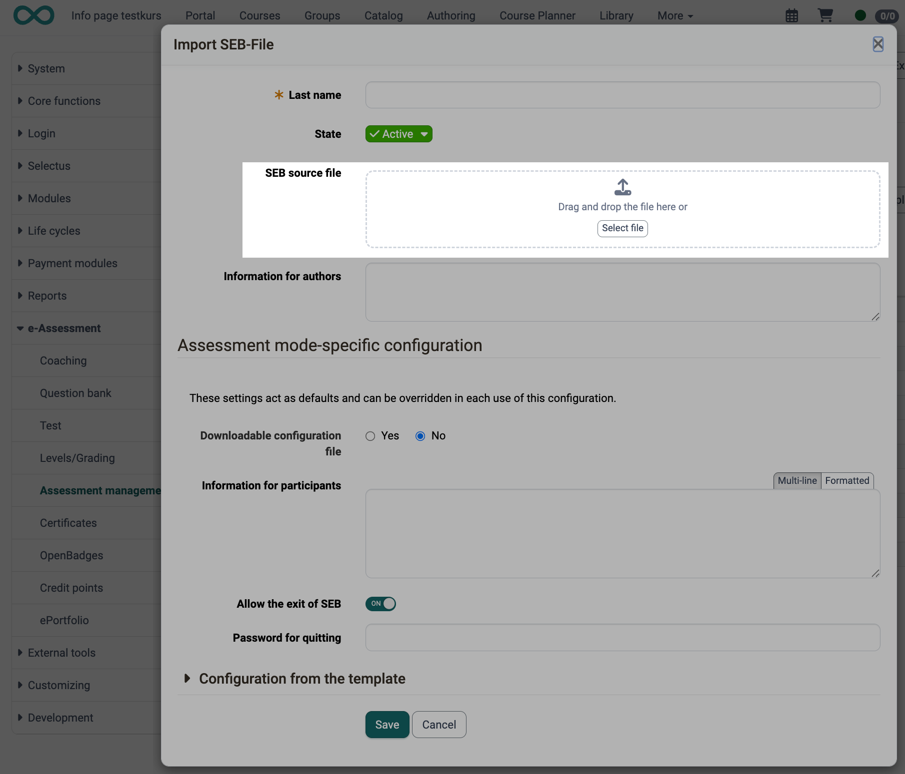
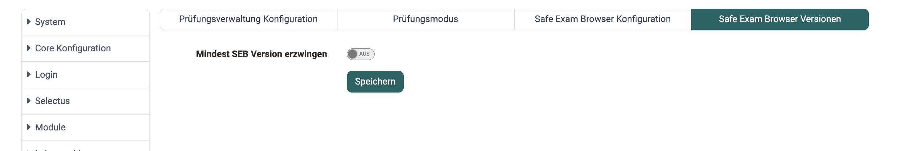
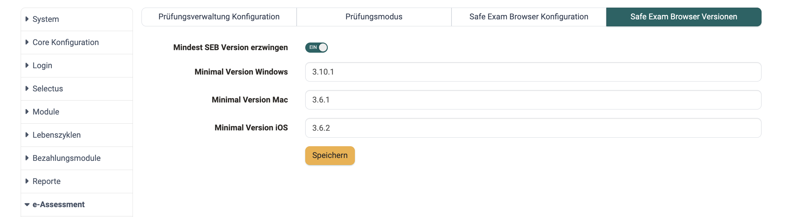

# e-Assessment Administration: Assessment management {: #assessment_mgmt}

## Assessment Management Configuration Tab [:octicons-tag-16:{ title="from Release 18.2.2 (OO-7637)" }](https://track.frentix.com/issue/OO-7637)  {: #tab_config}

Assessment management includes configuring the **assessment mode** and setting up **assessment inspection**. Both can be enabled or disabled separately here.

{ class="shadow lightbox" }

[To the top of the page ^](#assessment_mgmt)

---

## Assessment mode tab  {: #tab_mode}

As an administrator, you can view an overview of all assessment modes created in your OpenOlat instance.

{ class="shadow lightbox" }

[To the top of the page ^](#assessment_mgmt)

---

## Safe Exam Browser Configuration Tab [:octicons-tag-16:{ title="from Release 20.3 (OO-9159)" }](https://track.frentix.com/issue/OO-9159) {: #tab_seb}

Manage Safe Exam Browser configuration templates that can be applied to assessment modes.

{ class="shadow lightbox" }

### Template list in the *SEB Configuration* tab

The overview table shows all created SEB configuration templates with various columns that can be configured individually via the gear icon.

The **Type** column shows whether a template is a **Form** (configured in OpenOlat) or an imported **SEB-File**.

If **no template** has been created yet, the message is displayed: *"No Safe Exam Browser configuration templates have been created yet."*

#### Adding / editing a template

Use the **"Create template"** button to create a new SEB configuration template. Open existing templates with **"Edit template"** in the three-dot menu. The form contains all existing SEB configuration options as well as the required field:

#### Name {: #name }

Required field for naming the template.

#### Status {: #status }

Defines whether the template is selectable for authors: **Active** or **Inactive**.

#### Import SEB-File [:octicons-tag-16:{ title="from Release 21.0 (OO-9571)" }](https://track.frentix.com/issue/OO-9571)

We distinguish two types of templates:

- **Form**: The configuration is maintained via the individual form options in OpenOlat (as described under **"Create template"**).
- **SEB-File**: A complete, unencrypted `.seb configuration file` is imported and covers the full range of Safe Exam Browser functionality.

For the import, use the **"Import SEB-File"** action. OpenOlat reads the configuration from the file, displays it read-only, and calculates the config key automatically. The file must not be encrypted or password-protected.

For an SEB-File template, the following are additionally available:

#### SEB source file {: #seb_source_file }

The imported `.seb` file.

#### Information for authors {: #hint_for_authors }

An optional text shown to authors when using the template in the assessment mode.

{ class="shadow lightbox" }

#### Setting the default template

Exactly one template must be marked as the default. Use the **"Set as default"** action to define a different template as the default. The default template is automatically pre-selected when SEB is activated in the assessment mode.

#### Activating / deactivating templates

Deactivated templates no longer appear in the template selection when configuring an assessment mode.

!!! note "Deleting templates"
    A template can only be deleted if it is no longer in use:
    **Column *Uses* = 0**. Otherwise the template can be *deactivated*.

[To the top of the page ^](#assessment_mgmt)

---

## Safe Exam Browser Versions Tab [:octicons-tag-16:{ title="from Release 21.0 (OO-9579)" }](https://track.frentix.com/issue/OO-9579)  {: #tab_seb_versions}

#### Enforce minimal SEB version {: #enforce_min_seb_version }

Via this tab, you can require a minimal version of the Safe Exam Browser instance-wide. This is helpful if versions below a certain SEB version should not be permitted.

{ class="shadow lightbox" }

Activate **"Enforce minimal SEB version"**. Then set the required version separately per operating system:

#### Minimal version Windows {: #min_version_windows }

#### Minimal version Mac {: #min_version_mac }

#### Minimal version iOS {: #min_version_ios }

{ class="shadow lightbox" }

If a participant starts an exam with an older version, the exam is not released; a prompt appears to update the Safe Exam Browser.

[To the top of the page ^](#assessment_mgmt)

---

## Further information {: #further_information}

[Assessment administration by course owners and instructors >](../../manual_user/learningresources/Assessment_Management.md) 
[Assessment mode >](../../manual_user/learningresources/Assessment_mode.md) 
[Assessment inspection >](../../manual_user/learningresources/Assessment_inspection.md) 

[To the top of the page ^](#assessment_mgmt)