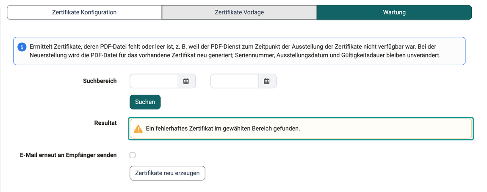

# e-Assessment Administration: Zertifikate {: #certificates}

Administrator:innen legen hier fest, wer externe Zertifikate hochladen darf, welche Zertifikatsvorlagen zur Auswahl stehen und wie fehlerhafte Zertifikate repariert werden. Sie finden die Einstellungen in der System-Administration unter: 
`Administration > e-Assessment > Zertifikate`

## Tab Zertifikate Konfiguration  {: #tab_config}

In OpenOlat können auch anderweitig erworbene Zertifikate hochgeladen werden. Im Tab "Zertifikate Konfiguration" wird bestimmt, welchen Rollen dies erlaubt ist. Ob Linienvorgesetzte und Betreuer:innen externe Zertifikate für andere Personen hochladen dürfen, regelt das Recht "Externe Zertifikate hochladen": für Linienvorgesetzte bei der Organisation, für Betreuer:innen in den Person-zu-Person-Einstellungen.

Administrator:innen können ebenfalls einrichten, dass beim Ausstellen eines Zertifikates eine Kopie auch an Linienvorgesetzte oder an eine andere E-Mail-Adresse (z.B. die Personalabteilung) verschickt wird. Betreuer:innen erhalten eine Kopie über das Recht "Kopie Zertifikate per E-Mail" in den Person-zu-Person-Einstellungen.

[Zum Seitenanfang ^](#certificates)

---

## Tab Zertifikate Vorlage  {: #tab_templates}

Wenn Kursbesitzer:innen ein Zertifikat für ihren Kurs ausstellen wollen, nehmen sie dazu eine Einstellung vor unter `Kurs > Administration > Einstellungen > Tab "Bewertung"` im Abschnitt "Zertifikat". Dort kann auch die zu verwendende Zertifikatsvorlage ausgewählt werden. Als Administrator:in können Sie die zur Auswahl stehenden Zertifikatsvorlagen bestimmen.

Die gleiche Auswahl der Zertifikatsvorlagen steht auch in Zertifikatsprogrammen zur Verfügung.

Die mitgelieferte Standardvorlage ist HTML-basiert. HTML-Vorlagen sind die empfohlene Variante; PDF-Formulare funktionieren weiterhin, sollten aber nur eingesetzt werden, wenn der Gotenberg-PDF-Dienst nicht installiert ist. [:octicons-tag-16:{ title="ab Release 21.0 (OO-9585)" }](https://track.frentix.com/issue/OO-9585)

Die Standardvorlage selbst erscheint nicht in dieser Liste. Sie gehört zur Installation, steht bei der Vorlagenwahl als Eintrag "Default" bereit und lässt sich hier weder austauschen noch löschen. Die Liste enthält nur die Vorlagen, die Sie mit "Vorlage hochladen" hinzugefügt haben: HTML-Vorlagen als ZIP-Datei mit der Datei "index.html" im Hauptverzeichnis, PDF-Formulare als PDF-Datei.

[Zum Seitenanfang ^](#certificates)

---

## Tab Wartung [:octicons-tag-16:{ title="ab Release 20.3.7 (OO-9659)" }](https://track.frentix.com/issue/OO-9659) {: #tab_maintenance}

Meldet eine Person, dass sich ihr Zertifikat nicht herunterladen lässt oder als leere PDF-Datei angekommen ist, finden Administrator:innen im Tab "Wartung" alle betroffenen Zertifikate und erzeugen die PDF-Dateien neu.

OpenOlat stellt ein Zertifikat sofort aus und erzeugt die PDF-Datei danach im Hintergrund. Bis sie vorliegt, trägt das Zertifikat den Status "Hängig". Antwortet der PDF-Dienst nicht, wechselt das Zertifikat auf "Fehler", und OpenOlat wiederholt die Erzeugung automatisch. Erst wenn alle Versuche gescheitert sind, bleibt es endgültig im Status "Fehler" und braucht den Tab "Wartung". Die Benachrichtigung geht nach dem ersten Versuch auch dann an die Person, wenn die PDF-Datei noch fehlt; gelingt ein späterer Versuch, folgt eine zweite E-Mail mit dem Zertifikat. [:octicons-tag-16:{ title="ab Release 21.1 (OO-9128)" }](https://track.frentix.com/issue/OO-9128)

Takt und Anzahl der Versuche sind Teil der Serverkonfiguration und lassen sich in der Oberfläche nicht einstellen. In der Standardkonfiguration prüft OpenOlat alle fünf Minuten, ob PDF-Dateien zu erzeugen sind, und wiederholt eine gescheiterte Erzeugung nach einer Stunde, höchstens zehnmal. Scheitern drei Zertifikate hintereinander, bricht OpenOlat den Durchgang ab und setzt beim nächsten Termin neu an. Eine Änderung gilt erst ab dem nächsten Neustart. frentix-Kund:innen wenden sich für eine Änderung an den frentix Support: [support@frentix.com](mailto:support@frentix.com)

Die Neuerstellung ersetzt nur die PDF-Datei. Seriennummer, Ausstellungsdatum und Gültigkeitsdauer bleiben unverändert. Auch bei einer Rezertifizierung bleibt das neu erzeugte Zertifikat das aktuelle Zertifikat der Person.

Bevor Sie Zertifikate neu erzeugen, stellen Sie sicher, dass der [PDF-Dienst](External_Tools_-_Administration.de.md#pdf_generator) erreichbar ist. Sonst schlägt auch die Neuerstellung fehl.

{ class="shadow lightbox" title="Tab Wartung" }

### Fehlerhafte Zertifikate suchen {: #search_broken_certificates}

1. Grenzen Sie im Feld "Suchbereich" den Zeitraum ein, in dem der PDF-Dienst ausgefallen ist. Lassen Sie beide Datumsfelder leer, prüft OpenOlat alle Zertifikate. Liegt das Startdatum nach dem Enddatum, weist OpenOlat die Suche ab.
2. Klicken Sie **Suchen**. Das "Resultat" meldet "Keine fehlerhaften Zertifikate im gewählten Bereich gefunden" oder die Anzahl der gefundenen Zertifikate.

Die Suche findet Zertifikate, deren PDF-Datei fehlt oder leer ist, sowie alle Zertifikate im Status "Fehler". Geprüft wird je Person und Kurs oder Zertifikatsprogramm nur das aktuelle Zertifikat.

### PDF-Dateien neu erzeugen {: #regenerate_certificates}

Findet die Suche fehlerhafte Zertifikate, erscheinen die Checkbox "E-Mail erneut an Empfänger senden" und die Schaltfläche **Zertifikate neu erzeugen**.

1. Entscheiden Sie, ob die Personen erneut benachrichtigt werden. Ohne Häkchen ersetzt OpenOlat nur die PDF-Datei, und niemand erhält eine E-Mail. Mit Häkchen verschickt OpenOlat die Benachrichtigung mit dem Zertifikat erneut an die Person. Bei Zertifikaten aus Einzelkursen gehen zusätzlich die Kopien, die im Tab "Zertifikate Konfiguration" eingerichtet sind. Bei Zertifikaten aus Zertifikatsprogrammen erhält nur die Person die E-Mail.
2. Klicken Sie **Zertifikate neu erzeugen**. Der Dialog nennt die Anzahl der Zertifikate und, falls gewählt, der E-Mails. Bestätigen Sie mit **Neu erzeugen** oder **Neu erzeugen und senden**.
3. OpenOlat erzeugt die PDF-Dateien im Hintergrund. Wiederholen Sie die Suche, um das Resultat zu prüfen: Erfolgreich neu erzeugte Zertifikate erscheinen nicht mehr im Resultat.

[Zum Seitenanfang ^](#certificates)

---

## Weiterführende Informationen {: #further_information}

[Externe Werkzeuge: Übersicht >](External_Tools_-_Administration.de.md) 
[Persönliche Erfolge/Leistungen: Zertifikate >](../../manual_user/personal_menu/Certificates.de.md) 
[Kurseinstellungen - Tab Bewertung: Zertifikate und Rezertifizierung >](../../manual_user/learningresources/Course_Settings_Assessment_Certificate.de.md) 
[Course Planner: Zertifikatsprogramme >](../../manual_user/area_modules/Course_Planner_Certification_Programs.de.md) 
[Coaching - Reports: Zertifikate >](../../manual_user/area_modules/Reports_Certficates.de.md)

[Zum Seitenanfang ^](#certificates)
