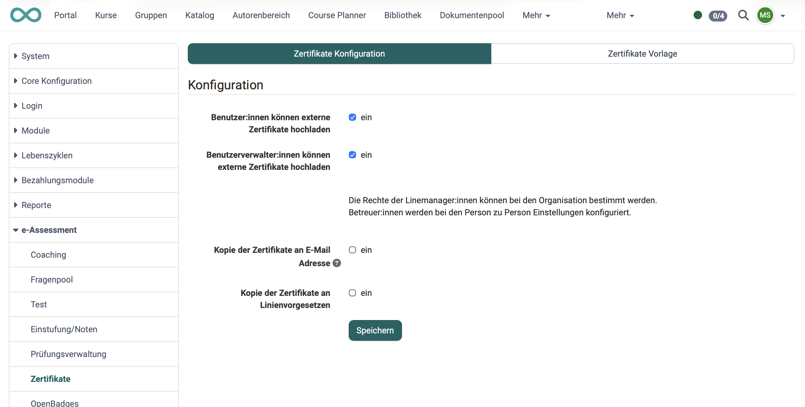
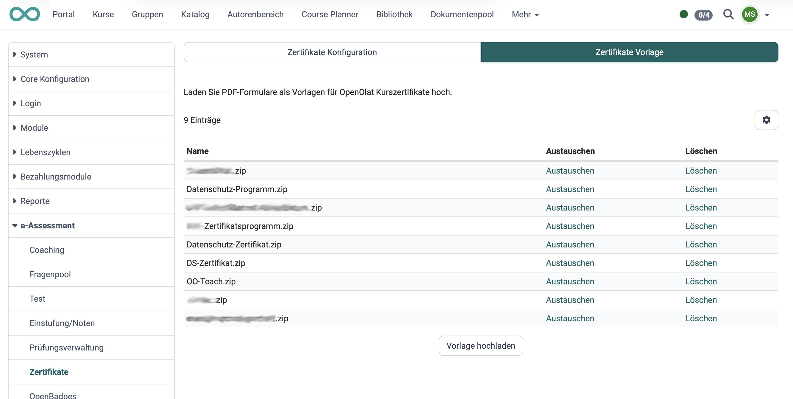

# e-Assessment Administration: Certificates {: #certificates}

## Certificate configuration tab  {: #tab_config}

In OpenOlat, certificates obtained from other sources can also be uploaded. The "Certificate Configuration" tab is used to specify which roles are permitted to do so. 

Administrators can also configure the system so that when a certificate is issued, a copy is sent to the employee’s line manager or to another email address (e.g., the HR department).

{ class="shadow lightbox" }

[To the top of the page ^](#certificates)

---

## Certificate template tab  {: #tab_templates}

If course owners want to issue a certificate for their course, they can do so by going to (Course) Administration > Settings > Grading > "Certificate" section. You can also select the certificate template to use there. As an administrator, you can specify which certificate templates are available for selection.

The same selection of certificate templates is also available in certificate programs.

The default template supplied is HTML-based. HTML templates are the recommended option; PDF forms still work but should only be used if the Gotenberg PDF service is not installed. [:octicons-tag-16:{ title="ab Release 21.0 (OO-9585)" }](https://track.frentix.com/issue/OO-9585)

{ class="shadow lightbox" }

[To the top of the page ^](#certificates)

---

## Further information  {: #further_information}

[Certificates in the personal menu >](../../manual_user/personal_menu/Certificates.md) 
[Certificates in single courses >](../../manual_user/learningresources/Course_Settings_Assessment_Certificate.md) 
[Certificates in the Certification Program >](../../manual_user/area_modules/Course_Planner_Certification_Programs.md) 

[To the top of the page ^](#certificates)