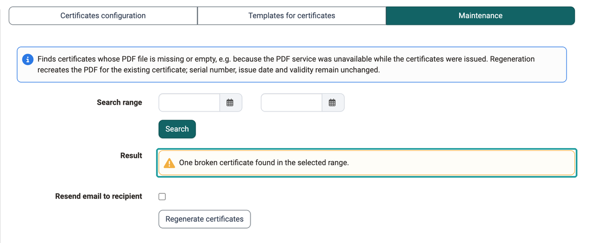

# e-Assessment Administration: Certificates {: #certificates}

Administrators define here who may upload external certificates, which certificate templates are available for selection and how broken certificates are repaired. You find the settings in the system administration under: 
`Administration > e-Assessment > Certificates`

## Certificate configuration tab  {: #tab_config}

In OpenOlat, certificates obtained from other sources can also be uploaded. The "Certificate Configuration" tab is used to specify which roles are permitted to do so. 

Administrators can also configure the system so that when a certificate is issued, a copy is sent to the employee’s line manager or to another email address (e.g., the HR department).

{ class="shadow lightbox" }

[To the top of the page ^](#certificates)

---

## Certificate template tab  {: #tab_templates}

If course owners want to issue a certificate for their course, they can do so under `Course > Administration > Settings > Tab "Assessment"` in the "Certificate" section. You can also select the certificate template to use there. As an administrator, you can specify which certificate templates are available for selection.

The same selection of certificate templates is also available in certificate programs.

The default template supplied is HTML-based. HTML templates are the recommended option; PDF forms still work but should only be used if the Gotenberg PDF service is not installed. [:octicons-tag-16:{ title="from Release 21.0 (OO-9585)" }](https://track.frentix.com/issue/OO-9585)

{ class="shadow lightbox" }

[To the top of the page ^](#certificates)

---

## Maintenance tab [:octicons-tag-16:{ title="from Release 20.3.7 (OO-9659)" }](https://track.frentix.com/issue/OO-9659) {: #tab_maintenance}

When a person reports that their certificate arrived as an empty PDF file, administrators find all affected certificates in the "Maintenance" tab and regenerate the PDF files. Such certificates occur when the PDF service does not respond at the moment of issuing: the certificate counts as issued, the certificate list shows a download link, and the notification reaches the person with an empty attachment. The certificate list does not reveal these cases.

The regeneration only replaces the PDF file. The serial number, the issue date and the validity remain unchanged. In a recertification, the regenerated certificate also remains the current certificate of the person.

Before you regenerate certificates, make sure that the [PDF service](External_Tools_-_Administration.md#pdf_generator) is available. Otherwise the regeneration fails as well.

{ class="shadow lightbox" }

### Search for broken certificates {: #search_broken_certificates}

1. In the "Search range" field, limit the period in which the PDF service was unavailable. If you leave both date fields empty, OpenOlat checks all certificates. If the start date is after the end date, OpenOlat rejects the search.
2. Click **Search**. The "Result" reports "No broken certificates found in the selected range" or the number of certificates found.

The search finds certificates whose PDF file is missing or empty. Per person and course or certification program, only the current certificate is checked.

### Regenerate PDF files {: #regenerate_certificates}

If the search finds broken certificates, the checkbox "Resend email to recipient" and the button **Regenerate certificates** appear.

1. Decide whether the persons are notified again. Without the checkmark, OpenOlat only replaces the PDF file and nobody receives an email. With the checkmark, OpenOlat sends the notification with the certificate to the person again. For certificates from single courses, the copies configured in the "Certificate configuration" tab are also sent. For certificates from certification programs, only the person receives the email.
2. Click **Regenerate certificates**. The dialog states the number of certificates and, if selected, of emails. Confirm with **Regenerate** or **Regenerate and send**.
3. OpenOlat creates the PDF files in the background. Repeat the search to check the result: successfully regenerated certificates no longer appear in the result.

[To the top of the page ^](#certificates)

---

## Further information {: #further_information}

[External Tools: PDF Generator >](External_Tools_-_Administration.md) 
[Certificates in the personal menu >](../../manual_user/personal_menu/Certificates.md) 
[Certificates in single courses >](../../manual_user/learningresources/Course_Settings_Assessment_Certificate.md) 
[Certificates in the Certification Program >](../../manual_user/area_modules/Course_Planner_Certification_Programs.md) 
[Reports: Certificates >](../../manual_user/area_modules/Reports_Certficates.md)

[To the top of the page ^](#certificates)