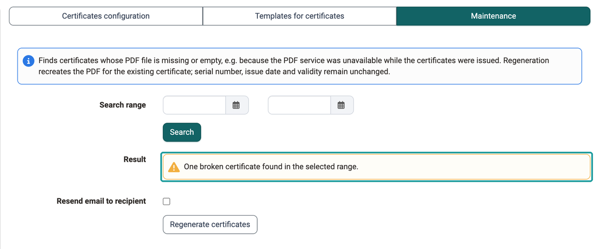

# e-Assessment Administration: Certificates {: #certificates}

Administrators define here who may upload external certificates, which certificate templates are available for selection and how broken certificates are repaired. You find the settings in the system administration under: 
`Administration > e-Assessment > Certificates`

## Certificates configuration tab  {: #tab_config}

In OpenOlat, certificates obtained from other sources can also be uploaded. The "Certificates configuration" tab is used to specify which roles are permitted to do so. 

Administrators can also configure the system so that when a certificate is issued, a copy is sent to the employee’s line manager or to another email address (e.g., the HR department). The rights of line managers are defined in the organisation, the rights of coaches in the user to user settings.

[To the top of the page ^](#certificates)

---

## Templates for certificates tab  {: #tab_templates}

If course owners want to issue a certificate for their course, they can do so under `Course > Administration > Settings > Tab "Assessment"` in the "Certificate" section. You can also select the certificate template to use there. As an administrator, you can specify which certificate templates are available for selection.

The same selection of certificate templates is also available in certificate programs.

The default template supplied is HTML-based. HTML templates are the recommended option; PDF forms still work but should only be used if the Gotenberg PDF service is not installed. [:octicons-tag-16:{ title="from Release 21.0 (OO-9585)" }](https://track.frentix.com/issue/OO-9585)

The default template itself does not appear in this list. It belongs to the installation, is available in the template selection as the entry "Default", and can neither be replaced nor deleted here. The list only contains the templates that you added with "Upload template": HTML templates as a ZIP file with the file "index.html" in the main directory, PDF forms as a PDF file.

[To the top of the page ^](#certificates)

---

## Maintenance tab [:octicons-tag-16:{ title="from Release 20.3.7 (OO-9659)" }](https://track.frentix.com/issue/OO-9659) {: #tab_maintenance}

When a person reports that their certificate cannot be downloaded or arrived as an empty PDF file, administrators find all affected certificates in the "Maintenance" tab and regenerate the PDF files.

OpenOlat issues a certificate immediately and then generates the PDF file in the background. Until the file is available, the certificate has the status "Pending". If the PDF service does not respond, the certificate changes to "Error", and OpenOlat repeats the generation automatically. Only when all attempts have failed does it remain in the status "Error" for good and require the "Maintenance" tab. The notification reaches the person after the first attempt even if the PDF file is still missing; if a later attempt succeeds, a second email with the certificate follows. [:octicons-tag-16:{ title="from Release 21.1 (OO-9128)" }](https://track.frentix.com/issue/OO-9128)

The interval and the number of attempts are part of the server configuration and cannot be set in the user interface. In the default configuration, OpenOlat checks every five minutes whether PDF files need to be generated, and repeats a failed generation after one hour, at most ten times. If three certificates fail in a row, OpenOlat stops the run and starts again at the next scheduled time. A change only takes effect after the next restart. frentix customers contact the frentix support for a change: [support@frentix.com](mailto:support@frentix.com)

The regeneration only replaces the PDF file. The serial number, the issue date and the validity remain unchanged. In a recertification, the regenerated certificate also remains the current certificate of the person.

Before you regenerate certificates, make sure that the [PDF service](External_Tools_-_Administration.md#pdf_generator) is available. Otherwise the regeneration fails as well.

{ class="shadow lightbox" title="Maintenance tab" }

### Search for broken certificates {: #search_broken_certificates}

1. In the "Search range" field, limit the period in which the PDF service was unavailable. If you leave both date fields empty, OpenOlat checks all certificates. If the start date is after the end date, OpenOlat rejects the search.
2. Click **Search**. The "Result" reports "No broken certificates found in the selected range" or the number of certificates found.

The search finds certificates whose PDF file is missing or empty, as well as all certificates in the status "Error". Per person and course or certification program, only the current certificate is checked.

### Regenerate PDF files {: #regenerate_certificates}

If the search finds broken certificates, the checkbox "Resend email to recipient" and the button **Regenerate certificates** appear.

1. Decide whether the persons are notified again. Without the checkmark, OpenOlat only replaces the PDF file and nobody receives an email. With the checkmark, OpenOlat sends the notification with the certificate to the person again. For certificates from single courses, the copies configured in the "Certificates configuration" tab are also sent. For certificates from certification programs, only the person receives the email.
2. Click **Regenerate certificates**. The dialog states the number of certificates and, if selected, of emails. Confirm with **Regenerate** or **Regenerate and send**.
3. OpenOlat creates the PDF files in the background. Repeat the search to check the result: successfully regenerated certificates no longer appear in the result.

[To the top of the page ^](#certificates)

---

## Further information {: #further_information}

[External Tools: Overview >](External_Tools_-_Administration.md) 
[Personal achievements/successes: Certificates >](../../manual_user/personal_menu/Certificates.md) 
[Course Settings - Tab Assessment: Certificates and recertification >](../../manual_user/learningresources/Course_Settings_Assessment_Certificate.md) 
[Course Planner: Certification programs >](../../manual_user/area_modules/Course_Planner_Certification_Programs.md) 
[Coaching - Reports: Certificates >](../../manual_user/area_modules/Reports_Certficates.md)

[To the top of the page ^](#certificates)