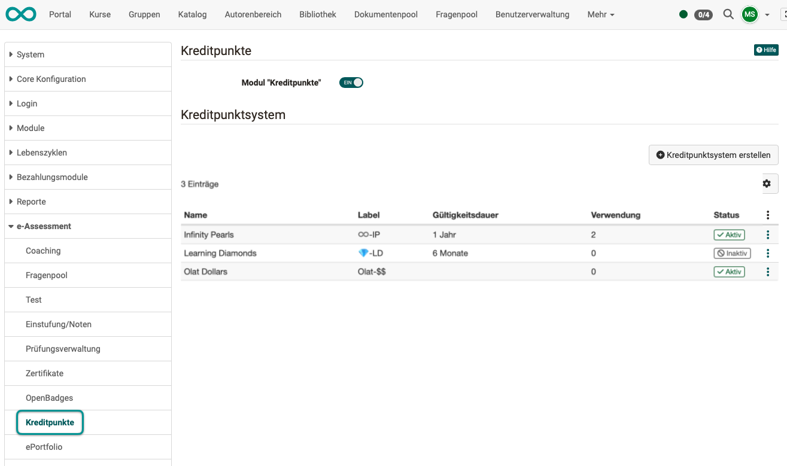
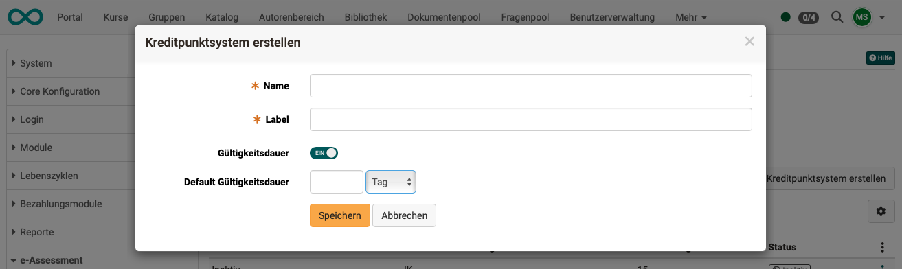

# e-Assessment Administration: Kreditpunkte {: #credit_points}

Verfügbar ab :octicons-tag-24: Release 20.1

Nach Aktivierung der Kreditpunkte in der Administration können Kursbesitzer:innen ihren Kursteilnehmer:innen Kreditpunkte für das erfolgreiche Bestehen eines Kurses vergeben. Die Punkte können als Belohnung vergeben werden, gesammelt werden und dann - auch in Verbindung mit Zertifizierungsprogrammen - in OpenOlat weiter verwendet werden.

{ class="shadow lightbox }

[Zum Seitenanfang ^](#credit_points)

---

## Eigenes Kreditpunktesystem erstellen {: #define_credit_point_system}

Über das Modul können eigene Kreditpunktesysteme global definiert werden. Diese ermöglichen später den Teilnehmenden für das Bestehen von Kursen Bildungspunkte/Credits, wie zum Beispiel ECTS oder LearnCoins, zu sammeln.

{ class="shadow lightbox }

[Zum Seitenanfang ^](#credit_points)

---

## Einkauf mit Kreditpunkten (Kreditpunkte als eigene Währung) {: #credit_points_as_currency}

In Planung: 
Es ist vorgesehen, dass die Kreditpunkte als Währung verwendet werden können, um weitere Kurse zu kaufen oder um im Rahmen einer Rezertifizierung die gesammelten Kreditpunkte für die Erneuerung des Zertifikats einzulösen.
Ein reines Wiederholen des initialen Zertifikatskurses ist dann nicht mehr erforderlich.

[Zum Seitenanfang ^](#credit_points)

---

## Weiterführende Informationen {: #further information}

[Kreditpunkte in Kursen vergeben >](../../manual_user/learningresources/Course_Settings_Assessment.de.md) 

[Zum Seitenanfang ^](#credit_points)