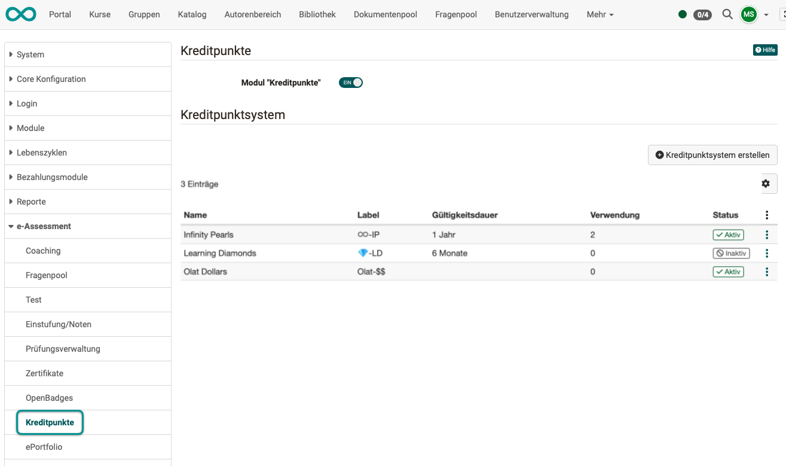
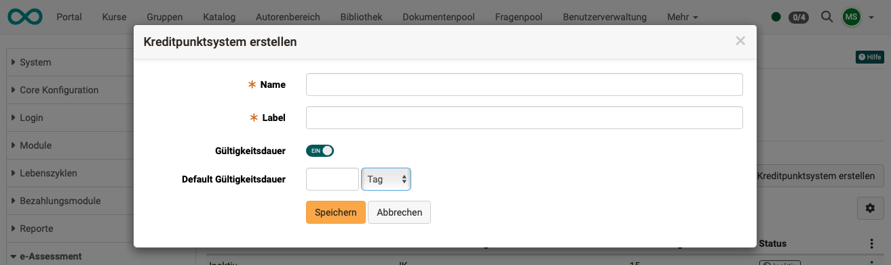

# e-Assessment Administration: Credit points {: #credit_points}

Available since :octicons-tag-16: Release 20.1

After activating credit points in the System Administration under `Administration > e-Assessment > Credit points`, course owners can award credit points to their course participants for successfully completing a course. The points can be awarded as a reward, collected, and then reused in OpenOlat, including in connection with certification programs.

{ class="shadow lightbox" }

[To the top of the page ^](#credit_points)

---

## Define your own credit point system {: #define_credit_point_system}

The module allows you to define your own credit point systems globally. These enable participants to collect educational points/credits, such as ECTS or LearnCoins, for passing courses.

{ class="shadow lightbox" }

[To the top of the page ^](#credit_points)

---

## Shopping with credit points (Credit points as currency) {: #credit_points_as_currency}

In planning: 
It is planned that the credit points can be used as currency to purchase further courses or to redeem the accumulated credit points for the renewal of the certificate as part of a recertification process.
It is then no longer necessary to repeat the initial certificate course.

[To the top of the page ^](#credit_points)

---

## Further information {: #further_information}

[Awarding credit points in courses >](../../manual_user/learningresources/Course_Settings_Assessment.md) 
[Course Planner: Certification programs >](../../manual_user/area_modules/Course_Planner_Certification_Programs.md) 
[Personal achievements/successes: Credit points >](../../manual_user/personal_menu/Credit_Points.md) 
[e-Assessment Administration: Certificates >](e-Assessment_Certificates.md)

[To the top of the page ^](#credit_points)
