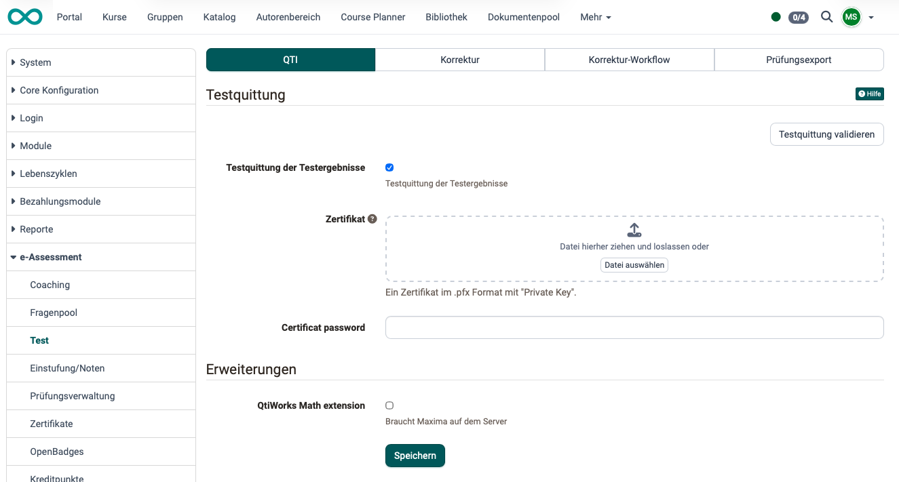
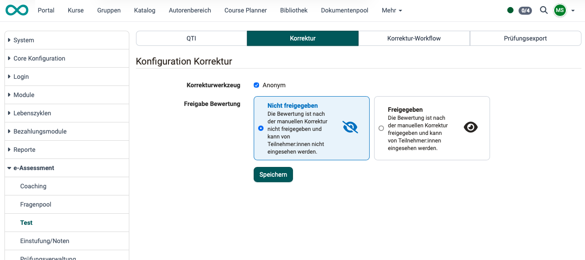
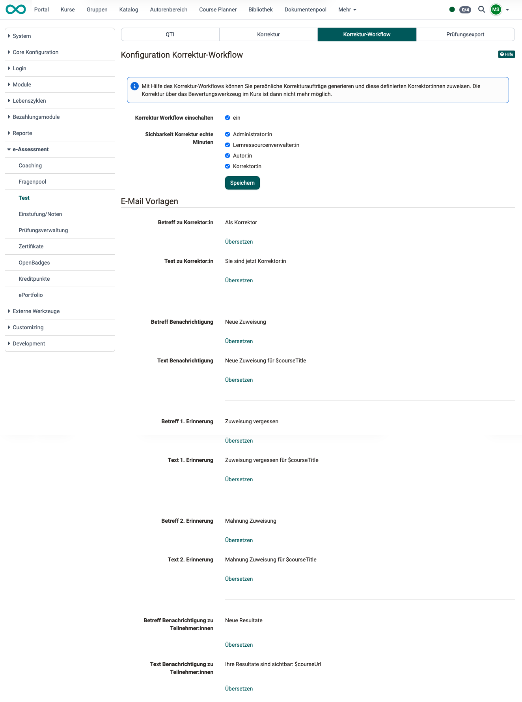
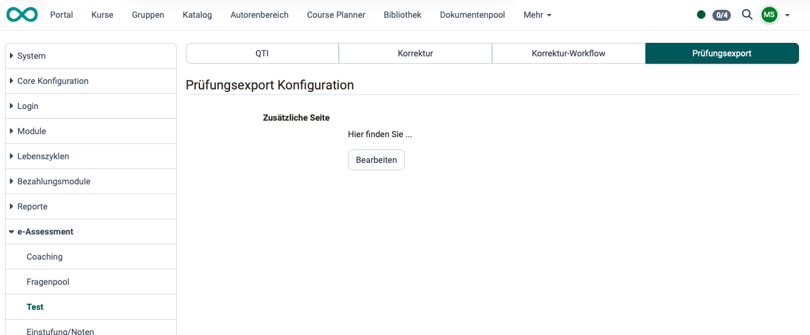

# e-Assessment Administration: Test {: #test}

## Tab QTI  {: #tab_QTI}

{ class="shadow lightbox" }

---

## Tab Korrektur  {: #tab_correction}

Administrator:innen können festlegen, ob das Korrekturwerkzeug für anonyme Korrekturen eingerichtet werden soll.

Ausserdem können sie grundsätzlich festlegen, ob eine Bewertung nach der manuellen Korrektur freigegeben und von Teilnehmer:innen eingesehen werden kann.

{ class="shadow lightbox" }

[Zum Seitenanfang ^](#test)

---

## Tab Korrektur-Workflow  {: #tab_correction-workflow}

Eine Korrektur kann auch durch kurs-externe Betreuer:innen durchgeführt werden. (Diese sind zwar in OpenOlat registriert, aber kein Mitglied im Kurs.) Für diese steht der Korrektur-Workflow zur Verfügung, wenn er hier aktiviert wird.

Für das Management der Korrekturen durch mehrere verschiedene Korrektor:innen benötigt es E-Mails zur Kommunikation. Es können mehrere Mail-Vorlagen an die verschiedenen Akteure in verschiedenen Sprachen vorformuliert werden.

Die angefallenen Korrekturaufwände können verschiedenen Rollen zugänglich gemacht werden.

{ class="shadow lightbox" }

[Zum Seitenanfang ^](#test)

---

## Tab Prüfungsexport  {: #tab_tests_export}

Werden OpenOlat-Prüfungen als handschriftliche Prüfungen ausgegeben, kann eine zusätzliche Seite angehängt werden, die hier definiert wird.

{ class="shadow lightbox" }

[Zum Seitenanfang ^](#test)

---

## Weiterführende Informationen  {: #further_information}

[Bewertungswerkzeug >](../../manual_user/learningresources/Assessment_tool_overview.de.md) 
[Coachingwerkzeug >](../../manual_user/area_modules/Coaching.de.md) 
[Korrektur-Workflow >](../../manual_user/learningresources/Test_settings.de.md#korrektur-workflow) 

[Zum Seitenanfang ^](#test)
