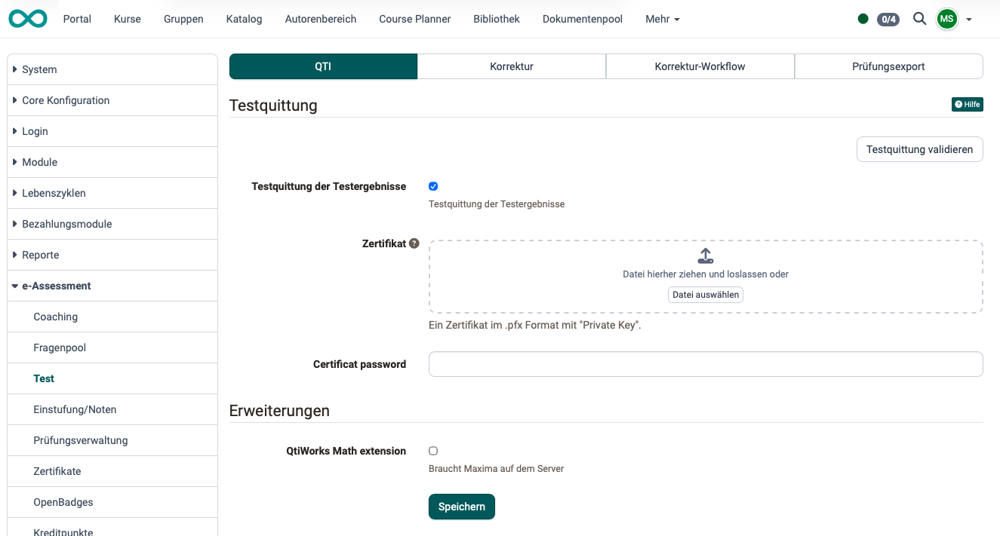
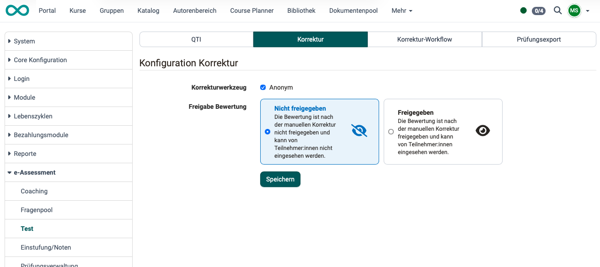
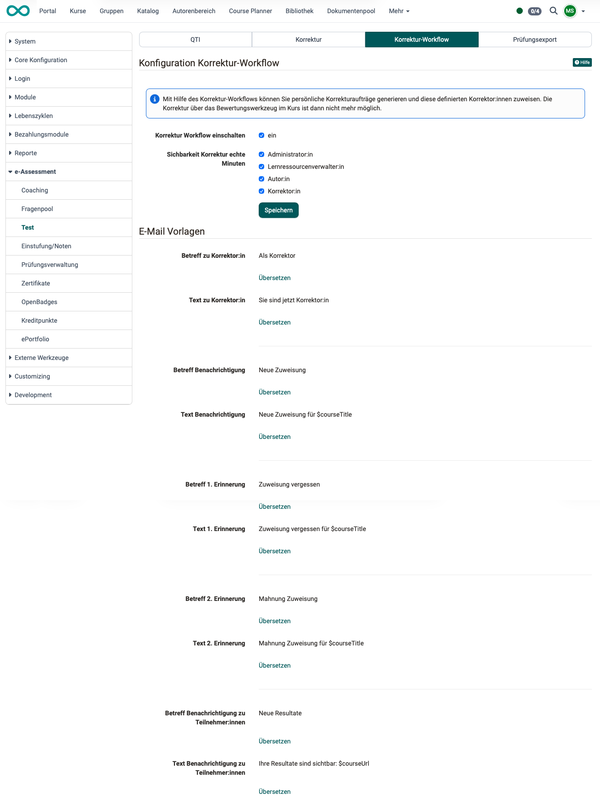
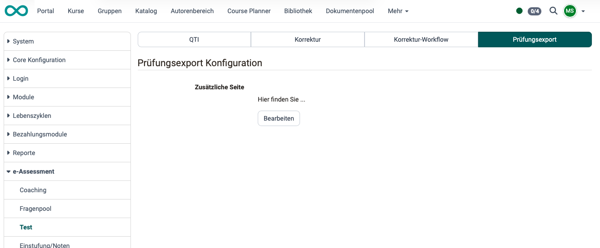

# e-Assessment Administration: Test {: #test}

The test settings are located in the System Administration under `Administration > e-Assessment > Test`, spread across four tabs.

## Tab QTI {: #tab_QTI}

On this tab, a digitally signed test receipt of the test results can be enabled. The signature requires a certificate in .pfx format with a private key and the corresponding password. The test receipt confirms to participants that they completed the test at the stated time.

Under Extensions, the QtiWorks Math extension can be enabled. It requires a Maxima installation on the server.

{ class="shadow lightbox" }

---

## Tab Correction  {: #tab_correction}

Administrators can choose whether to enable the grading tool for anonymous grading.

In addition, you can generally specify whether a grade will be released and made visible to participants after a manual correction.

{ class="shadow lightbox" }

[To the top of the page ^](#test)

---

## Correction workflow tab {: #tab_correction-workflow}

Grading can also be performed by coaches from outside the course. (Although they are registered in OpenOlat, they are not members of the course.) The grading workflow is available to them if it is enabled here.

Emails are needed to coordinate corrections made by several different correctors. Pre-written email templates can be created in different languages for the various stakeholders.

The correction work that has been performed can be made available to various roles.

{ class="shadow lightbox" }

[To the top of the page ^](#test)

---

## Test export tab {: #tab_tests_export}

If OpenOlat exams are printed as handwritten exams, an additional page can be attached, which is defined here.

{ class="shadow lightbox" }

[To the top of the page ^](#test)

---

## Further information {: #further_information}

[Assessment tool - overview >](../../manual_user/learningresources/Assessment_tool_overview.md) 
[Coaching - Overview >](../../manual_user/area_modules/Coaching.md) 
[Test settings - Administration >](../../manual_user/learningresources/Test_settings.md) 

[To the top of the page ^](#test)