# e-Assessment Administration: OpenBadges {: #badges}

OpenBadges sind nach dem OpenBadges-Standard implementiert und voll kompatibel mit diesem.
Weitere Informationen zum Standard finden Sie [hier](https://www.imsglobal.org/activity/openbadges).

## Tab "Konfiguration" {: #tab_config}

* Hier schalten Sie Badges für die gesamte Instanz Ihres OpenOlat ein/aus.
* Ausserdem können LinkedIn-Organisationen, die Badges verwenden, hier hinzugefügt werden.

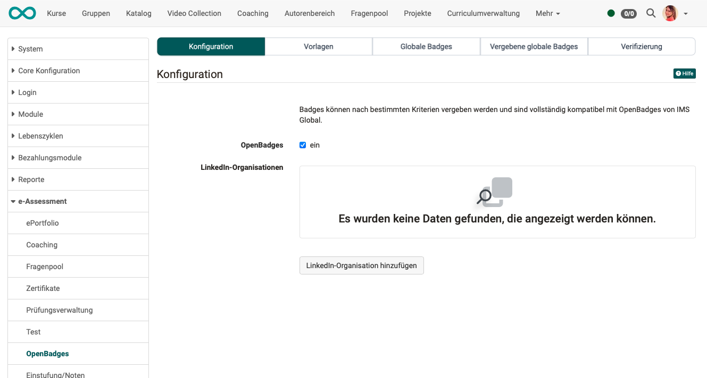{ class="shadow lightbox" }

[Zum Seitenanfang ^](#badges)

---

## Tab "Vorlagen" {: #tab_templates}

Ein Standardset von Vorlagen ist bereits auf der OpenOlat Instanz vorbereitet. 

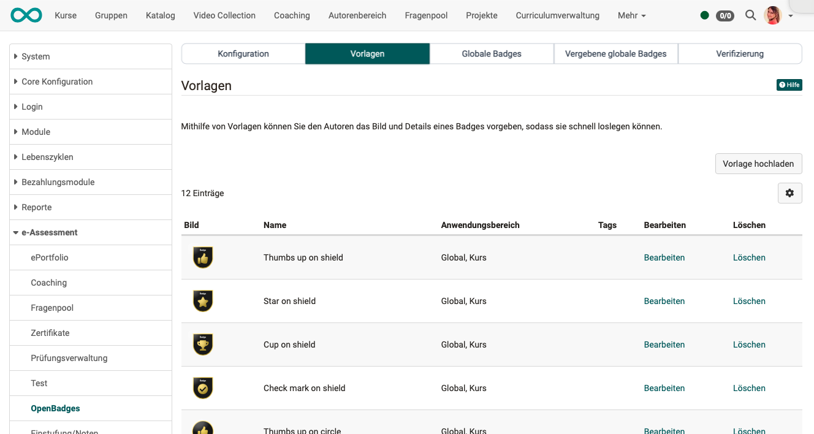{ class="shadow lightbox" }

Weitere Vorlagen können  erstellt werden, indem  Bild, Name und eine Beschreibung der Vorlage spezifiziert wird.

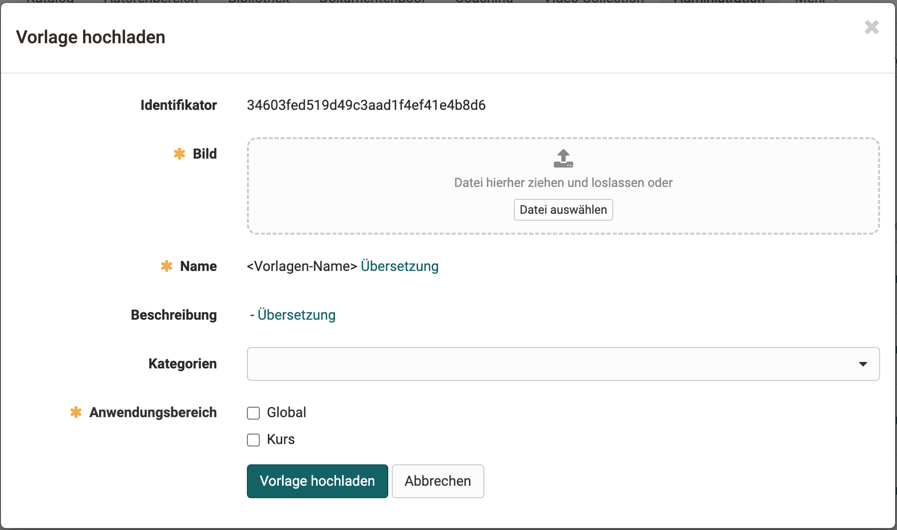{ class="shadow lightbox" }

#### Name {: #name }

Der Name der Vorlage wird im Wizard angezeigt.

#### Beschreibung {: #description }

Die Beschreibung der Vorlage wird automatisch aus der Vorlagen-Übersetzung übernommen und ist hier nicht bearbeitbar.

#### Kategorien {: #categories }

Hier kann man die Vorlagen nach Kategorien einteilen. Badge-Vorlagen mit gleicher Kategorie werden im gleichen Reiter im Wizard angezeigt.

#### Anwendungsbereich {: #scope }

Der Anwendungsbereich legt fest, ob ein Badge global (für das Ausstellen auf Instanzebene) oder für Kurse verfügbar sein soll.

[Zum Seitenanfang ^](#badges)

---

## Tab "Globale Badges" {: #tab_global_badges}

Globale Badges können in einem separaten Tab eingesehen werden, ebenso ihr Status (aktiv / in Vorbereitung) und ob sie bereits vergeben wurden. Sie können auch bearbeitet und gelöscht werden. Globale Badges sind nicht an einen Kurs gebunden.

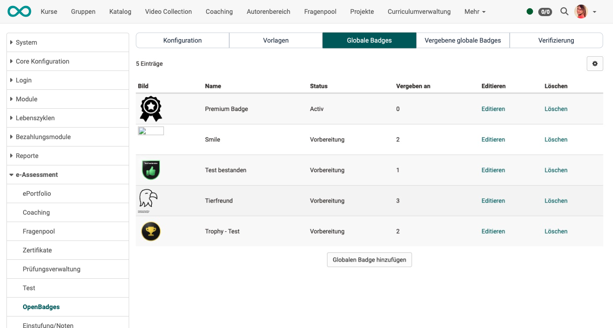{ class="shadow lightbox" }

### Erstellen und Bearbeiten eines globalen Badges

Im Tab "Globale Badges" befindet sich auch der Button "Globalen Badge hinzufügen". Er startet das Badge-Tool (Wizard) mit den folgenden Schritten:

1. **Vorlage**: Der erste Schritt ist die Auswahl einer Vorlage oder das Hochladen eines eigenen Bildes. Derzeit wird SVG unterstützt.
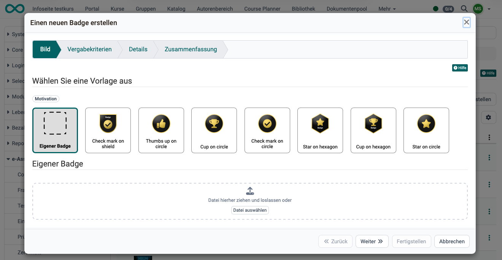{ class="shadow lightbox" }
2. **Anpassung**: Wenn die Vorlage entsprechend erstellt wurde, können Sie Farben und Text während der Erstellung des Badges ändern.
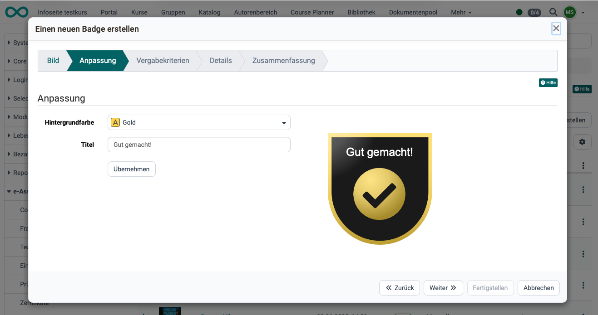{ class="shadow lightbox" }
3. **Vergabekriterien**: Geben Sie die Kriterien und die Erklärung für die von Ihnen gewählten Regeln an. Im Unterschied zu Badges, die von Autor:innen in einem Kurs vergeben werden, können globale Badges z.B. auch kursübergreifend für das Bestehen mehrerer Kurse vergeben werden.
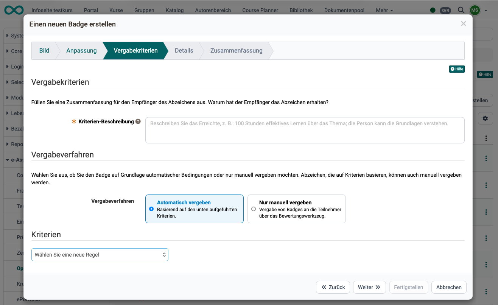{ class="shadow lightbox" }
4. **Details & Validierungszeitraum:** Obligatorische Details sind der Name und die Beschreibung des Badge sowie der Aussteller. Sie können zusätzlich eine URL und einen Kontakt zu den Ausstellereigenschaften hinzufügen. Die Gültigkeitsdauer kann auch so festgelegt werden, dass sie nie abläuft oder z.B. 12 Monate beträgt.
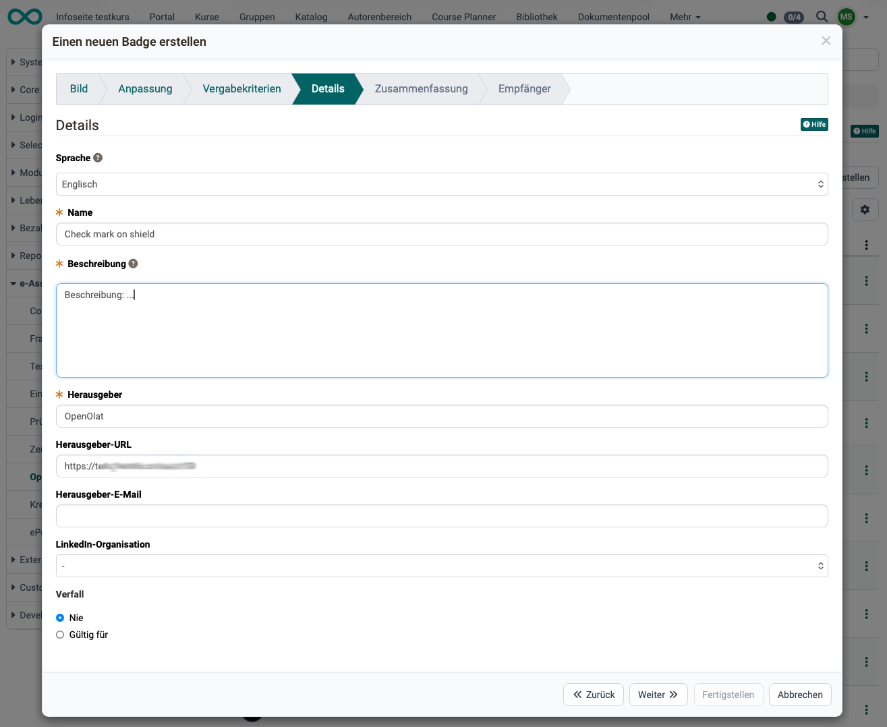{ class="shadow lightbox" }
5. **Zusammenfassung**: Bildschirm mit einer Zusammenfassung der wichtigen Details.
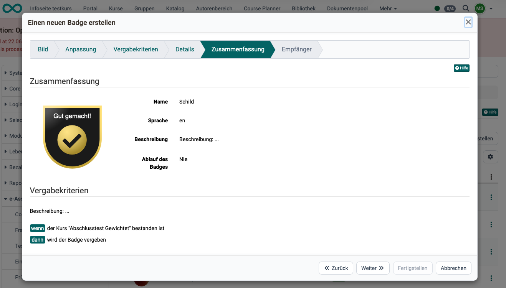{ class="shadow lightbox" }
6. **Empfänger**: Zeigt die Empfänger in einer Tabelle an, um zu sehen, welche Teilnehmer:innen sich bereits gemäss der von Ihnen gewählten Kriterien qualifiziert haben.
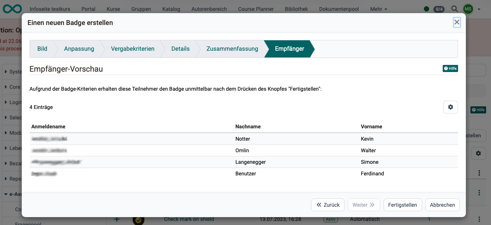{ class="shadow lightbox" }

### Globale Badges manuell vergeben

Die manuelle Vergabe ist möglich unter 
**Administration > e-Assessment > OpenBadges > Tab "Globale Badges" > Badge wählen > Tab Übersicht > Button "Manuell vergeben"**.

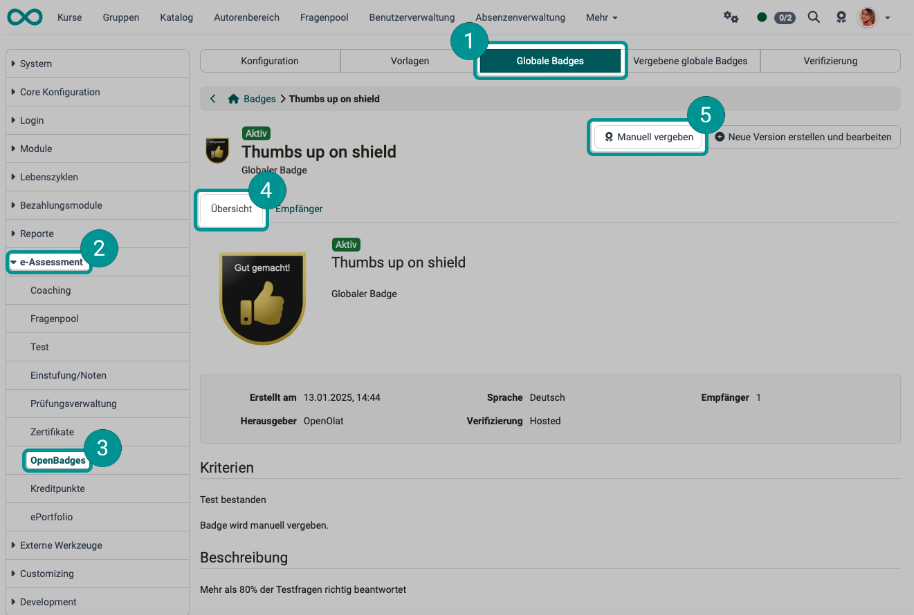{ class="shadow lightbox" }

### Globale Badges automatisch vergeben

Die automatische Vergabe wird während des Erstellens im Wizard eingerichtet.

!!! note "Hinweis"

    Bei der Vergabe eines globalen Badges wird dieser der empfangenden Person zusätzlich automatisch per E-Mail zugestellt, unabhängig davon, ob er manuell oder automatisch vergeben wird.

[Zum Seitenanfang ^](#badges)

---

## Tab "Vergebene globale Badges" {: #tab_awarded}

In diesem Tab werden vergebene **globale Badges** aufgelistet. (Die Kurs-Badges sind hier nicht enthalten.)

!!! note "Hinweis"

    **Kurs-Badges** können durch Betreuer:innen und Besitzer:innen im Bewertungswerkzeug eingesehen werden. Dort können die automatisch vergebenen Kurs-Badges eingesehen und Kurs-Badges manuell vergeben werden.

!!! note "Hinweis"

    Für Kursteilnehmer:innen sind erworbene Badges im Persönlichen Menü aufgelistet. [Hier](../../manual_user/personal_menu/OpenBadges.de.md) mehr dazu.

[Zum Seitenanfang ^](#badges)

---

## Tab "Verifizierung" {: #verification}

Im Tab "Verifizierung" kann eine Badge-Datei hochgeladen werden. (Sie kann einfach per Drag&drop in ein Feld gezogen werden.) Nach Klick auf den Button "Badge verifizieren" prüft OpenOlat, ob es sich um einen rechtmässig ausgestellen Badge handelt.

[Zum Seitenanfang ^](#badges)

---

## Weiterführende Informationen {: #further_information}

[Badges im Bewertungswerkzeug >](../../manual_user/learningresources/OpenBadges.de.md) 
[Persönliche Erfolge/Leistungen: Badges >](../../manual_user/personal_menu/OpenBadges.de.md) 
[Wie vergebe ich in meinem Kurs Badges? >](../../manual_how-to/badges/badges.de.md) 
[Der OpenBadges-Standard >](https://www.imsglobal.org/activity/openbadges) 

[Zum Seitenanfang ^](#badges)
