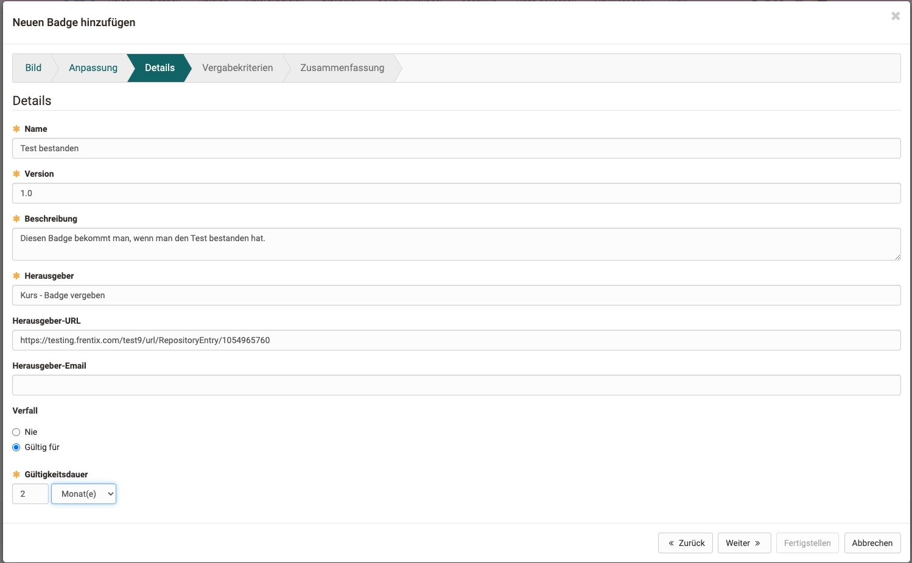

# OpenBadges

OpenBadges sind nach dem OpenBadges-Standard implementiert und voll kompatibel mit diesem.
Weitere Informationen finden Sie hier:

[IMS Global Documentation Site](https://www.imsglobal.org/activity/openbadges)

## Konfiguration

* Schalten Sie Badges für die gesamte Instanz Ihres OpenOlat ein/aus.

## Vorlagen

Es ist ein Standardset von Vorlagen bereits auf der OpenOlat Instanz instanziert. Weitere Vorlagen können  erstellt werden, indem  Bild, Name und eine Beschreibung der Vorlage spezifiziert wird.

### Name

Ist der Anzeigename der Vorlage und wird im Wizard angezeigt.

### Kategorien

Hier kann man die Vorlagen nach Kategorien einteilen. Badge-Vorlagen mit gleicher Kategorie werden im gleichen Reiter im Wizard angezeigt.

### Anwendungsbereich

Der Anwendungsbereich legt fest, ob ein Badge Global (für das Ausstellen auf Instanzebene) oder für Kurse verfügbar sein soll.

## Globale Badges

Globale Badges können hier eingesehen werden. Der Status (aktiv / in Vorbereitung) und ob sie bereits vergeben wurden. Sie können auch bearbeitet und gelöscht werden. Global Badges sind nicht an einen Kurs gebunden und können manuell vergeben werden.

## Erstellen und Bearbeiten eines Badges

1. **Vorlage**: Der erste Schritt ist die Auswahl einer Vorlage oder das Hochladen eines eigenen Bildes. Derzeit wird SVG unterstützt.

2. **Anpassung**: Wenn die Vorlage unter Berücksichtigung von Variablen erstellt wurde, können Sie Farben und Text in einer Vorlage ändern. Mehr Informationen dazu [hier](Link)

3. **Details & Validierungszeitraum:** Obligatorische Details sind der Name, die Version und die Beschreibung des Badge sowie der Aussteller. Sie können zusätzlich eine URL und einen Kontakt zu den Ausstellereigenschaften hinzufügen. Die Gültigkeitsdauer kann auch so festgelegt werden, dass sie nie abläuft oder z. B. 12 Monate beträgt.

4. **Kriterien**: Geben Sie die Kriterien und die Erklärung für die von Ihnen gewählten Regeln an.

5. Zusammenfassung: Bildschirm mit einer Zusammenfassung aller Details.

6. Earners: Zeigt die Earners in einer Tabelle an, um zu sehen, welcher Teilnehmer sich bereits für die von Ihnen gewählten Kriterien qualifiziert.

## Verwendung der Badges

Die Vergabe von Badges wird durch Kursbesitzer:innen in jedem Kurs unter 
**Einstellungen > Tab Bewertung > Abschnitt Badges**  
ermöglicht. Das Recht zur manuellen Vergabe kann hier auch Betreuer:innen gegeben werden.

Wurden Badges aktiviert, ist nach dem nächsten Login in der **Kursadministration** die Option **Badges** vorhanden. Hier können die Vergaberegeln der Badges für den Kurs eingerichtet werden.

Im **Bewertungswerkzeug** können die automatisch vergebenen Badges dann eingesehen oder auch manuell vergeben werden.

Für Kursteilnehmer:innen sind erworbene Badges im Persönlichen Menü aufgelistet. [Hier](https://docs.openolat.org/de/manual_user/personal_menu/OpenBadges) mehr dazu.
