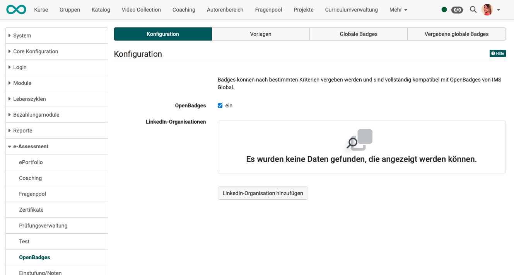

# OpenBadges {: #badges}

OpenBadges sind nach dem OpenBadges-Standard implementiert und voll kompatibel mit diesem.
Weitere Informationen zum Standard finden Sie [hier](https://www.imsglobal.org/activity/openbadges).

## Tab "Konfiguration"

* Hier schalten Sie Badges für die gesamte Instanz Ihres OpenOlat ein/aus.
* Ausserdem können Organisationen, die Badges verwenden, hier hinzugefügt werden.

{ class="shadow lightbox" }

[Zum Seitenanfang ^](#badges)

---

## Tab "Vorlagen"

Ein Standardset von Vorlagen ist bereits auf der OpenOlat Instanz vorbereitet. 

{ class="shadow lightbox" }

Weitere Vorlagen können  erstellt werden, indem  Bild, Name und eine Beschreibung der Vorlage spezifiziert wird.

### Name

Der Name der Vorlage wird im Wizard angezeigt.

### Kategorien

Hier kann man die Vorlagen nach Kategorien einteilen. Badge-Vorlagen mit gleicher Kategorie werden im gleichen Reiter im Wizard angezeigt.

### Anwendungsbereich

Der Anwendungsbereich legt fest, ob ein Badge global (für das Ausstellen auf Instanzebene) oder für Kurse verfügbar sein soll.

[Zum Seitenanfang ^](#badges)

---

## Tab "Globale Badges" {: #global_badges}

Globale Badges können in einem separaten Tab eingesehen werden, ebenso ihr Status (aktiv / in Vorbereitung) und ob sie bereits vergeben wurden. Sie können auch bearbeitet und gelöscht werden. Globale Badges sind nicht an einen Kurs gebunden.

{ class="shadow lightbox" }

### Erstellen und Bearbeiten eines globalen Badges

Im Tab "Globale Badges" befindet sich auch der Button "Globalen Badge hinzufügen". Er startet das Badge-Tool (Wizard) mit den folgenden Schritten:

1. **Vorlage**: Der erste Schritt ist die Auswahl einer Vorlage oder das Hochladen eines eigenen Bildes. Derzeit wird SVG unterstützt.

2. **Anpassung**: Wenn die Vorlage unter Berücksichtigung von Variablen erstellt wurde, können Sie Farben und Text in einer Vorlage ändern.

3. **Details & Validierungszeitraum:** Obligatorische Details sind der Name, die Version und die Beschreibung des Badge sowie der Aussteller. Sie können zusätzlich eine URL und einen Kontakt zu den Ausstellereigenschaften hinzufügen. Die Gültigkeitsdauer kann auch so festgelegt werden, dass sie nie abläuft oder z. B. 12 Monate beträgt.

4. **Kriterien**: Geben Sie die Kriterien und die Erklärung für die von Ihnen gewählten Regeln an.

5. **Zusammenfassung**: Bildschirm mit einer Zusammenfassung aller Details.

6. **Earners**: Zeigt die Earners in einer Tabelle an, um zu sehen, welcher Teilnehmer sich bereits für die von Ihnen gewählten Kriterien qualifiziert.

### Globale Badges manuell vergeben

Die manuelle Vergabe ist möglich unter 
**Administration > e-Assessment > OpenBadges > Tab "Globale Badges" > Button "Badge manuell vergeben"**.

{ class="shadow lightbox" }

### Globale Badges automatisch vergeben

Die automatische Vergabe wird während des Erstellens im Wizard eingerichtet.

[Zum Seitenanfang ^](#badges)

---

## Tab "Vergebene globale Badges"

In diesem Tab werden vergebene **globale Badges** aufgelistet. (Die Kurs-Badges sind hier nicht enthalten.)

!!! note "Hinweis"

    **Kurs-Badges** können durch Betreuer:innen und Besitzer:innen im Bewertungswerkzeug eingesehen werden. Dort können die automatisch vergebenen Kurs-Badges eingesehen und Kurs-Badges manuell vergeben werden.

!!! note "Hinweis"

    Für Kursteilnehmer:innen sind erworbene Badges im Persönlichen Menü aufgelistet. [Hier](../../manual_user/personal_menu/OpenBadges.de.md) mehr dazu.

[Zum Seitenanfang ^](#badges)

---

## Weiterführende Informationen  {: #further_information}

[Badges im Bewertungswerkzeug >](../../manual_user/learningresources/OpenBadges.de.md) 
[Wie vergebe ich in meinem Kurs Badges? >](../../manual_how-to/badges/badges.de.md) 
[Der OpenBadges-Standard >](https://www.imsglobal.org/activity/openbadges) 
