# e-Assessment Administration: OpenBadges {: #badges}

OpenBadges are implemented after the OpenBadges standard and fully compatible with it.
More information [here](https://www.imsglobal.org/activity/openbadges).

## Tab Configuration {: #tab_config}

* Here you can switch badges on/off for the entire instance of your OpenOlat.
* In addition, organizations that use badges can be added here.

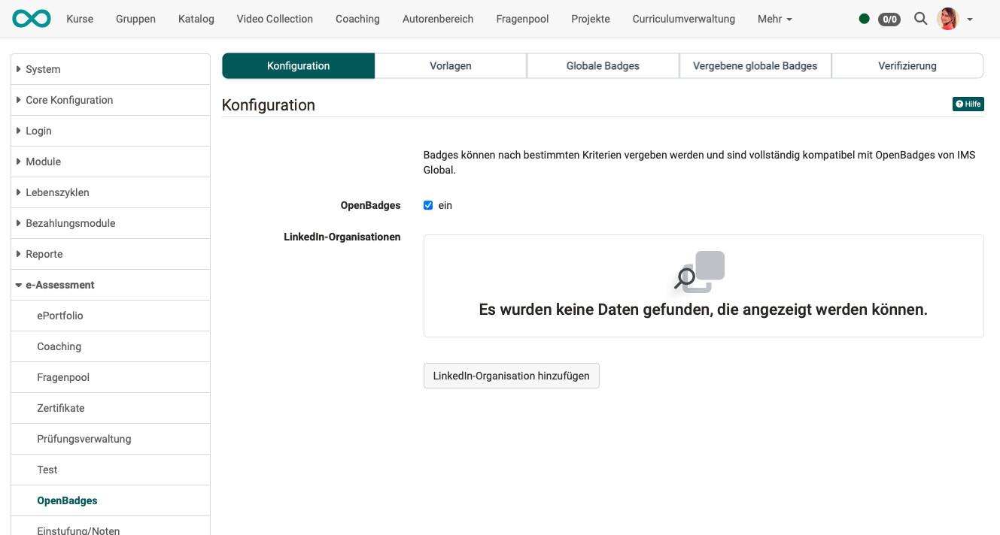{ class="shadow lightbox" }

[To the top of the page ^](#badges)

---

## Tab "Templates" {: #tab_templates}

A standard set of templates is already instantiated on the OpenOlat instance.

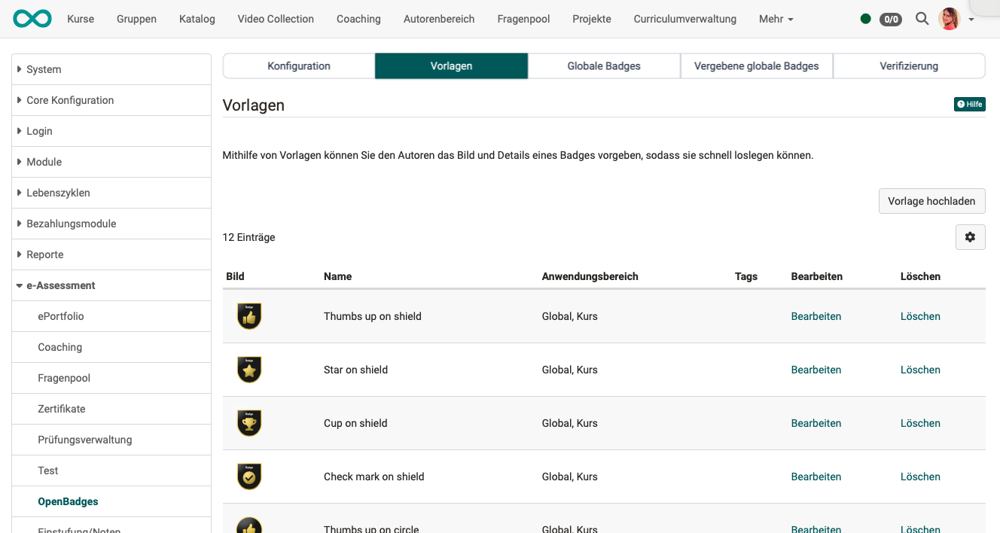{ class="shadow lightbox" }

Additional templates can be created by specifying the image, name and a description of the template.

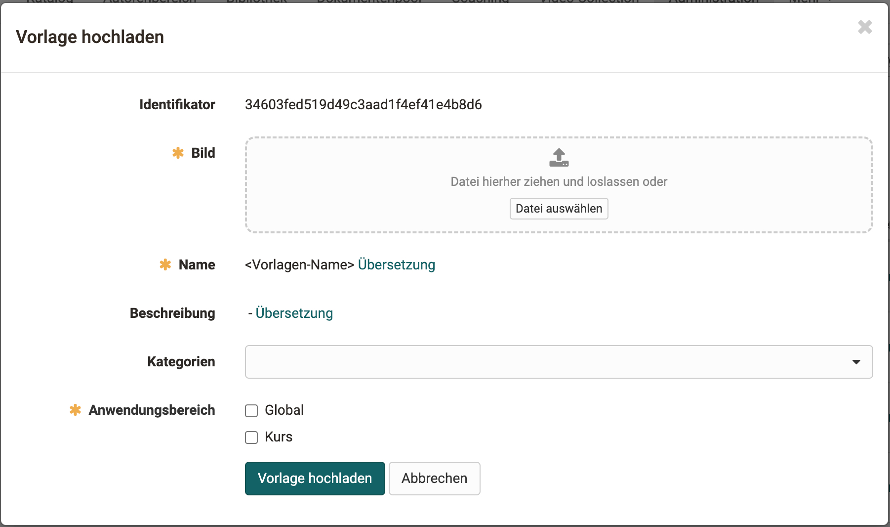

### Name

The display name of the template and is displayed in the wizard.

### Categories

Here you can divide the templates into categories. Badge templates with the same category are displayed in the same tab in the wizard.

### Area of application

The scope defines whether a badge should be available globally (for issuing at instance level) or for courses.

[To the top of the page ^](#badges)

---

## Tab "Global Badges" {: #tab_global_badges}

Global badges can be viewed here. The status (active / in preparation) and whether they have already been awarded. They can also be edited and deleted. Global badges are not linked to a course and can be assigned manually.

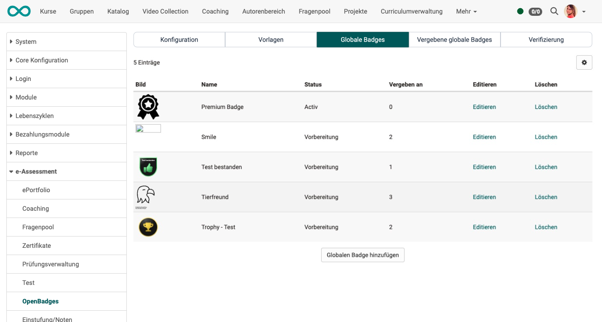{ class="shadow lightbox" }

### Creating and editing a badge

1. **Template**: The first step is to select a template or upload your own image. SVG is currently supported.
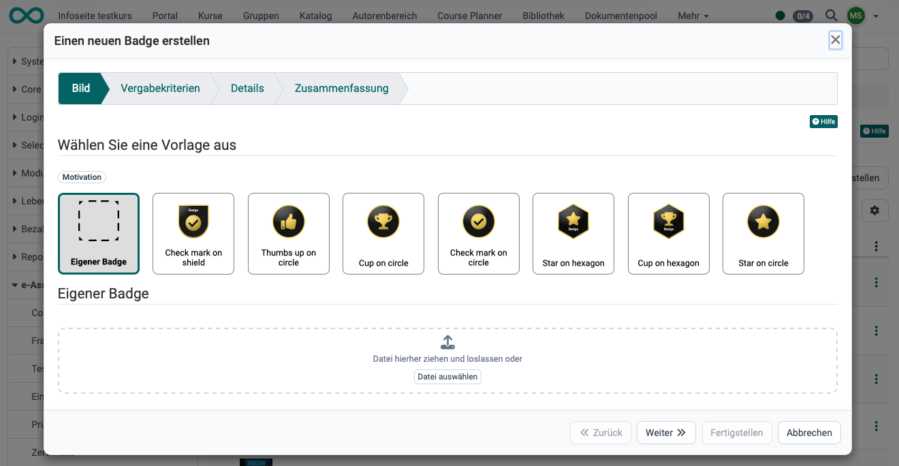{ class="shadow lightbox" }
2. **Customization**: If the template was created accordingly, you can change colors and text while creating the badge.
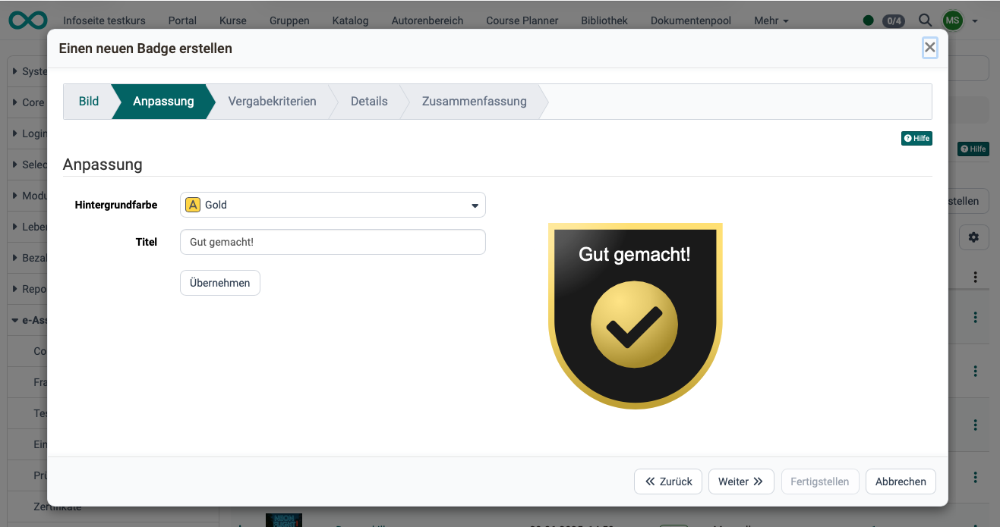{ class="shadow lightbox" }
3. **Award Criteria**: Enter the criteria and explanation for the rules you have chosen. Unlike badges awarded by authors in a course, global badges can, for example, also be awarded across courses for passing multiple courses.
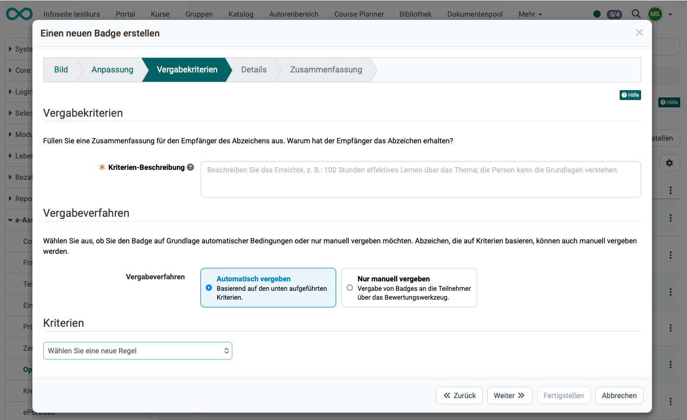{ class="shadow lightbox" }
4. **Details & Validation Period**: Mandatory details are the name, version and description of the badge and the issuer. You can also add a URL and a contact to the exhibitor properties. The validity period can also be set so that it never expires or is 12 months, for example.
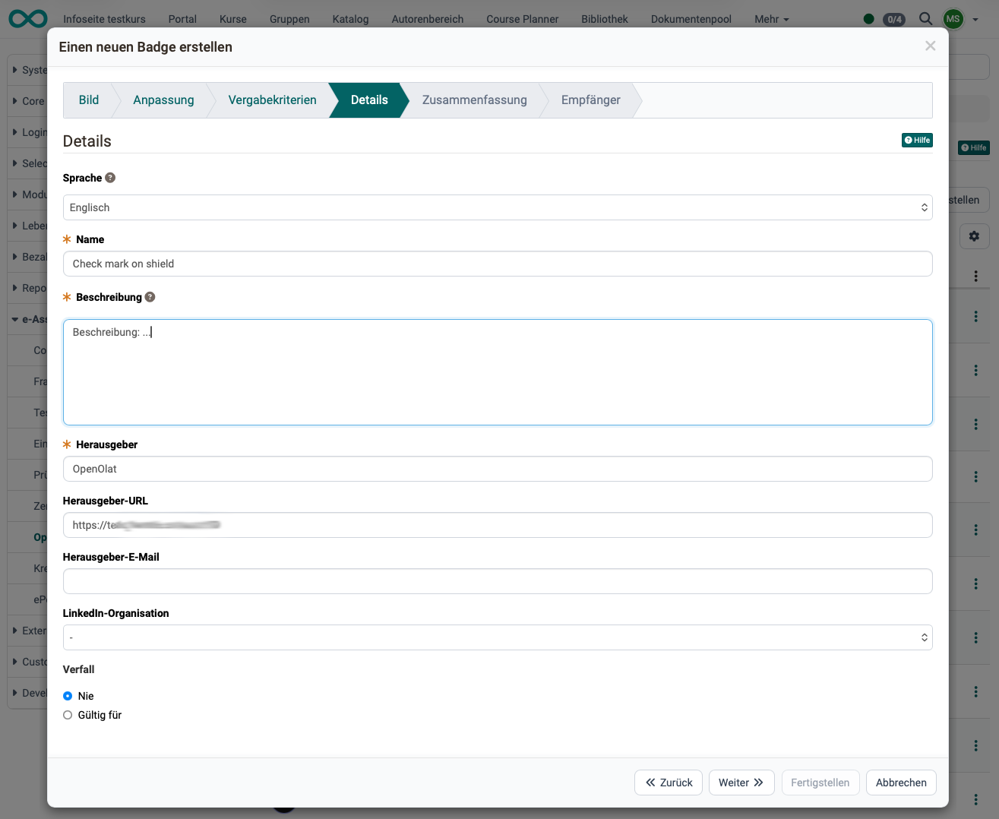{ class="shadow lightbox" }
5. **Summary**: Screen with a summary of the key details.
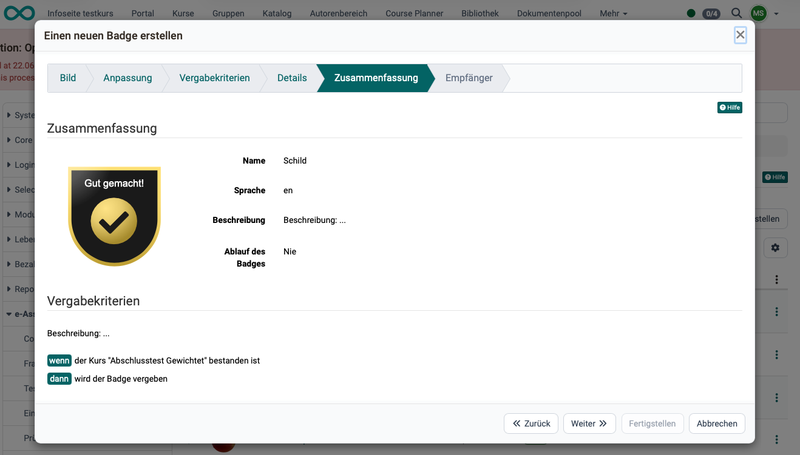{ class="shadow lightbox" }
6. **Earners**: Displays the earners in a table to see which participants already qualify according to the criteria you have selected.
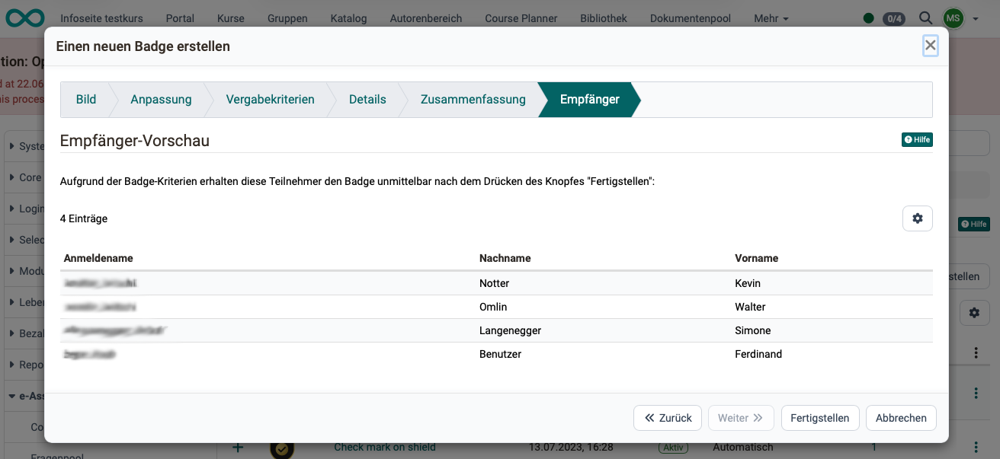{ class="shadow lightbox" }

### Assign global badges manually

Manual assignment is possible under 
**Administration > e-Assessment > OpenBadges > Tab "Global Badges" > Select badge > Tab Overview > Button "Assign manually"**.

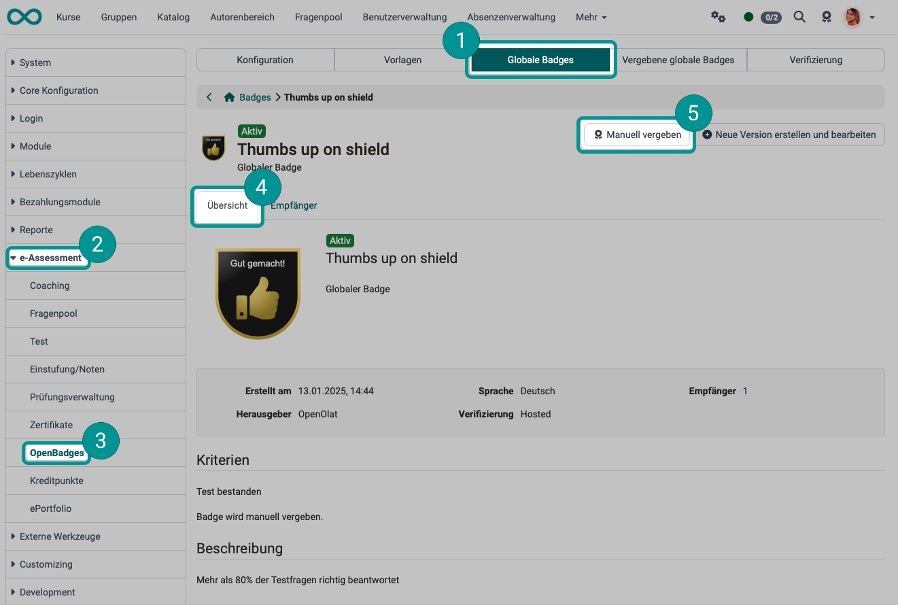{ class="shadow lightbox" }

### Assign global badges automatically

Automatic assignment is set up in the wizard during creation.

!!! note "Note"

    When a global badge is assigned, the recipient is also automatically sent the badge by email, regardless of whether it is assigned manually or automatically.

[To the top of the page ^](#badges)

---

## Tab "Awarded Global badges" {: #tab_awarded}

This tab lists **global badges** that have been awarded. (The course badges are not included here).

!!! note "Note"

    **Course badges** can be viewed by coaches and owners in the assessment tool. The automatically assigned course badges can be viewed there and course badges can be assigned manually.

!!! note "Note"

    For course participants, acquired badges are listed in the personal menu. [Here](../../manual_user/personal_menu/OpenBadges.md) for more information.

[To the top of the page ^](#badges)

---

## Tab "Verification" {: #verification}

In the “Verification” tab, you can upload a badge file. (You can simply drag and drop it into a field.) After clicking the “Verify badge” button, OpenOlat checks whether the badge was issued legitimately.

[To the top of the page ^](#badges)

---

## Further information  {: #further_information}

[Badges in Assessment tool >](../../manual_user/learningresources/OpenBadges.md) 
[How do I award badges in my course? >](../../manual_how-to/badges/badges.md) 
[The OpenBadges standard >](https://www.imsglobal.org/activity/openbadges) 

