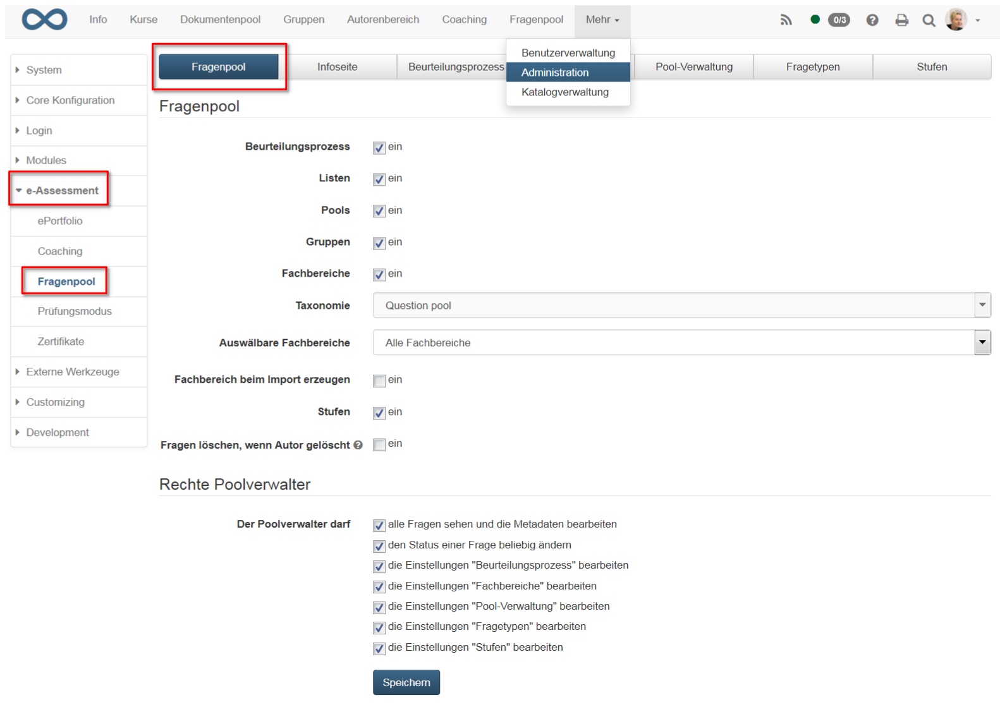

# e-Assessment: Fragenpool

Hier können Sie den Fragenpool aus Sicht des Systemadministrators
konfigurieren. Einige der Einstellungen können auch in der 
[Administration des Poolverwalters](../../manual_user/area_modules/Question_Bank_Administration.md) vorgenommen werden.

{ class="shadow lightbox" }

## Tab Fragenpool

Im ersten Tab Fragenpool werden grundlegende Einstellungen vom Fragenpool
vorgenommen. Es wird definiert, ob der Beurteilungsprozess aktiviert ist und
ob Listen, Pools und Gruppen zur Verfügung stehen sollen. Standardmässig ist
der Beurteilungsprozess ausgeschaltet, Listen, Pools und Gruppen dafür
aktiviert.

Wenn nun beispielsweise die Listen deaktiviert werden, werden im Fragenpool
keine Listen mehr angezeigt und Fragen können nicht mehr zu Listen hinzugefügt
werden. Fragen, welche in Listen waren, sind weiterhin unter "Meine Fragen"
sichtbar, sie werden nicht gelöscht. Wenn die Listen wieder aktiviert werden,
sind dieselben Fragen wie zuvor in den entsprechenden Listen verknüpft. Genau
gleich verhält es sich mit Pools und Gruppen.

Weitere Informationen zum
[Beurteilungsprozess](../../manual_user/area_modules/Question_Bank_Review_Process.de.md) finden Sie im entsprechenden Kapitel.

  * Taxonomie: Jedem Fragenpool ist die Taxonomie "Question pool" zugeordnet. Diese Taxonomie wurde automatisch aus den ehemaligen Fachbereichen erstellt. Änderungen können im Tab "Fachbereiche" vorgenommen werden. Weitere Informationen zur Taxonomie finden Sie [hier](Modules_Taxonomy.de.md).
  * Auswählbare Fachbereiche: Wenn "Alle Fachbereiche" ausgewählt ist, kann bei einer Frage jeder Fachbereich ausgewählt werden, unabhängig von den eigenen Kompetenzen.   
Wenn jedoch "Fachbereiche mit der Kompetenz "Dozieren" oder "Verwalten""
ausgewählt ist, können im Fragenpool die Fragen nur denjenigen Fachbereichen
zugeordnete werden, bei denen man selbst über eine gewissen Kompetenz verfügt.
Diese Kompetenzen werden entweder unter `Administration → Modules → Taxonomie`
oder in der Benutzerverwaltung hinzugefügt.
  * Fachbereich beim Import erzeugen: Fragen können via Excel-Import im Fragenpool hinzugefügt werden. Bei jeder Frage kann als Metadaten der Fachbereich importiert werden. Wenn diese Option aktiviert ist, bedeutet dies, dass durch den Import neue Fachbereiche angelegt werden, sofern diese noch nicht bestehen. Wenn es sich nur um einen Tippfehler handelt, wird auch ein neuer Fachbereich erstellt.
  * Stufen: Hier kann die Verwendung von [Stufen](../administration/Assessment_translate_points_in_grades_admin.de.md) aktiviert werden.
  * Fragen löschen, wenn Autor gelöscht: Wenn der letzte Autor einer Frage aus der Benutzerverwaltung von OpenOlat gelöscht wird, werden alle diese Fragen gelöscht, sofern diese Option hier aktiviert wird. Ansonsten bleiben die Fragen im Fragenpool drin, ohne zugeordneten Autor. Als Systemadministrator können Sie im Fragenpool unter `Fragen → Ohne Autor` all diejenigen Fragen suchen und einen neuen Autor zuordnen.

!!! tip "Tipp"

	Wenn Sie mit einer Taxonomie und Kompetenzen arbeiten, ist es empfohlen, die
	Option "Fachbereich beim Import erzeugen" _nicht_ zu aktivieren. Nur so haben
	Sie die Möglichkeit, einen Wildwuchs der Taxonomiestufen zu vermeiden und die
	Kontrolle und Struktur zu behalten.

### Rechte Poolverwalter

Im Folgenden können die Rechte des Poolverwalters konfiguriert werden. Die
Rolle des Poolverwalters wird in der Benutzerverwaltung vergeben. Das
Bearbeiten der Einstellungen bezieht sich auf die Tabs, die hier in der
Administration sichtbar sind. Der Poolverwalter kann die aktivierten Optionen
in der Administration im Fragenpool bearbeiten.

## Tab Infoseite

Hier können Sie eine Infoseite erstellen. Diese Infoseite wird angezeigt, wenn
man die Site Fragenpool öffnet und sich dann auf der obersten Ebene "Mein
Fragenpool" befindet. Es empfiehlt sich hier beispielsweise eine Erklärung zum
spezifischen Beurteilungsprozess des eigenen Systems zu hinterlegen. Dies
erleichtert den Benutzern des Fragenpools das Zurechtfinden.

## Tab Beurteilungsprozess

{ class="shadow lightbox" }

  * Beurteilungsmethode: Vorerst kann nur die Beurteilungsmethode Untergrenze ausgewählt werden. Bei der Beurteilungsmethode "Untergrenze" wird eine Frage auf den Status "Final" gesetzt, wenn die minimale Anzahl der Bewertungen erreicht ist und alle Bewertungen höher oder gleich hoch sind wie die Untergrenze. Wenn eine Bewertung unterhalb der Untergrenze liegt, dann wird der Status der Frage sofort auf "Revision" gesetzt, auch wenn die minimale Anzahl Bewertungen noch nicht erreicht ist.
  * Anzahl Beurteilungen pro Frage: Diese Anzahl an Personen muss pro Frage eine positive Beurteilung, also oberhalb der Untergrenze, abgeben, damit die Frage in den Status Final wechselt.
  * Untergrenze für positive Beurteilung: Die hier definierte Anzahl Sterne muss von den Beurteilern mindestens vergeben werden, damit die Frage in den Status Final wechseln kann. Wird eine Bewertung unterhalb der Untergrenze vergeben, wird die Frage direkt in den Status Revision gesetzt. 
  * Sichtbarkeit von finalen Fragen: Hier kann definiert werden, wer den Bereich Final und somit die Fragen im Status Final sieht. Dies können entweder nur die Personen mit der Kompetenz "Verwalten" des entsprechenden Fachs sein. Oder aber alle Personen, welche entweder die Kompetenz "Dozieren" oder "Verwalten" des entsprechenden Fachs besitzen.

## Tab Fachbereiche

Hier können neue Fachbereiche hinzugefügt, bearbeitet, zusammengefügt und
gelöscht werden. Weitere Informationen finden Sie unter
[Taxonomie](Modules_Taxonomy.de.md).

## Tab Pool-Verwaltung

Hier können neue Pools erstellt, bearbeitet und gelöscht werden. Pools wie
auch Gruppen ermöglichen es, sich gegenseitig Fragen freizugeben und zu
teilen.

  * **Öffentliche Pools**: Auf diese Pools haben alle Zugriff
  * **Private Pools**: auf diese Pools hat nur Zugriff, wer als Besitzer hinzugefügt worden ist

## Tab Fragetypen

Hier werden alle Fragetypen aufgelistet, welche im Fragenpool auftauchen. Dies sind zum einen die [Fragetypen](../../manual_user/learningresources/Test_question_types.de.md), die im OpenOlat erstellt werden können. Zum anderen sind dies jedoch auch Fragetypen, welche von externen Systemen importiert worden sind. Erstellen Sie hier zusätzliche Fragetypen, wenn die Standard Fragetypen von OpenOlat nicht genügen. Die Standard Fragetypen können nicht gelöscht werden.

## Tab Stufen

Hier können diverse Stufen erstellt werden. In den Metadaten jeder Fragen kann dann diese Stufe oder das Level ausgewählt werden. Hier bieten sich beispielsweise Schwierigkeitsgrade oder Kompetenzstufen an.