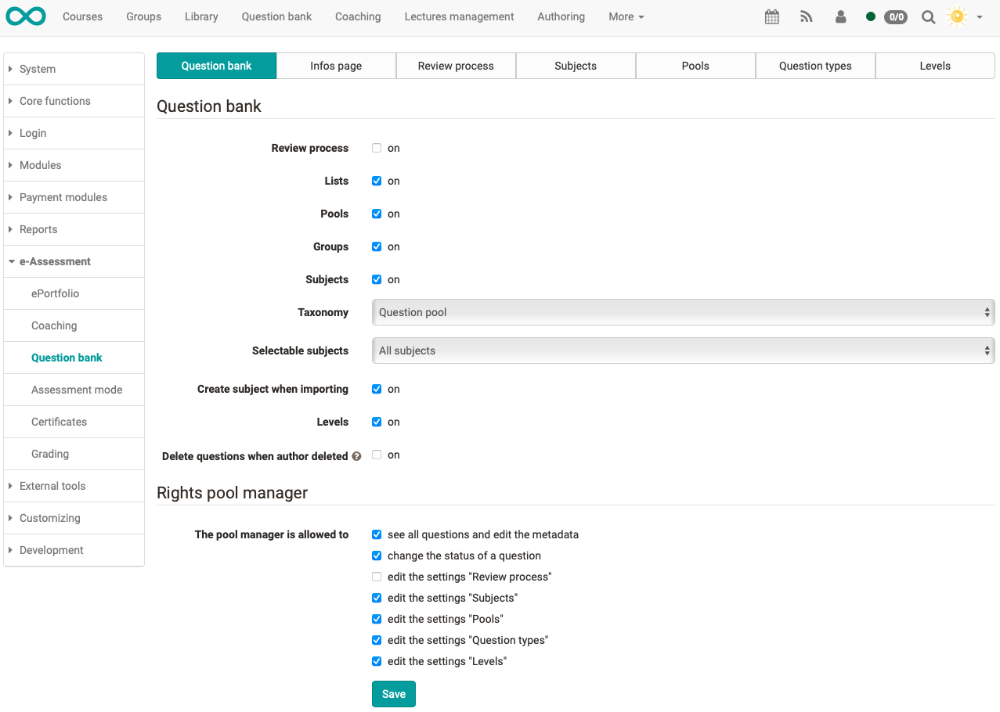
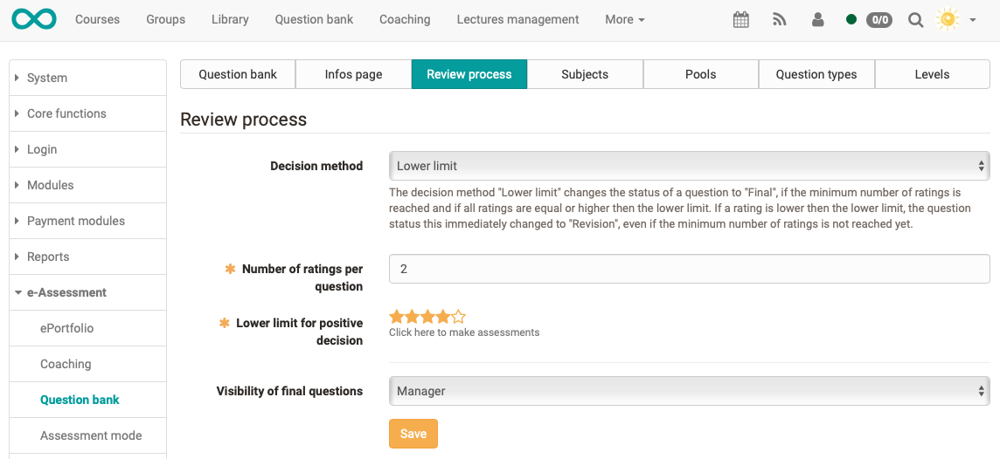

# eAssessment: Question bank

Here you can configure the question pool from the system administrator's point
of view. Some of the settings can also be made in the 
[pool manager's administration](../../manual_user/question_bank/Question_Bank_Administration.md).

{ class="shadow lightbox" }

## Tab Question bank

In the first tab Question bank, basic settings of the question bank are made.
It is defined whether the review process is activated and whether lists, pools
and groups should be available. By default, the review process is switched
off, while lists, pools and groups are activated. This is how the question
pool behaves as in versions 12.2 and older.

For example, if lists are now disabled, lists will no longer be displayed in
the question pool and questions can no longer be added to lists. Questions
that were in lists are still visible under "My questions", they are not
deleted. When the lists are reactivated, the same questions as before are
linked in the corresponding lists. It is exactly the same with pools and
groups.

For more information on the 
[review process](../../manual_user/question_bank/Question_Bank_Review_Process.md), please refer to the corresponding
chapter.

  * Taxonomy: The taxonomy "Question bank" is assigned to each question bank. 
  This taxonomy was automatically created from the former subject. Changes can 
  be made in the "Subjects" tab. More information about the taxonomy can be found 
  [here](Modules_Taxonomy.md).
  * Selectable subjects: When "All subjects" is selected, any subject can be selected 
  for a question, regardless of its own competencies.   
However, if "Subjects with the competence "Teach" or "Manage"" is selected, in  
the question bank the questions can only be assigned to those subjects in  
which one has a certain competence oneself. These competences are added either  
under `Administration → Modules → Taxonomy` or in the user administration.

  * Create subject when importing: Questions can be added to the question bank via Excel import. For each question, the subject can be imported as metadata. If this option is activated, it means that new subjects will be created by the import, if they do not already exist. If it is just a typo, a new subject will also be created.
  * Levels: The use of [levels](../../manual_user/question_bank/Question_Bank_Administration.md) can be activated here.
  * Delete questions when author deleted: If the last author of a question is deleted from the user administration of OpenOlat, all these questions will be deleted, if this option is activated here. Otherwise, the questions remain in the question bank, without an assigned author. As a system administrator, you can search for all those questions in the question bank under `Questions → Without author` and assign a new author.

!!! tip
	If you work with a taxonomy and competencies, it is recommended not to
	activate the "Create subject when importing" option. This is the only way to
	avoid a wild growth of taxonomy levels and to keep the control and structure.

### Pool manager rights

In the following, the rights of the pool manager can be configured. The role
of the pool manager is assigned in the user administration. Editing the
settings refers to the tabs that are visible here in the administration. The
pool manager can edit the activated options in the administration in the
question bank.

## Tab Info page

Here you can create an info page. This info page is displayed when you open
the Question bank site and then go to the top level "My question bank". It is
advisable to store here, for example, an explanation of the specific review
process of one's own system. This makes it easier for the users of the
question bank to find their way around.

## Tab Review process

{ class="shadow lightbox" }

  * Decision method: For the time being, only the assessment method Lower limit can be selected. The decision method "Lower limit" changes the status of a question to "Final", if the minimum number of ratings is reached and if all ratings are equal or higher than the lower limit. If a rating is lower than the lower limit, the question status this immediately changed to "Revision", even if the minimum number of ratings is not reached yet.
  * Number of ratings per question: This number of people must give a positive rating per question, i.e. above the lower limit, for the questions to change to Final status.
  * Lower limit for positive assessment: The minimum number of stars defined here must be awarded by the assessors for the question to change to the Final status. If a rating below the lower limit is awarded, the question is set directly to Revision status. 
  * Visibility of final questions: Here you can define who sees the Final section and thus the questions in Final status. This can be either only the persons with the competence "Manage" of the corresponding subject. Or all persons who have either the competence "Teach" or "Manage" of the corresponding subject.

## Tab Subjects

Here you can add, edit, merge and delete new subjects. For more information,
see [Taxonomy](Modules_Taxonomy.md).

## Tab Pools

New pools can be created, edited and deleted here. Pools as well as groups
allow to share questions with each other.

  * **Public pools**: everyone has access to these pools
  * **Private" pools**: only those who have been added as owners have access to these pools

## Tab Question types

All question types that appear in the question bank are listed here. On the
one hand, these are the [question types](../../manual_user/learningresources/Test_question_types.md) 
that can be created in OpenOlat. On the
other hand, these are also question types that have been imported from
external systems. Create additional question types here if the standard
question types of OpenOlat are not sufficient. The default question types
cannot be deleted.

## Tab Levels

Various levels can be created here. The level can then be selected in the
metadata of each question. For example, difficulty levels or competence levels
are available here.

  

