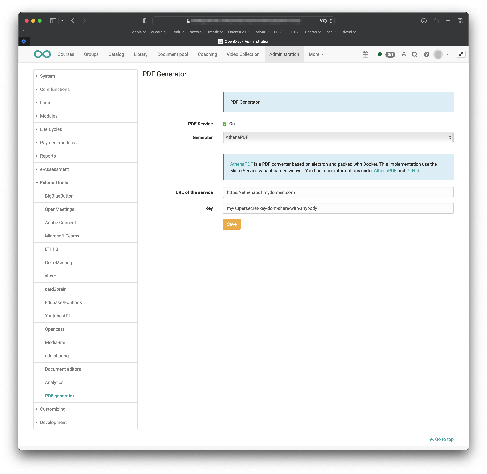

# Install AthenaPDF

## PDF Service

OpenOlat can generate PDF's, e.g. for downloadable test results overview or certificates. 
In order to generate those PDF's a PDF service must be installed and configured properly. We use [AthenaPDF](https://www.athenapdf.com) for this purpose. 

AthenaPDF allows us to use HTML as the description language for PDF's and to style the PDF with simple print CSS rules 
using the powerful Google Chrome render engine. 

A benefit of this approach is that the styling of the generated PDF's can easily be customised using the theme mechanism. 

## Get AthenaPDF

[AthenaPDF](https://www.athenapdf.com) can be downloaded from the [AthenaPDF GitHub repository](https://github.com/arachnys/athenapdf/tree/master/weaver).

## Run AthenaPDF in Docker

Start AthenaPDF as a docker container with a command like this:

	docker run --shm-size 2G -p 8090:8080 -d --security-opt seccomp=unconfined -e WEAVER_MAX_CONVERSION_QUEUE=5000 -e WEAVER_MAX_WORKERS=10 -e WEAVER_AUTH_KEY=<my auth key> -e WEAVER_ATHENA_CMD='athenapdf --stdout --delay 5000' --restart always arachnysdocker/athenapdf-service

- `--delay 5000` depends on the complexity of math formulas used in tests when printing test results
- `-d --security-opt seccomp=unconfined-d --security-opt seccomp=unconfined` is of course not recommended but often necessary

Make sure you have enough RAM assigned to the docker container. 

## Configure OpenOlat

Open `Administration > External Tools > PDF generator` 

- The URL is the URL of your docker container
- The key is the `<my auth key>` that you used in the launch command above

{ class="lightbox" }

## Security
 
Make sure the AthenaPDF docker is only reachable by the IP address of your OpenOlat instance and to block all other requests. The PDF service is only
use by OpenOlat to generate the PDF, the delivery of the PDF's is done by OpenOlat. Client never need to call AthenaPDF. 
