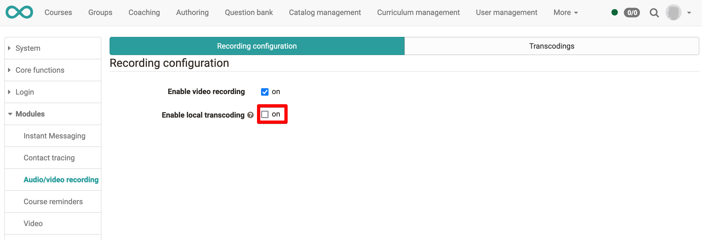

# Local installation of HandBrakeCLI

When a user makes a video recording, the video is saved directly in OpenOlat like a video upload. 

Not all browsers are able to produce video files that are fully supported by the browser itself and by other 
browsers. In some constellations, video files produced by one browser are not supported at all on other 
browsers. We have found that the proven **mp4** format with the **h246** video codec is fully supported for playback on
all browsers. Therefore, video files that are not loaded in this format from the browser to the server are
converted to such **mp4** files.

We use HandBrakeCLI to perform the conversion from files such as **webm** to **mp4**.

When using a hosting package of OpenOlat, your installation is managed, and you have to contact
your OpenOlat hosting partner to activate the video conversion using HandBrakeCLI.

When you host OpenOlat yourself, you can set up and use a local installation of HandBrakeCLI.

## Get HandBrakeCLI

You can install the tool on a Ubuntu server running OpenOlat. As root, execute:

```
apt-get update
apt install handbrake-cli
```

You can also download HandBrakeCLI from the supplier of the tool:

[HandBrake Command Line Download](https://handbrake.fr/downloads2.php)

## Configure local conversion

Open `Administration > Modules > Audio/video recording`. If you host and manage OpenOlat yourself, 
you can check the box `Enable local video conversion`:

{ class="lightbox" }

If OpenOlat can't find HandBrakeCLI in its path, you can try to set the HandBrakeCLI executable
in the `olat.local.properties` file:

```
av.handbrakecli.path=/usr/bin/HandBrakeCLI
```

You need to restart the OpenOlat server after making this change to the `olat.local.properties` file.