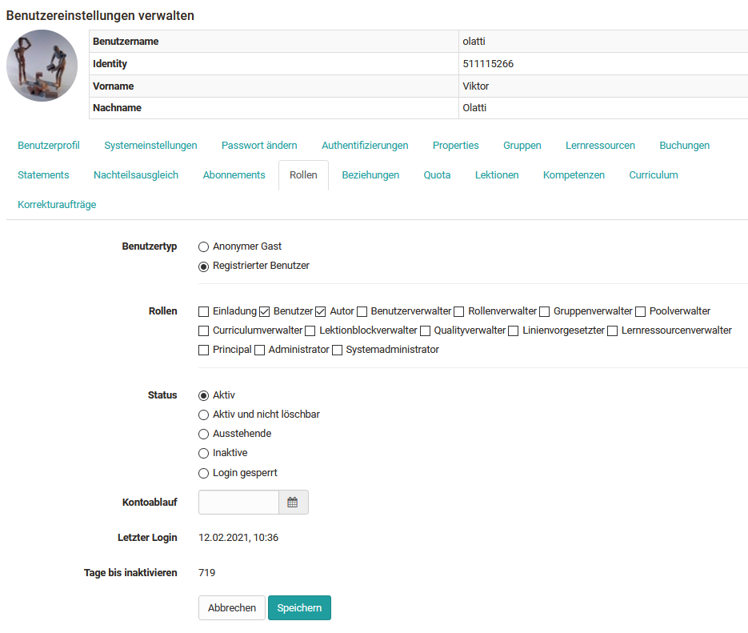

# Rollen zuweisen

Sobald ein User erstellt wurde und ein Account angelegt wurde, kann dieser
weiter konfiguriert werden. Eine wichtige Einstellung ist die Zuordnung der
gewünschten Rolle(n).

Gehen Sie als Benutzerverwalter in die Benutzersuche und wählen Sie die
gewünschte Person. So gelangen Sie zu den Benutzereinstellungen. Hier stehen
verschiedene Reiter zur Verfügung. Wählen Sie "Rollen" und ordnen Sie die
gewünschte [Rolle](../../../manual_user/basic_concepts/Roles_Rights) zu.

## Benutzereinstellungen verwalten

{ class="shadow lightbox" }

!!! info

    Weitere Einstellungen im Rollenkontext können in den Reitern Beziehungen, Gruppen und Lernressourcen vorgenommen werden.
