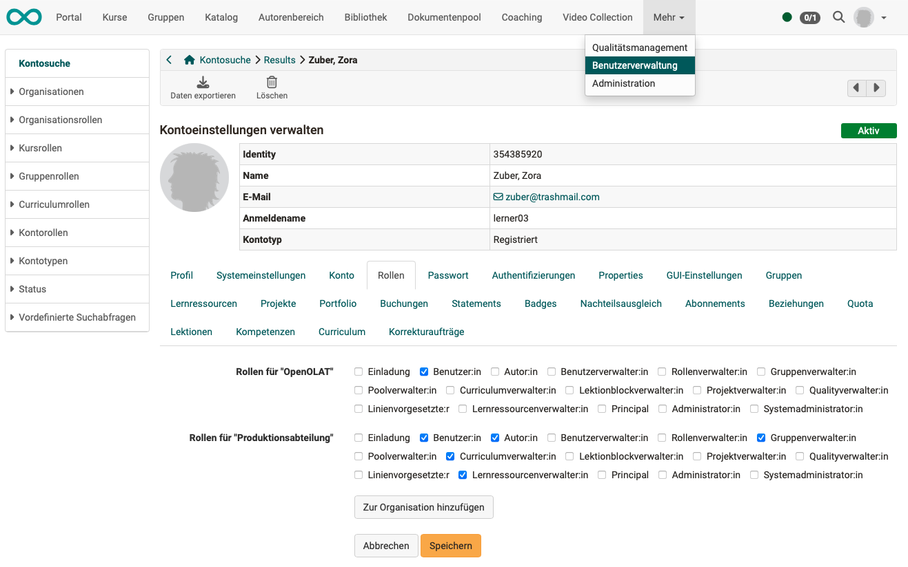

# Rollen zuweisen

Sobald eine Person erfasst und ihr Konto angelegt wurde, lässt sich dieses weiter konfigurieren. Eine wichtige Einstellung ist die Zuordnung der gewünschten Rolle(n).

Gehen Sie als Benutzerverwalter:in in die Benutzersuche und wählen Sie die gewünschte Person. So gelangen Sie zu den Benutzereinstellungen. Hier stehen verschiedene Reiter zur Verfügung. Wählen Sie "[Rollen](../../../manual_user/basic_concepts/Roles_Rights)" und ordnen Sie die gewünschte Rolle zu.

## Rollen in einer Organisation

Ist das Modul "Organisationen" aktiviert, können unterschiedliche Rollen pro Organisation vergeben werden. Verwenden Sie dazu den Button "Zur Organisation hinzufügen". 

{ class="shadow lightbox"}

!!! info

    Weitere Einstellungen zu den Rollen nehmen Sie in den Reitern "Beziehungen", "Gruppen" und "Lernressourcen" vor.
