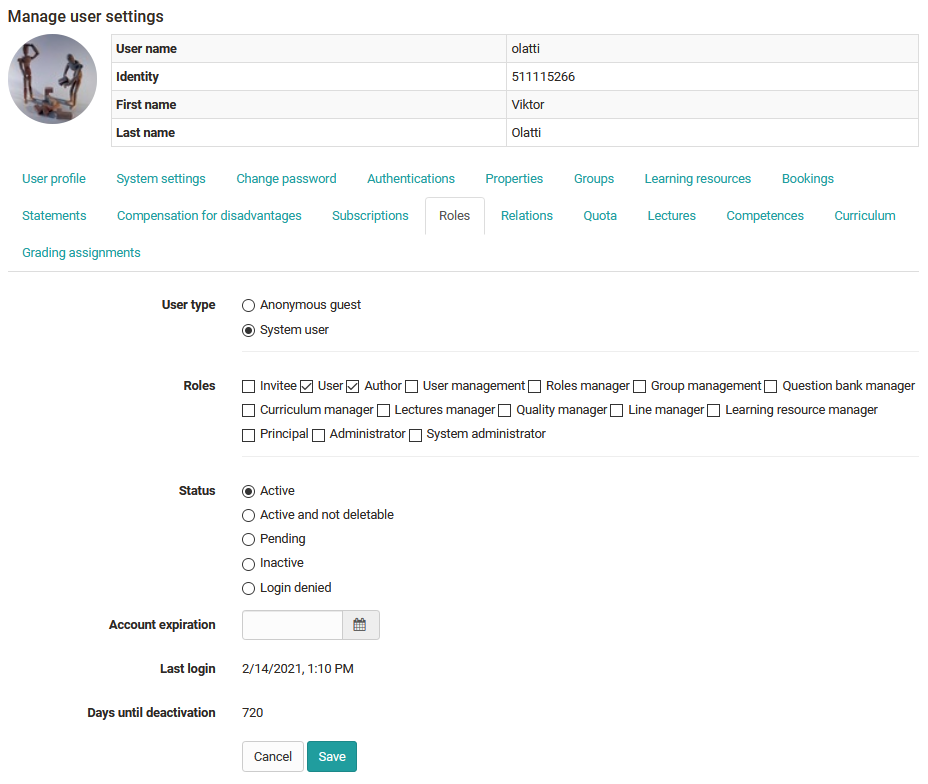

# Assign roles

As soon as a user has been created and an account has been set up, it can be configured further. An important setting is the assignment of the desired role(s).

As the user administrator, go to the user search and select the desired person. This will take you to the user settings. Various tabs are available here. Select "[Roles](../../../manual_user/basic_concepts/Roles_Rights)" and assign the desired role.

## Roles in an organizational unit

If the "Organizational units" module is activated, different roles can be assigned per organizational unit. To do this, use the "Add to organization" button. 

{ class="shadow lightbox" }

!!! info

	Further settings in the role context can be made in the "Relationships", "Groups" and "Learning resources" tabs.
