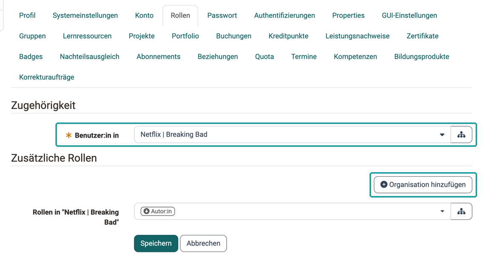

# Assign roles {: #assign_roles}

As soon as a person has been created and their account has been set up, it can be configured further. An important setting is the assignment of the desired role(s).

Search for the desired person in the user management and open their account: 
`User management > "Name of the person" > Roles` 
This takes you to the page "Manage user settings". Various tabs are available here. Select "[Roles](../../manual_user/basic_concepts/Roles_Rights.md)" and assign the desired role.

The user manual describes which rights a role brings with it: [Which roles are available?](../../manual_user/basic_concepts/Roles.md) for the organisation roles and [Authorisation in courses](../../manual_user/basic_concepts/Authorisation_Concept.md) for the roles in a course.

Which roles you can assign depends on your own role. User managers assign the roles User and Author. Roles managers assign the administrative roles of the organisation as well as Group manager and Question bank manager. The roles Principal, Administrator and System administrator are assigned only by administrators.

## Roles in an organisation

If your instance works with several organisations, you give a person their own roles in each organisation, for example Author in one and only User in the other. The prerequisite is that the "Organisations" module is switched on.

### Affiliation and additional roles [:octicons-tag-16:{ title="from Release 20.0.3 (OO-8610)" }](https://track.frentix.com/issue/OO-8610) {: #affiliation_additional_roles}

With the "Organisations" module switched on, the "Roles" tab is divided into two sections. This way you see separately where the person belongs and which additional tasks they take on.

In the "Affiliation" section, you use the "User in" field to select in which organisations the person has the role User. At least one organisation is mandatory.

In the "Additional roles" section, each organisation of the person has its own selection list "Roles for "Organisation"". If the person has no further role there, the list shows "No additional role selected". You add a further organisation with the "Add organisation" button. The button appears as long as there are organisations that you manage and that the account does not have yet.

If the "Organisations" module is switched off, the tab only shows the "Additional roles" section with a single selection list "Roles".

{ class="shadow lightbox"}

!!! note "Note"

	Further settings for the roles can be made in the "Relationships", "Groups" and "Learning resources" tabs.

## Role history [:octicons-tag-16:{ title="from Release 20.0.4 (OO-6304)" }](https://track.frentix.com/issue/OO-6304) {: #role_history}

If you want to trace who gave a person a role or withdrew it, and when, you find this under the roles in the "Role history" section. Each change appears there as a separate row.

The table shows the columns "Date", "Role", "Inheritance", "Activity", "Original value", "New value", "Administrative comment" and "User" with the person who made the change. With the "Organisations" module switched on, the column "Organisation" is added.

Use the tabs "All", "7 days", "4 weeks" and "12 months" to narrow down the period. In addition, you can filter by "Role", "Organisations" and "Date", or use "Not inherited" to show only the directly assigned roles. The table can be downloaded as an Excel file.

[To the top of the page ^](#assign_roles)

## Further information {: #further_information}

**Mentioned on this page** 
[Roles and Rights: Overview >](../../manual_user/basic_concepts/Roles_Rights.md) 
[Roles and Rights: Which roles are available? >](../../manual_user/basic_concepts/Roles.md) 
[Roles and Rights: Authorisation in courses >](../../manual_user/basic_concepts/Authorisation_Concept.md)

**Further reading** 
[Configure user >](Configure_User.md) 
[User search >](Search_Users.md) 
[Module Organisations >](../administration/Modules_Organisations.md) 
[Roles and Rights: Assign roles >](../../manual_user/basic_concepts/Assign_Roles.md)

[To the top of the page ^](#assign_roles)
