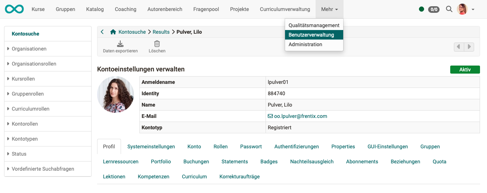

# Benutzer konfigurieren {: #user_configuration} 

Wer das Recht zur Benutzerverwaltung besitzt, kann über die Benutzersuche eine bestimmte Person suchen und für sie weitere Konfigurationen vornehmen. 

Zu jedem/jeder Benutzer:in stehen maximal die im Folgenden aufgeführten Reiter für die Konfiguration zur Verfügung (Administrator:innen). Je nach Rollen und aktivierten Modulen sind es evtl. weniger Reiter.

{ class="shadow lightbox"}

### Profil

Im Benutzerprofil werden die Personalien, Angaben zur Person, Kontaktdaten und Angaben zur Institution erfasst. (Siehe Persönliches Menü > Konfiguration > [Profil](../../manual_user/personal_menu/Profile.de.md)). Ferner sind die vom User eingetragenen Informationen zur Person, sowie die jeweilige Visitenkarte und das gewählte persönliche Bild/Foto sichtbar. Zu den verbindlichen Einträgen des Benutzerprofils gehören: Anmeldename, Vorname, Nachname und E-Mail. Soll der Versand von Mails an diese Adresse unterbunden werden, kann diese E-Mailadresse gesperrt werden.

[zum Seitenanfang ^](#user_configuration)

### Systemeinstellungen

Hier werden die vom User vorgenommenen Systemeinstellungen angezeigt (Siehe Persönliches Menü > Konfiguration > [Einstellungen](../../manual_user/personal_menu/Settings.de.md)).  
Dazu gehört z.B. die voreingestellte Sprache und ob E-Mails nur OpenOlat-intern oder auch an die Adresse im Profil verschickt werden. 

[zum Seitenanfang ^](#user_configuration)

### Konto

Hier ist z.B. der letzte Login ersichtlich und das Konto des/der Benutzer:in kann auf inaktiv gesetzt werden.  

[zum Seitenanfang ^](#user_configuration)

### Rollen

In diesem Reiter werden die Rollen des/der Benutzer:in definiert. Bei aktiviertem Modul Organisationseinheiten können unterschiedliche Rollen pro Organisationseinheit vergeben werden. Siehe ["Rollen zuweisen"](Assign_roles.de.md). 

[zum Seitenanfang ^](#user_configuration)

### Passwort ändern

Hier kann ein neues Passwort direkt gesetzt oder ein Passwortlink generiert werden, der dem/der User:in dann per Mail zugeschickt wird, so dass er/sie selbst ein neues Passwort setzen kann. 
Der Abschnitt "Passwortlink senden für OpenOlat Passwort" wird nur angezeigt, sofern es dem/der Benutzer:in
erlaubt ist, das Passwort zu ändern. 

[zum Seitenanfang ^](#user_configuration)

### Authentifizierungen

Hier kann der Anmeldename geändert, sowie Authentifizierungen ergänzt, editiert und gelöscht werden.  

[zum Seitenanfang ^](#user_configuration)

### Properties

Hier können User Properties angezeigt und als Tabelle exportiert werden.

[zum Seitenanfang ^](#user_configuration)

### GUI-Einstellungen

Hier können die zu dem/der Benutzer:in gespeicherten Einstellungen des GUI zurückgesetzt werden.

[zum Seitenanfang ^](#user_configuration)

### Gruppen

Es wird eine Übersicht über alle Gruppen angezeigt, bei denen der/die Benutzer:in als Teilnehmer:in oder Betreuer:in dabei ist. Unter diesem Reiter kann der/die User:in auch weiteren Gruppen zugeordnet oder aus einer Gruppe ausgetragen werden.

[zum Seitenanfang ^](#user_configuration)

### Lernressourcen

Dieser Reiter generiert eine Übersicht mit allen Kursen und Lernressourcen des Users/der Userin.
Benutzerverwalter:innen und Administrator:innen können die User:innen aus den jeweiligen Lernressourcen austragen, sowie die jeweiligen Lernressourcen aufrufen. Umgekehrt kann der/die User:in als Besitzer:in, Betreuer:in oder Teilnehmer:in in weitere OpenOlat-Kurse eingetragen werden.  

[zum Seitenanfang ^](#user_configuration)

### Portfolio

Hier werden alle Portfolio-Mappen angezeigt, zu welchen der/die Benutzer:in eingeladen ist. (Die eigenen Mappen dieses/dieser Benutzer:in werden hier nicht gelistet.)

[zum Seitenanfang ^](#user_configuration)

### Buchungen

Hier werden die Buchungen und Vorbestellungen des Users angezeigt. 

[zum Seitenanfang ^](#user_configuration)

  
### Statements

Hier werden die Leistungsnachweise, Punkte und der Fortschritt eines/einer Benutzer:in angezeigt. Auch anderweitig erworbene Zertifikate können hochgeladen werden, um in OpenOlat einen Überblick über den gesamten Leistungsnachweis zu erhalten.  

[zum Seitenanfang ^](#user_configuration)

### Badges

Unter diesem Reiter werden alle erworbenen Badges angezeigt.

[zum Seitenanfang ^](#user_configuration)

### Nachteilsausgleich

Ein Nachteilausgleich berechtigt Teilnehmende einer Prüfung für einen Test aufgrund einer Einschränkung mehr Zeit zu verwenden. Unter diesem Reiter kann ein Nachteilsausgleich hinzugefügt und konfiguriert werden.

{ class="shadow lightbox" }

[zum Seitenanfang ^](#user_configuration)

### Abonnements

Hier werden sämtliche Abonnements eines Benutzers/einer Benutzerin angezeigt. Sie können hier auch deaktiviert oder gelöscht werden.  

[zum Seitenanfang ^](#user_configuration)

### Beziehungen

In diesem Reiter können Beziehungen zwischen dem/der gewählten User:in und weiteren OpenOlat-Benutzer:innen definiert werden. Z.B. ob jemand Vorgesetzter, Elternteil, Ausbildungsverantwortliche oder Schüler:in eines Lehrers/einer Lehrerin ist. Voraussetzung ist, dass generell eine Systematik verwendet wird. (Vergl. [Benutzerrollen](index.de.md))

[zum Seitenanfang ^](#user_configuration)

### Quota

Hier kann eine individuelle Quota eingerichtet werden, um z.B. einer Person mit besonderen Aufgaben mehr Upload-Möglichkeit zu geben.

[zum Seitenanfang ^](#user_configuration)

### Lektionen

Hier finden Sie eine Übersicht über den Stand der Lektionen und Absenzen und den damit verbundenen Fortschritt des Users/der Userin.

[zum Seitenanfang ^](#user_configuration)

### Kompetenzen

Hier können dem/der Benutzer:in Kompetenzbereiche hinzugefügt werden. Sie sind kategorisiert nach "Verwalten", "Dozieren", "Haben" und "Ziel".

[zum Seitenanfang ^](#user_configuration)

### Curriculum

Hier finden Sie eine Übersicht über alle Curricula, denen der/die User:in zugeordnet ist, sowie über den Fortschritt des Benutzers/der Benutzerin.

[zum Seitenanfang ^](#user_configuration)

### Korrekturaufträge

Hier kann abgefragt werden, welche Korrekturaufträge diesem Benutzer / dieser Benutzerin zugeordnet wurden.

[zum Seitenanfang ^](#user_configuration)

