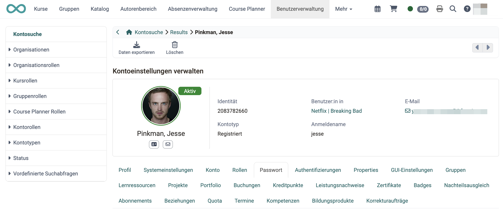
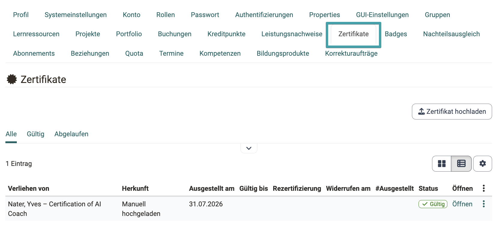
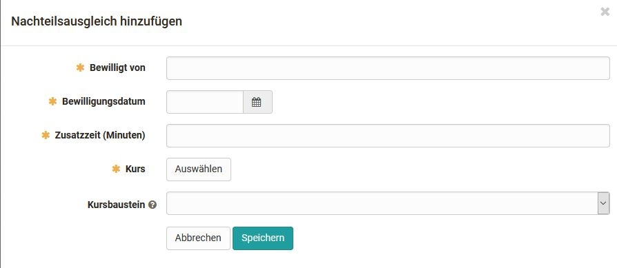

# Benutzer konfigurieren {: #user_configuration} 

Wer das Recht zur Benutzerverwaltung besitzt, kann über die Benutzersuche eine bestimmte Person suchen und für sie weitere Konfigurationen vornehmen. 

Zu jedem/jeder Benutzer:in stehen maximal die im Folgenden aufgeführten Reiter für die Konfiguration zur Verfügung (Administrator:innen). Je nach Rollen und aktivierten Modulen sind es evtl. weniger Reiter.

{ class="shadow lightbox" }

In den Kontoinformationen sind die Organisationen der Person unter "Benutzer:in in" und ihre zusätzlichen Rollen unter "Zusätzliche Rollen" als anklickbare Einträge aufgeführt; ein Klick öffnet den Reiter "Rollen". Hat das Konto keine zusätzlichen Rollen, wird der Eintrag nicht angezeigt. [:octicons-tag-16:{ title="ab Release 20.0.2 (OO-8515)" }](https://track.frentix.com/issue/OO-8515)

Daneben nennen die Kontoinformationen den Status des Kontos, die Identität, den Kontotyp, den Anmeldenamen und die E-Mail-Adresse. Über der Ansicht stellt die Aktion "Daten exportieren" die personenbezogenen Daten des Kontos zusammen, siehe [Datenschutz](Data_protection.de.md). An derselben Stelle lässt sich das Konto löschen, siehe [Benutzer:in löschen](Delete_User.de.md).

Jedes Benutzerkonto wird eigenständig geführt; Konten werden nicht zusammengeführt. Die Lernhistorie einer Person, also Kursmitgliedschaften, Testresultate, Leistungsnachweise, Zertifikate und Badges, bleibt dauerhaft mit dem Konto verbunden, auf dem sie entstanden ist. So bleibt jeder Nachweis eindeutig einer Anmeldung zugeordnet und später überprüfbar, und die personenbezogenen Daten bleiben auf ein Konto begrenzt.

Ist die Option "Eindeutig" in der System-Administration aktiviert, entstehen keine zwei Konten mit derselben E-Mail-Adresse. Sie finden die Option im Abschnitt "E-Mail Adresse" unter: 
`Administration > Core Konfiguration > E-Mail`, Segment "Einstellungen", siehe [E-Mail Einstellungen](../administration/E-Mail_Settings.de.md#email_address).

!!! info "Bestehen dennoch zwei Konten..."
    derselben Person, entscheiden Sie, welches Konto weitergeführt wird. Zertifikate des zweiten Kontos laden Sie im Reiter "Zertifikate" über "Zertifikat herunterladen" herunter und erfassen sie im weitergeführten Konto über "Zertifikat hochladen". Das zweite Konto setzen Sie danach im Reiter "Konto" auf inaktiv.

### Profil

Im Benutzerprofil werden die Personalien, Angaben zur Person, Kontaktdaten und Angaben zur Institution erfasst. Siehe: `Persönliches Menü > Konfiguration >` [Profil](../../manual_user/personal_menu/Profile.de.md). Ferner sind die vom User eingetragenen Informationen zur Person, sowie die jeweilige Visitenkarte und das gewählte persönliche Bild/Foto sichtbar. Zu den verbindlichen Einträgen des Benutzerprofils gehören: Anmeldename, Vorname, Nachname und E-Mail. Soll der Versand von Mails an diese Adresse unterbunden werden, kann diese E-Mailadresse gesperrt werden.

[zum Seitenanfang ^](#user_configuration)

### Systemeinstellungen

Hier werden die vom/von der Benutzer:in vorgenommenen Systemeinstellungen angezeigt. Siehe: `Persönliches Menü > Konfiguration >` [Einstellungen](../../manual_user/personal_menu/Settings.de.md). 
Dazu gehört z.B. die voreingestellte Sprache und ob E-Mails nur OpenOlat-intern oder auch an die Adresse im Profil verschickt werden. 

[zum Seitenanfang ^](#user_configuration)

### Konto

Hier ist z.B. der letzte Login ersichtlich und das Konto des/der Benutzer:in kann auf inaktiv gesetzt werden.  

[zum Seitenanfang ^](#user_configuration)

### Rollen

In diesem Reiter werden die Rollen des/der Benutzer:in definiert. Bei aktiviertem Modul Organisationseinheiten können unterschiedliche Rollen pro Organisationseinheit vergeben werden. Siehe ["Rollen zuweisen"](Assign_roles.de.md). 

[zum Seitenanfang ^](#user_configuration)

### Passwort [:octicons-tag-16:{ title="ab Release 20.3.0 (OO-9139)" }](https://track.frentix.com/issue/OO-9139)

Verfügt der/die Benutzer:in noch über keine lokale Authentifizierung, zeigt der Abschnitt "Lokale OpenOlat-Authentifizierung" zwei Buttons: "Einladungslink zum Setzen der Zugangsdaten senden" (Primärbutton) versendet einen Link per Mail, über den die Person selbst Zugangsdaten setzen kann; "Zugangsdaten erstellen" legt die Zugangsdaten direkt fest.

Wurde ein Einladungslink bereits versendet, zeigt eine Meldung im Tab «Passwort» dessen Gültigkeitsdauer an. Über die Aktion "Einladungslink deaktivieren" kann der Link jederzeit ungültig gemacht werden.

Der Abschnitt "Passkeys" wird ausgeblendet, sofern als Minimum die Sicherheitsstufe 1 (Passwort) gilt und keine lokale Authentifizierung vorhanden ist.

[zum Seitenanfang ^](#user_configuration)

### Authentifizierungen

Hier kann der Anmeldename geändert, sowie Authentifizierungen ergänzt, editiert und gelöscht werden.  

[zum Seitenanfang ^](#user_configuration)

### Properties

Hier können User Properties angezeigt und als Tabelle exportiert werden.

[zum Seitenanfang ^](#user_configuration)

### GUI-Einstellungen

Hier können die zu dem/der Benutzer:in gespeicherten Einstellungen des GUI zurückgesetzt werden.

[zum Seitenanfang ^](#user_configuration)

### Gruppen

Es wird eine Übersicht über alle Gruppen angezeigt, bei denen der/die Benutzer:in als Teilnehmer:in oder Betreuer:in dabei ist. Unter diesem Reiter kann der/die Benutzer:in auch weiteren Gruppen zugeordnet oder aus einer Gruppe ausgetragen werden.

[zum Seitenanfang ^](#user_configuration)

### Lernressourcen

Dieser Reiter generiert eine Übersicht mit allen Kursen und Lernressourcen des/der Benutzer:in.
Benutzerverwalter:innen und Administrator:innen können die Benutzer:innen aus den jeweiligen Lernressourcen austragen, sowie die jeweiligen Lernressourcen aufrufen. Umgekehrt kann der/die Benutzer:in als Besitzer:in, Betreuer:in oder Teilnehmer:in in weitere OpenOlat-Kurse eingetragen werden.  

[zum Seitenanfang ^](#user_configuration)

### Projekte

Unter diesem Tab werden alle Projekte aufgelistet, in denen dieser/diese Benutzer:in Mitglied ist. 

[zum Seitenanfang ^](#user_configuration)

### Portfolio

Hier werden alle Portfolio-Mappen angezeigt, zu welchen der/die Benutzer:in eingeladen ist. (Die eigenen Mappen dieses/dieser Benutzer:in werden hier nicht gelistet.)

[zum Seitenanfang ^](#user_configuration)

### Buchungen

Hier werden die Buchungsaufträge und Vorbestellungen des/der Benutzer:in angezeigt. 

[zum Seitenanfang ^](#user_configuration)

### Kreditpunkte [:octicons-tag-16:{ title="ab Release 20.1.1 (OO-8558)" }](https://track.frentix.com/issue/OO-8558)

Hier sind die erworbenen Kreditpunkte des/der Benutzer:in angezeigt. 

[zum Seitenanfang ^](#user_configuration)

### Leistungsnachweise

Hier werden die Leistungsnachweise, Punkte und der Fortschritt eines/einer Benutzer:in aus Kursen angezeigt. Neben den Spalten für Punkte, Erfolgsstatus und Fortschritt lassen sich weitere Spalten einblenden, darunter "Bewertung" mit der erreichten Note (bei aktivem Notenmodul) und die standardmässig ausgeblendete Spalte "Kennzeichen". [:octicons-tag-16:{ title="ab Release 21.0 (OO-9581)" }](https://track.frentix.com/issue/OO-9581)

<h4>Leistungsnachweis löschen</h4>

Über das Aktionsmenü (drei Punkte) einer Zeile lässt sich ein einzelner Leistungsnachweis löschen [:octicons-tag-16:{ title="ab Release 21.0 (OO-9551)" }](https://track.frentix.com/issue/OO-9551). Ein Bestätigungsdialog erklärt die Folge: Ist die Person noch Teilnehmer:in des Kurses, wird der Leistungsnachweis automatisch neu erstellt; ist sie nicht mehr im Kurs, wird er endgültig gelöscht.  

[zum Seitenanfang ^](#user_configuration)

### Zertifikate [:octicons-tag-16:{ title="ab Release 20.2.0 (OO-8984)" }](https://track.frentix.com/issue/OO-8984)

Dieser Reiter fasst alle Zertifikate der Person zusammen, sowohl die in Kursen erworbenen als auch die manuell hochgeladenen. Die Tabelle führt pro Zertifikat "Verliehen von", "Herkunft", "Ausgestellt am", "Gültig bis", "Rezertifizierung", "Widerrufen am", "#Ausgestellt" und "Status"; über die vordefinierten Filter "Alle", "Gültig" und "Abgelaufen" lässt sich die Liste eingrenzen. Rechts über der Tabelle wird zwischen Kachel- und Tabellenansicht umgeschaltet. Über "Zertifikat hochladen" werden extern erworbene Zertifikate erfasst, damit das Profil den gesamten Leistungsnachweis abbildet.

{ class="shadow lightbox" }

[zum Seitenanfang ^](#user_configuration)

### Badges

Unter diesem Reiter werden alle erworbenen Badges angezeigt.

[zum Seitenanfang ^](#user_configuration)

### Nachteilsausgleich

Ein Nachteilausgleich berechtigt Teilnehmende einer Prüfung für einen Test aufgrund einer Einschränkung mehr Zeit zu verwenden. Unter diesem Reiter kann ein Nachteilsausgleich hinzugefügt und konfiguriert werden. Der Dialog "Nachteilsausgleich hinzufügen" verlangt "Bewilligt von", "Bewilligungsdatum", "Zusatzzeit (Minuten)" und den Kurs. Das Feld "Kursbaustein" grenzt den Ausgleich auf einen einzelnen Test des Kurses ein.

{ class="shadow lightbox" }

[zum Seitenanfang ^](#user_configuration)

### Abonnements [:octicons-tag-16:{ title="ab Release 8.1.2 (OO-265)" }](https://track.frentix.com/issue/OO-265)

Hier werden sämtliche Abonnements des/der Benutzer:in angezeigt. Sie können hier auch deaktiviert oder gelöscht werden.  

[zum Seitenanfang ^](#user_configuration)

### Beziehungen [:octicons-tag-16:{ title="ab Release 13.2 (OO-3305)" }](https://track.frentix.com/issue/OO-3305)

In diesem Reiter können Beziehungen zwischen dem/der gewählten User:in und weiteren OpenOlat-Benutzer:innen definiert werden. Z.B. ob jemand Vorgesetzter, Elternteil, Ausbildungsverantwortliche oder Schüler:in eines Lehrers/einer Lehrerin ist. Voraussetzung ist, dass generell eine Systematik verwendet wird. (Vergl. [Benutzerrollen](index.de.md))

[zum Seitenanfang ^](#user_configuration)

### Quota

Hier kann eine individuelle Quota eingerichtet werden, um z.B. einer Person mit besonderen Aufgaben mehr Upload-Möglichkeit zu geben. Z.B. kann für Autor:innen, die besonders viele Videos in ihre Kurse einbinden müssen, die Quota im Media Center erhöht werden.

[zum Seitenanfang ^](#user_configuration)

### Termine

Hier finden Sie eine Übersicht über die Termine und Absenzen des/der Benutzer:in.

[zum Seitenanfang ^](#user_configuration)

### Kompetenzen

Hier können dem/der Benutzer:in Kompetenzbereiche hinzugefügt werden. Sie sind kategorisiert nach "Verwalten", "Dozieren", "Haben" und "Ziel".

[zum Seitenanfang ^](#user_configuration)

### Bildungsprodukte [:octicons-tag-16:{ title="ab Release 20.3.0 (OO-9288)" }](https://track.frentix.com/issue/OO-9288)

Hier finden Sie dieselbe hierarchische Übersicht über die Bildungsprodukte, Durchführungen und Kurse des/der Benutzer:in wie im Coaching-Tool aus Sicht Linienvorgesetzte:r bzw. Ausbildungsverantwortliche:r.

!!! note "Kontrollaufgaben als Linienvorgesetzte / Ausbildungsverantwortliche"
    Details zu Filtern, Status und Darstellung dieser Ansicht. 
    [Kontrollaufgaben als Linienvorgesetzte / Ausbildungsverantwortliche](../../manual_user/area_modules/Coaching_People.de.md#linemanager_educationmanager_observe)

[zum Seitenanfang ^](#user_configuration)

### Korrekturaufträge

Hier kann abgefragt werden, welche Korrekturaufträge dem/der Benutzer:in zugeordnet wurden.

[zum Seitenanfang ^](#user_configuration)

