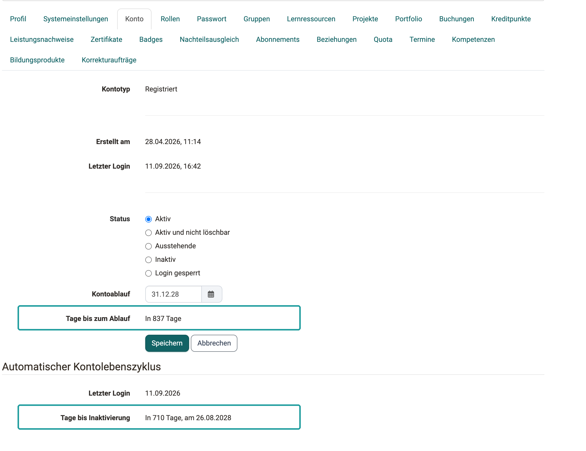
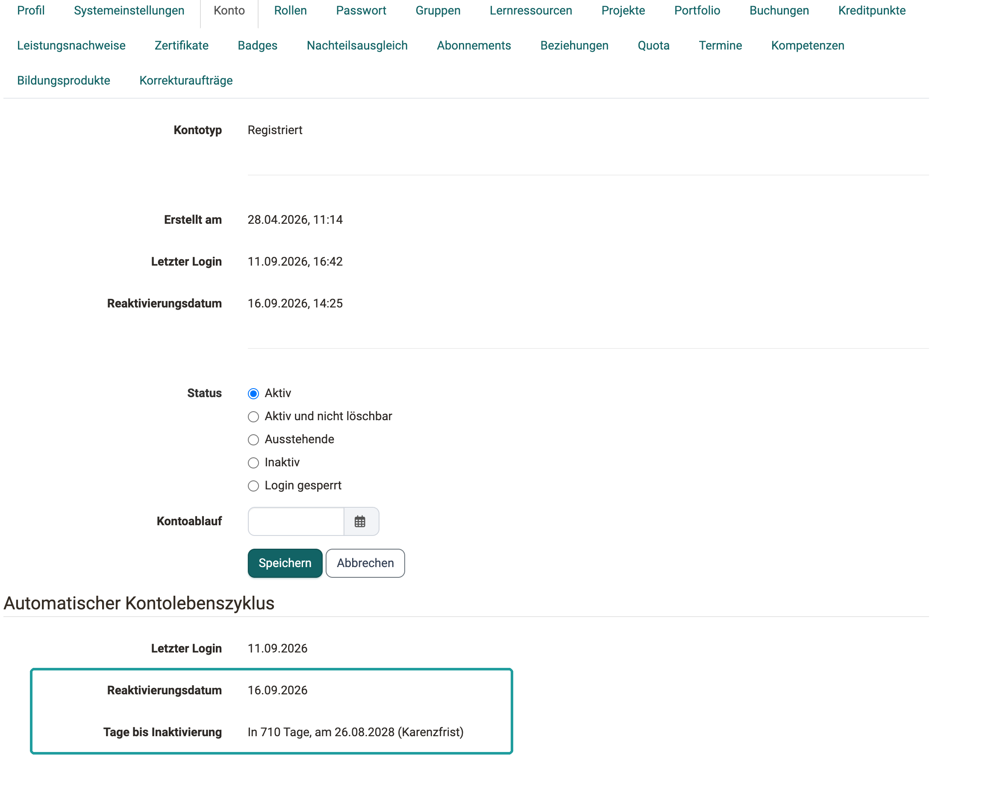
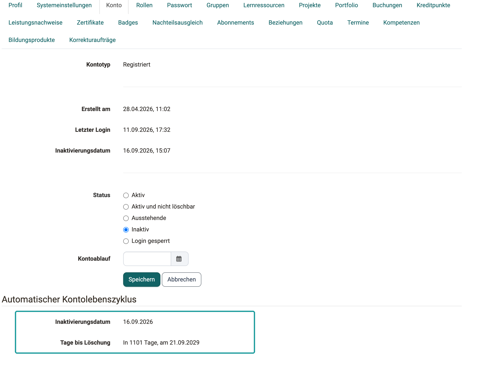
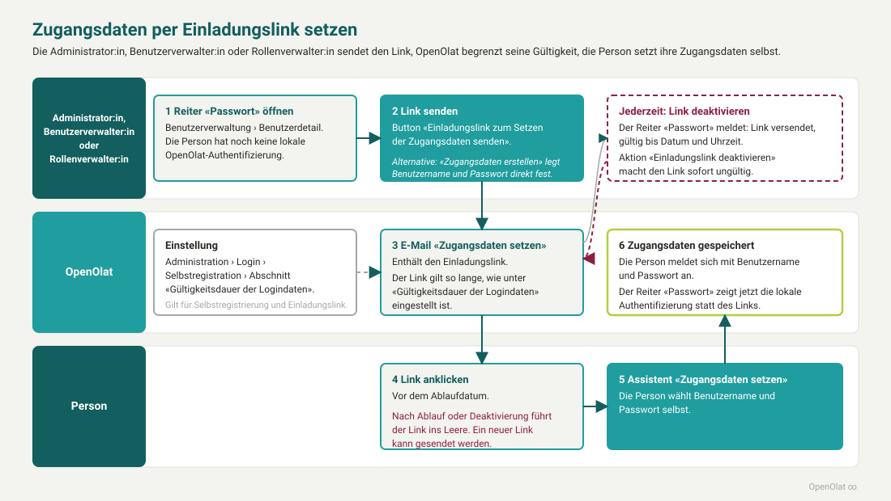
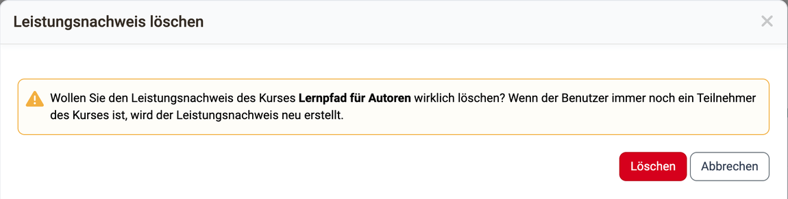
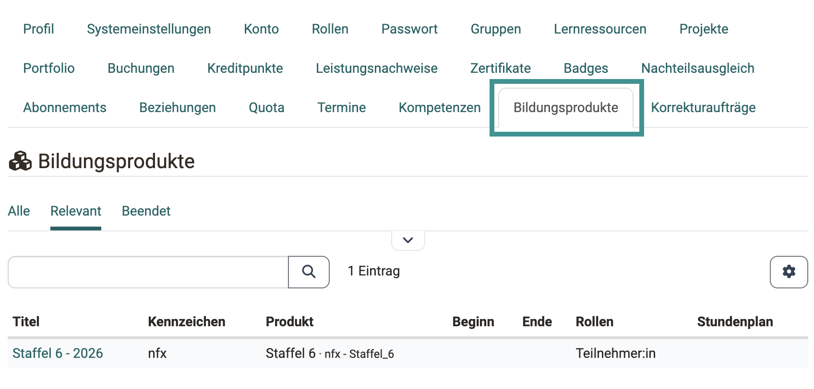

# Benutzer konfigurieren {: #user_configuration} 

Wer das Recht zur Benutzerverwaltung besitzt, kann über die Benutzersuche eine bestimmte Person suchen und für sie weitere Konfigurationen vornehmen. 

Zu jedem/jeder Benutzer:in stehen maximal die im Folgenden aufgeführten Reiter für die Konfiguration zur Verfügung (Administrator:innen). Je nach Rollen und aktivierten Modulen sind es evtl. weniger Reiter.

{ class="shadow lightbox" }

In den Kontoinformationen sind die Organisationen der Person unter "Benutzer:in in" und ihre zusätzlichen Rollen unter "Zusätzliche Rollen" als anklickbare Einträge aufgeführt; ein Klick öffnet den Reiter "Rollen". Hat das Konto keine zusätzlichen Rollen, wird der Eintrag nicht angezeigt. [:octicons-tag-16:{ title="ab Release 20.0.2 (OO-8515)" }](https://track.frentix.com/issue/OO-8515)

Daneben nennen die Kontoinformationen den Status des Kontos, die Identität, den Kontotyp, den Anmeldenamen und die E-Mail-Adresse. Über der Ansicht stellt die Aktion "Daten exportieren" die personenbezogenen Daten des Kontos zusammen, siehe [Datenschutz](Data_protection.de.md). An derselben Stelle lässt sich das Konto löschen, siehe [Benutzer:in löschen](Delete_User.de.md).

Jedes Benutzerkonto wird eigenständig geführt; Konten werden nicht zusammengeführt. Was eine Person in OpenOlat erarbeitet hat, also Kursmitgliedschaften, Testresultate, Leistungsnachweise, Zertifikate und Badges, bleibt dauerhaft mit dem Konto verbunden, auf dem es entstanden ist. So bleibt jeder Nachweis eindeutig einer Anmeldung zugeordnet und später überprüfbar, und die personenbezogenen Daten bleiben auf ein Konto begrenzt.

Ist die Option "Eindeutig" in der System-Administration aktiviert, entstehen keine zwei Konten mit derselben E-Mail-Adresse. Sie finden die Option im Abschnitt "E-Mail Adresse" unter: 
`Administration > Core Konfiguration > E-Mail`, Segment "Einstellungen", siehe [E-Mail Einstellungen](../administration/E-Mail_Settings.de.md#email_address).

!!! tip "Zwei Konten derselben Person"
    Bestehen dennoch zwei Konten derselben Person, entscheiden Sie, welches Konto weitergeführt wird. Zertifikate des zweiten Kontos laden Sie im Reiter "Zertifikate" über "Zertifikat herunterladen" herunter und erfassen sie im weitergeführten Konto über "Zertifikat hochladen". Das zweite Konto setzen Sie danach im Reiter "Konto" auf inaktiv.

### Profil

Im Benutzerprofil werden die Personalien, Angaben zur Person, Kontaktdaten und Angaben zur Institution erfasst. Siehe: `Persönliches Menü > Konfiguration >` [Profil](../../manual_user/personal_menu/Profile.de.md). Ferner sind die vom User eingetragenen Informationen zur Person, sowie die jeweilige Visitenkarte und das gewählte persönliche Bild/Foto sichtbar. Zu den verbindlichen Einträgen des Benutzerprofils gehören: Anmeldename, Vorname, Nachname und E-Mail. Soll der Versand von Mails an diese Adresse unterbunden werden, kann diese E-Mailadresse gesperrt werden.

[zum Seitenanfang ^](#user_configuration)

### Systemeinstellungen

Hier werden die vom/von der Benutzer:in vorgenommenen Systemeinstellungen angezeigt. Siehe: `Persönliches Menü > Konfiguration >` [Einstellungen](../../manual_user/personal_menu/Settings.de.md). 
Dazu gehört z.B. die voreingestellte Sprache und ob E-Mails nur OpenOlat-intern oder auch an die Adresse im Profil verschickt werden. 

Trägt das Konto ein Ablaufdatum, zeigt der Reiter es unter "Kontoablauf" an. Eine Anzahl verbleibender Tage steht hier nicht; die Fristen führt der Reiter "Konto". Bei inaktiven Konten blendet OpenOlat die Angabe aus. [:octicons-tag-16:{ title="ab Release 21.1 (OO-8382)" }](https://track.frentix.com/issue/OO-8382)

[zum Seitenanfang ^](#user_configuration)

### Konto

Der Reiter "Konto" zeigt den Zustand eines Kontos und den Punkt, an dem es im Lebenszyklus steht. Hier beurteilen Sie, ob und wann OpenOlat ein Konto automatisch deaktiviert oder löscht, und hier setzen Sie es manuell auf inaktiv.

Den Reiter erreichen Administrator:innen, Benutzerverwalter:innen und Rollenverwalter:innen. Welche Felder er zeigt, hängt von der Rolle des bearbeiteten Kontos und von den Schaltern des Kontolebenszyklus ab, siehe [Lebenszyklen: Konto](../administration/Life_cycles_-_Administration.de.md#lifecycle_accounts).

#### Kontotyp {: #account_type }

Der Kontotyp unterscheidet registrierte Konten, Gastkonten und eingeladene Konten. Ein eingeladenes Konto wandeln Sie über "In registriertes Konto umwandeln" um.

#### Erstellt am {: #creation_date }

Datum und Uhrzeit, zu der das Konto angelegt wurde.

#### Letzter Login {: #last_login }

Datum und Uhrzeit der letzten Anmeldung. Dieser Wert ist die Bezugsgrösse des automatischen Kontolebenszyklus. Bei Gastkonten entfällt die Angabe.

#### Inaktivierungsdatum {: #inactivation_date }

Datum, an dem das Konto deaktiviert wurde. Das Feld erscheint nur bei einem Konto, das bereits einmal deaktiviert war.

#### Reaktivierungsdatum {: #reactivation_date }

Datum, an dem ein deaktiviertes Konto wieder freigeschaltet wurde. Das Feld erscheint nur nach einer Reaktivierung.

#### Status {: #account_status }

Der Status steuert, ob sich die Person anmelden kann. Zur Auswahl stehen "Aktiv", "Aktiv und nicht löschbar", "Ausstehende", "Inaktiv" und "Login gesperrt". Bei Konten mit der Rolle Administrator:in, Systemadministrator:in oder Rollenverwalter:in lässt sich der Status nicht ändern.

#### Kontoablauf {: #account_expiration }

Hier hinterlegen Sie das Datum, an dem OpenOlat das Konto deaktivieren soll. Das eignet sich für befristete Zugänge, etwa für Gastdozierende oder Projektmitarbeit. Bei Administrator:innen, Systemadministrator:innen und Gastkonten steht das Feld nicht zur Verfügung.

#### Tage bis Ablauf {: #days_until_expiry }

Ist ein Ablaufdatum gesetzt, zeigt dieses Feld die verbleibende Zeit im Format "In 14 Tage". Liegt das Datum in der Vergangenheit, erscheint in Rot die Anzahl überfälliger Tage mit dem Hinweis, dass OpenOlat das Konto beim nächsten Durchlauf deaktiviert. Ohne Ablaufdatum entfällt das Feld.

#### Automatischer Kontolebenszyklus {: #automatic_user_lifecycle }

Dieser Abschnitt zeigt, wie der systemweite Lebenszyklus auf dieses Konto wirkt. Er entfällt bei Gastkonten. OpenOlat deaktiviert ein Konto, das sich in der eingestellten Frist nicht anmeldet. Die Oberfläche nennt diesen Schritt "Inaktivierung", das Konto trägt danach den Status "Inaktiv", siehe [Deaktivierung und Reaktivierung](../administration/Life_cycles_-_Administration.de.md#account_reactivation). Welche Angaben erscheinen, hängt vom Zustand des Kontos ab:

| Zustand | Anzeige | Bedeutung |
|---------|---------|-----------|
| Aktiv | "Letzter Login", "Tage bis Inaktivierung" | OpenOlat deaktiviert das Konto nach dieser Frist ohne Login automatisch. |
| Reaktiviert | zusätzlich "Reaktivierungsdatum", die Frist trägt den Zusatz "(Karenzfrist)" | Das Konto wurde nach einer Deaktivierung wieder freigeschaltet und läuft in einer Karenzfrist (Schonfrist). |
| Inaktiv | "Inaktivierungsdatum", "Tage bis Löschung" | Das Konto ist deaktiviert und wird nach dieser Frist automatisch gelöscht. |

Beide Fristen nennen neben der Anzahl Tage auch das Datum, an dem der Schritt fällig wird.

"Tage bis Inaktivierung" erscheint nur bei aktivem Schalter "Konten nach Inaktivität deaktivieren", "Tage bis Löschung" nur bei aktivem Schalter "Inaktive Konten löschen". Beide Schalter finden Sie in der System-Administration unter: 
`Administration > Lebenszyklen > Konto`

Sind die Schalter aus, greift kein automatischer Prozess, und die Fristen entfallen.

Ein aktives Konto mit hinterlegtem Ablaufdatum führt beide Fristen nebeneinander: "Tage bis Ablauf" für das Datum, "Tage bis Inaktivierung" für den letzten Login.

{ class="shadow lightbox" }

Nach einer Reaktivierung kommt das Reaktivierungsdatum dazu, und die Frist trägt den Zusatz "(Karenzfrist)".

{ class="shadow lightbox" }

Bei einem inaktiven Konto treten Inaktivierungsdatum und "Tage bis Löschung" an die Stelle der Inaktivierungsfrist.

{ class="shadow lightbox" }

[zum Seitenanfang ^](#user_configuration)

### Rollen

In diesem Reiter werden die Rollen des/der Benutzer:in definiert. Bei aktiviertem Modul "Organisationen" können unterschiedliche Rollen pro Organisationseinheit vergeben werden. Siehe ["Rollen zuweisen"](Assign_roles.de.md). 

[zum Seitenanfang ^](#user_configuration)

### Passwort [:octicons-tag-16:{ title="ab Release 20.3.0 (OO-9139)" }](https://track.frentix.com/issue/OO-9139)

Verfügt der/die Benutzer:in noch über keine lokale Authentifizierung, zeigt der Abschnitt "Lokale OpenOlat-Authentifizierung" zwei Buttons. Der Button "Einladungslink zum Setzen der Zugangsdaten senden" versendet einen Link per Mail; die Person setzt ihre Zugangsdaten damit selbst. "Zugangsdaten erstellen" legt sie direkt fest.

Wurde ein Einladungslink bereits versendet, zeigt eine Meldung dessen Gültigkeitsdauer an. Über die Aktion "Einladungslink deaktivieren" kann der Link jederzeit ungültig gemacht werden. Nach Ablauf oder Deaktivierung führt der Link ins Leere; Sie können danach einen neuen Einladungslink senden.

Den Reiter "Passwort" und seine Aktionen erreichen Administrator:innen, Benutzerverwalter:innen und Rollenverwalter:innen. Benutzerverwalter:innen sehen den Reiter nicht bei Konten, die selbst Administrator:in oder Rollenverwalter:in sind.

Wie lange ein Einladungslink gültig bleibt, legen Sie in der System-Administration im Abschnitt "Gültigkeitsdauer der Logindaten" fest: 
`Administration > Login > Selbstregistration`, Reiter "Konfiguration", siehe [Selbstregistration](../administration/Login_Self-Registration.de.md#tab_configuration).

{ class="shadow lightbox" }

Der Abschnitt "Passkeys" wird ausgeblendet, sofern als Minimum die Sicherheitsstufe 1 (Passwort) gilt und keine lokale Authentifizierung vorhanden ist.

[zum Seitenanfang ^](#user_configuration)

### Authentifizierungen

Hier kann der Anmeldename geändert, sowie Authentifizierungen ergänzt, editiert und gelöscht werden.  

[zum Seitenanfang ^](#user_configuration)

### Properties

Hier können User Properties angezeigt und als Tabelle exportiert werden.

[zum Seitenanfang ^](#user_configuration)

### GUI-Einstellungen

Hier können die zu dem/der Benutzer:in gespeicherten Einstellungen des GUI zurückgesetzt werden.

[zum Seitenanfang ^](#user_configuration)

### Gruppen

Es wird eine Übersicht über alle Gruppen angezeigt, bei denen der/die Benutzer:in als Teilnehmer:in oder Betreuer:in dabei ist. Unter diesem Reiter kann der/die Benutzer:in auch weiteren Gruppen zugeordnet oder aus einer Gruppe ausgetragen werden.

[zum Seitenanfang ^](#user_configuration)

### Lernressourcen

Dieser Reiter generiert eine Übersicht mit allen Kursen und Lernressourcen des/der Benutzer:in.
Benutzerverwalter:innen und Administrator:innen können die Benutzer:innen aus den jeweiligen Lernressourcen austragen, sowie die jeweiligen Lernressourcen aufrufen. Umgekehrt kann der/die Benutzer:in als Besitzer:in, Betreuer:in oder Teilnehmer:in in weitere OpenOlat-Kurse eingetragen werden.  

Die Liste führt einzelne Lernressourcen mit den Kurs- und Gruppenrollen der Person. Durchführungen des Course Planners stehen dagegen im Reiter "Bildungsprodukte".

[zum Seitenanfang ^](#user_configuration)

### Projekte

Unter diesem Tab werden alle Projekte aufgelistet, in denen dieser/diese Benutzer:in Mitglied ist. 

[zum Seitenanfang ^](#user_configuration)

### Portfolio

Hier werden alle Portfolio-Mappen angezeigt, zu welchen der/die Benutzer:in eingeladen ist. (Die eigenen Mappen dieses/dieser Benutzer:in werden hier nicht gelistet.)

[zum Seitenanfang ^](#user_configuration)

### Buchungen

Hier werden die Buchungsaufträge und Vorbestellungen des/der Benutzer:in angezeigt. 

[zum Seitenanfang ^](#user_configuration)

### Kreditpunkte [:octicons-tag-16:{ title="ab Release 20.1.1 (OO-8558)" }](https://track.frentix.com/issue/OO-8558)

Hier sind die erworbenen Kreditpunkte des/der Benutzer:in angezeigt. 

[zum Seitenanfang ^](#user_configuration)

### Leistungsnachweise

Hier werden die Leistungsnachweise, Punkte und der Fortschritt eines/einer Benutzer:in aus Kursen angezeigt. Neben den Spalten für Punkte, Erfolgsstatus und Fortschritt lassen sich weitere Spalten einblenden, darunter "Bewertung" mit der erreichten Note (bei aktivem Notenmodul) und die standardmässig ausgeblendete Spalte "Kennzeichen". [:octicons-tag-16:{ title="ab Release 21.0 (OO-9581)" }](https://track.frentix.com/issue/OO-9581)

<h4>Leistungsnachweis löschen</h4>

Über das Aktionsmenü (drei Punkte) einer Zeile lässt sich ein einzelner Leistungsnachweis löschen [:octicons-tag-16:{ title="ab Release 21.0 (OO-9551)" }](https://track.frentix.com/issue/OO-9551). Ein Bestätigungsdialog erklärt die Folge: Ist die Person noch Teilnehmer:in des Kurses, wird der Leistungsnachweis automatisch neu erstellt; ist sie nicht mehr im Kurs, wird er endgültig gelöscht.  

{ class="shadow lightbox" }

[zum Seitenanfang ^](#user_configuration)

### Zertifikate [:octicons-tag-16:{ title="ab Release 20.2.0 (OO-8984)" }](https://track.frentix.com/issue/OO-8984)

Dieser Reiter fasst alle Zertifikate der Person zusammen, sowohl die in Kursen erworbenen als auch die manuell hochgeladenen. Die Tabelle führt pro Zertifikat "Verliehen von", "Herkunft", "Ausgestellt am", "Gültig bis", "Rezertifizierung", "Widerrufen am", "#Ausgestellt" und "Status"; über die vordefinierten Filter "Alle", "Gültig" und "Abgelaufen" lässt sich die Liste eingrenzen. Rechts über der Tabelle wird zwischen Kachel- und Tabellenansicht umgeschaltet. Über "Zertifikat hochladen" werden extern erworbene Zertifikate erfasst, damit das Profil den gesamten Leistungsnachweis abbildet.

{ class="shadow lightbox" }

[zum Seitenanfang ^](#user_configuration)

### Badges

Unter diesem Reiter werden alle erworbenen Badges angezeigt.

[zum Seitenanfang ^](#user_configuration)

### Nachteilsausgleich

Ein Nachteilsausgleich berechtigt Teilnehmende einer Prüfung für einen Test aufgrund einer Einschränkung mehr Zeit zu verwenden. Unter diesem Reiter kann ein Nachteilsausgleich hinzugefügt und konfiguriert werden. Der Dialog "Nachteilsausgleich hinzufügen" verlangt "Bewilligt von", "Bewilligungsdatum", "Zusatzzeit (Minuten)" und den Kurs. Das Feld "Kursbaustein" grenzt den Ausgleich auf einen einzelnen Test des Kurses ein.

{ class="shadow lightbox" }

[zum Seitenanfang ^](#user_configuration)

### Abonnements [:octicons-tag-16:{ title="ab Release 8.1.2 (OO-265)" }](https://track.frentix.com/issue/OO-265)

Hier werden sämtliche Abonnements des/der Benutzer:in angezeigt. Sie können hier auch deaktiviert oder gelöscht werden.  

[zum Seitenanfang ^](#user_configuration)

### Beziehungen [:octicons-tag-16:{ title="ab Release 13.2 (OO-3305)" }](https://track.frentix.com/issue/OO-3305)

In diesem Reiter können Beziehungen zwischen dem/der gewählten User:in und weiteren OpenOlat-Benutzer:innen definiert werden. Z.B. ob jemand Vorgesetzter, Elternteil, Ausbildungsverantwortliche oder Schüler:in eines Lehrers/einer Lehrerin ist. Voraussetzung ist, dass in der System-Administration Rollen für Person zu Person definiert sind. Diese Rollen erteilen den verbundenen Personen die Rechte, die dort festgelegt sind. Sie finden die Rollen unter: 
`Administration > Module > Rolle Person zu Person`, siehe [Rolle Person zu Person](../administration/Modules.de.md#role_user_to_user). (Vergl. [Benutzerrollen](index.de.md))

[zum Seitenanfang ^](#user_configuration)

### Quota

Hier kann eine individuelle Quota eingerichtet werden, um z.B. einer Person mit besonderen Aufgaben mehr Upload-Möglichkeit zu geben. Z.B. kann für Autor:innen, die besonders viele Videos in ihre Kurse einbinden müssen, die Quota im Media Center erhöht werden.

[zum Seitenanfang ^](#user_configuration)

### Termine

Hier finden Sie eine Übersicht über die Termine und Absenzen des/der Benutzer:in.

[zum Seitenanfang ^](#user_configuration)

### Kompetenzen

Hier können dem/der Benutzer:in Kompetenzbereiche hinzugefügt werden. Sie sind kategorisiert nach "Verwalten", "Dozieren", "Haben" und "Ziel".

[zum Seitenanfang ^](#user_configuration)

### Bildungsprodukte [:octicons-tag-16:{ title="ab Release 20.3.0 (OO-9288)" }](https://track.frentix.com/issue/OO-9288)

Hier finden Sie die Durchführungen des/der Benutzer:in. Die Liste zeigt alle Durchführungen der Person, unabhängig davon, welche Rolle sie darin hat [:octicons-tag-16:{ title="ab Release 21.0 (OO-9374)" }](https://track.frentix.com/issue/OO-9374){:target="_blank"}.

Den Reiter zeigt OpenOlat nur bei aktivem Course Planner. Ohne dieses Modul erscheint er nicht.

Die Liste führt Durchführungen, nicht einzelne Kurse. Ein Kurs erscheint hier als Teil der Durchführung, über die die Person gebucht wurde, und im Reiter "Lernressourcen" zusätzlich als einzelne Lernressource. Die beiden Reiter beantworten verschiedene Fragen: "Bildungsprodukte" zeigt, welche Bildungsangebote die Person durchläuft, "Lernressourcen" zeigt, in welchen Kursen sie eingetragen ist. Anders als dort tragen Sie die Person hier weder ein noch aus.

{ class="shadow lightbox" }

Als Filter-Tabs stehen "Alle", "Relevant" und "Beendet" zur Verfügung, "Relevant" ist vorausgewählt. Gegenüber dem Coaching Tool zeigt die Liste zusätzlich die Spalte "Rollen", die je Durchführung ausweist, in welcher Rolle die Person beteiligt ist. Dafür fehlen die Spalten "Favorit" und "Status" sowie die Tabs "Favoriten" und "Vorbereitung". Ein Klick auf den Titel einer Durchführung öffnet deren Struktur mit den enthaltenen Kursen.

Was die einzelnen Tabs zeigen, beschreibt der Abschnitt [Die Liste filtern](../../manual_user/area_modules/Coaching_Educational_Products.de.md#filter) im Benutzerhandbuch.

[zum Seitenanfang ^](#user_configuration)

### Korrekturaufträge

Hier kann abgefragt werden, welche Korrekturaufträge dem/der Benutzer:in zugeordnet wurden.

[zum Seitenanfang ^](#user_configuration)

## Weiterführende Informationen {: #further_information}

**Auf dieser Seite erwähnt** 
[Datenschutz >](Data_protection.de.md) 
[Benutzer:in löschen >](Delete_User.de.md) 
[E-Mail Einstellungen >](../administration/E-Mail_Settings.de.md) 
[Profil >](../../manual_user/personal_menu/Profile.de.md) 
[Einstellungen >](../../manual_user/personal_menu/Settings.de.md) 
[Lebenszyklen: Administration >](../administration/Life_cycles_-_Administration.de.md) 
[Rollen zuweisen >](Assign_roles.de.md) 
[Selbstregistration >](../administration/Login_Self-Registration.de.md) 
[Benutzerrollen >](index.de.md) 
[Coaching: Bildungsprodukte >](../../manual_user/area_modules/Coaching_Educational_Products.de.md)

**Weiterführend** 
[Benutzer-/Kontosuche >](Search_Users.de.md) 
[Benutzer:in erstellen >](Create_User.de.md)

[zum Seitenanfang ^](#user_configuration)
