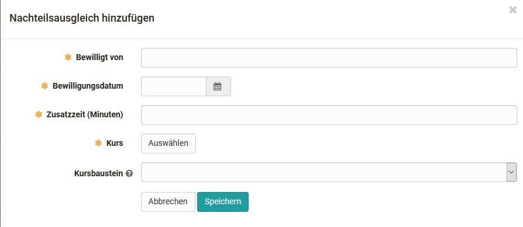

# Benutzer konfigurieren

Über die Benutzersuche können Personen mit dem Recht der Benutzerverwaltung
nach Personen suchen und weitere Konfigurationen vornehmen. So kann der
gefundenen Person eine E-Mail gesendet, bestimmte Benutzer-Attribute oder ihr
Status geändert oder der Benutzer komplett gelöscht werden. Zu den Benutzer-
Attributen zählen z.B. Name, Passwort, Institution usw. Mit Status ist
gemeint, ob es sich um einen aktiven, inaktiven oder gesperrten Account o.ä.
handelt.

Klickt man auf einen konkreten User stehen die folgenden aufgeführten Reiter
für die Benutzerkonfiguration zur Verfügung:

#### Benutzerprofil

| Hier werden die Personalien, Angaben zur Person, Kontaktdaten und Angaben
zur Institution erfasst (vergl. User Konfiguration
[Profil](Konfiguration.html#Konfiguration-_profil)). Ferner sind die vom User
eingetragenen Informationen zur Person sowie die jeweilige Visitenkarte und
das gewählte persönliche Bild/Foto sichtbar. Zu den verbindlichen Einträgen
des Benutzerprofils gehören: Vorname, Nachname und E-Mail.  
---|---  
  
#### Systemeinstellungen

| Hier werden die vom User vorgenommenen Systemeinstellungen angezeigt (vergl.
User Konfiguration [Einstellungen](Konfiguration.html#Konfiguration-
_einstellungen)).  
  
#### Passwort ändern

| Hier kann sowohl ein neues Passwort für den User direkt gesetzt oder ein
Passwortlink generiert werden, der dem User dann per Mail zugeschickt wird, so
dass er selbst ein neues Passwort setzen kann. Der Abschnitt "Passwortlink
senden für OpenOlat Passwort" wird nur angezeigt, sofern es dem Benutzer
erlaubt ist, das Passwort zu ändern.  
  
#### Authentifizierungen

| Hier kann der Benutzername geändert sowie Authentifizierungen editiert und
gelöscht werden.  
  
#### Properties

| User Properties können angezeigt und als Tabelle exportiert werden.  
  
#### Gruppen

| Übersicht über die Gruppen bei denen der User Teilnehmer oder Betreuer ist.
An dieser Stelle kann der User bestimmten Gruppen zugeordnet oder ausgetragen
werden.  
  
#### Lernressourcen

|

Dieser Reiter generiert eine Übersicht mit allen Lernressourcen des Users.
Benutzerverwalter und Administratoren können die User aus den jeweiligen
Lernressourcen austragen sowie die jeweiligen Lernressourcen aufrufen.  Ferner
kann der User als Besitzer, Coach oder Teilnehmer in weitere OpenOlat Kurse
eingetragen werden.  
  
#### Buchungen

|

Hier werden die Buchungen und Vorbestellungen des Users angezeigt.  
  
#### Statements

| Hier werden die Leistungsnachweise, sowie Punkte und Fortschritt eines
Benutzers angezeigt und können bei Bedarf auch gelöscht werden.  
  
#### Nachteilsausgleich

|

Hier kann ein Nachteilsausgleich hinzugefügt werden. Der Nachteilausgleich
berechtigt Teilnehmende einer Prüfung für einen Test aufgrund einer
Einschränkung mehr Zeit zu verwenden.

  
  
#### Abonnements

| Hier werden sämtliche Abonnements eines Users angezeigt. Diese können auch
hier gelöscht werden.  
  
#### Rollen

| In diesem Reiter wird der Benutzertyp, die Rollen sowie der Status des Users
definiert, siehe ["Rollen zuweisen"](Rollen+zuweisen.html). Auch der letzte
login in auslesbar.  
  
#### Beziehungen

| In diesem Reiter können neue Beziehungen zwischen dem gewählten User und
weiteren OpenOlat Nutzern definiert werden, z.B. Vorgesetzter, Elternteil,
Ausbildungsverantwortlicher, Schüler usw. sofern generell eine Systematik
verwendet wird  (vergl. [Benutzerrollen](Benutzerverwaltung.html)).  
  
#### Quota

| Übersicht über die Quota Einstellungen  
  
#### Lektionen

| Übersicht über den Stand der Lektionen und Absenzen und den damit
verbundenen Fortschritt des Users  
  
#### Kompetenzen

| Hier können Kompetenzbereiche entsprechend der Kategorien Verwalten,
Dozieren, Haben und Ziel hinzugefügt werden.  
  
#### Curriculum

| Übersicht über zugeordnete Curricula  
Korrekturaufträge| Übersicht über die zugeordneten Korrekturaufträge für Tests

