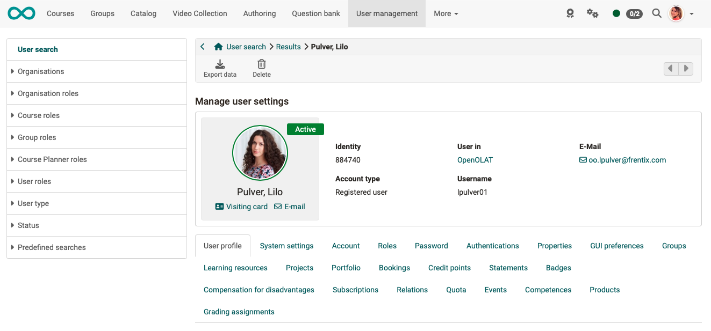
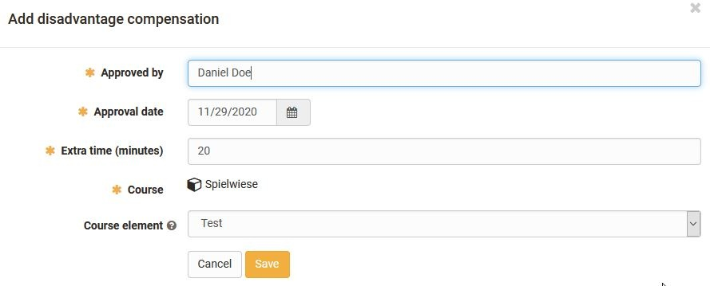

# Configure User {: #user_configuration} 

If you have the right to manage users, you can search for a specific person using the user search and make further configurations for them.

A maximum of the tabs listed below are available for configuration for each user (administrator). Depending on the roles and activated modules, there may be fewer tabs.

{ class="shadow lightbox"}

### User profile

Personal data, personal details, contact details and details of the institution are recorded in the user profile. (See Personal Menu > Configuration > [Profile](../../manual_user/personal_menu/Profile.md)). Furthermore, the personal information entered by the user, as well as the respective business card and the selected personal picture/photo are visible. The mandatory entries in the user profile include: Login name, first name, surname and e-mail address. If the sending of emails to this address is to be prevented, this email address can be blocked.

[To the top of the page ^](#user_configuration)

### System settings

The system settings made by the user are displayed here (see Personal Menu > Configuration > [Settings](../../manual_user/personal_menu/Configuration.md)).  
This includes, for example, the default language and whether emails are only sent within OpenOlat or also to the address in the profile. 

[To the top of the page ^](#user_configuration)

### Account

For example, the last login can be seen here and the user's account can be set to inactive.  

[To the top of the page ^](#user_configuration)

### Roles

The roles of the user are defined in this tab. If the Organizational units module is activated, different roles can be assigned per organizational unit. See ["Assign roles"](Assign_roles.md).

[To the top of the page ^](#user_configuration)

### Password

Here a new password can be set directly for the user or a password link can
be generated, which is then sent to the user by mail, so that he can set a new
password himself. The section "Send password link for OpenOlat password" is
only displayed if the user is allowed to change the password.  

[To the top of the page ^](#user_configuration)

### Authentications

Here you can change the username and edit and delete authentications.  
  
[To the top of the page ^](#user_configuration)

### Properties

User Properties can be displayed and exported as a table.  

[To the top of the page ^](#user_configuration)

### GUI preferences

The GUI settings saved for the user(s) can be reset here.

[To the top of the page ^](#user_configuration)

### Groups

An overview of all groups in which the user is a participant or coach is displayed. 
Under this tab, the user can also be assigned to other groups or removed from a group.

[To the top of the page ^](#user_configuration)

### Learning resources

This tab generates an overview with all learning resources of the user. User administrators and administrators can remove users from the respective learning resources and call up the respective learning resources. Furthermore, the user can be registered as owner, coach or participant in further OpenOlat courses.  

[To the top of the page ^](#user_configuration)

### Projects

All projects in which this user is a member are listed under this tab. 

[To the top of the page ^](#user_configuration)

### Portfolio

All portfolio folders to which the user is invited are displayed here. (This user's own portfolios are not listed here).

[To the top of the page ^](#user_configuration)

### Bookings

The bookings of the user are displayed here.  

[To the top of the page ^](#user_configuration)

### Credit points

The user's acquired credit points are displayed here. 

[To the top of the page ^](#user_configuration)

### Statements

The certificates, points and progress of a user are displayed here. Certificates acquired elsewhere can also be uploaded in order to obtain an overview of the entire transcript of records in OpenOlat.

[To the top of the page ^](#user_configuration)

### Badges

This tab displays all the badges you have purchased.

[To the top of the page ^](#user_configuration)

### Compensation for disadvantages

Disadvantage compensation entitles test takers to use more time for a test due to a restriction. Disadvantage compensation can be added and configured under this tab.

{ class="shadow lightbox" }
  
[To the top of the page ^](#user_configuration)

### Subscriptions

All of a user's subscriptions are displayed here. They can also be deactivated or deleted here.  

[To the top of the page ^](#user_configuration)

  
### Relations

In this tab, relations between the selected user and other OpenOlat users can be defined. For example, whether someone is a teacher's superior, parent, training coach or student. The prerequisite is that a system is generally used. (Cf. [User roles](index.md))

[To the top of the page ^](#user_configuration)

### Quota

An individual quota can be set up here, e.g. to give a person with special tasks more upload options. For example, the quota in the Media Centre can be increased for authors who need to include a particularly large number of videos in their courses.

[To the top of the page ^](#user_configuration)

### Events

Here you will find an overview of events and absences of the user.

[To the top of the page ^](#user_configuration)

### Competences

Areas of competence can be added to the user here. They are categorized according to "Manage", "Teach", "Have" and "Target".

[To the top of the page ^](#user_configuration)
  

### Products

Here you will find an overview of all products to which the user is assigned, as well as the user's progress.

[To the top of the page ^](#user_configuration)

### Grading assignments

Here you can check which grading assignments have been assigned to this user.

[To the top of the page ^](#user_configuration)

