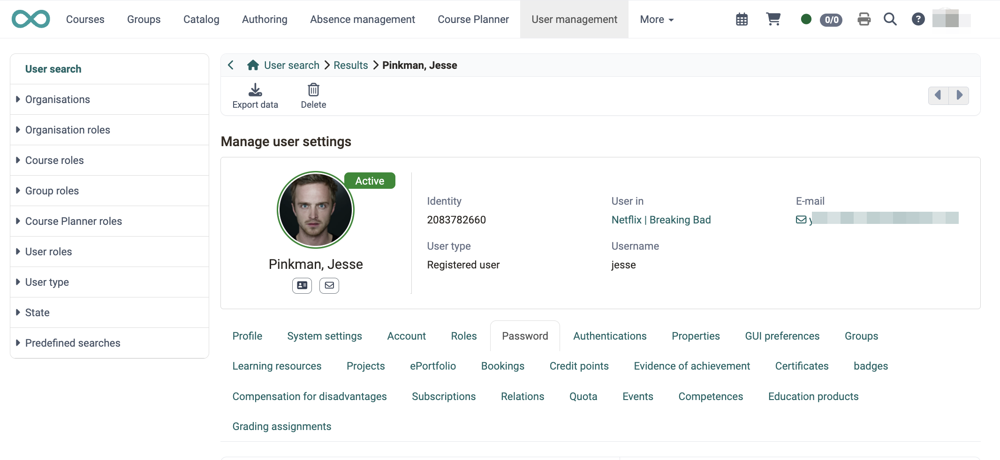
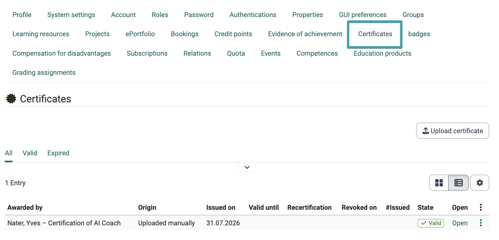
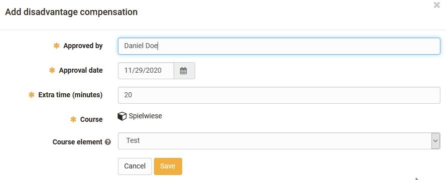

# Configure User {: #user_configuration} 

If you have the right to manage users, you can search for a specific person using the user search and make further configurations for them.

A maximum of the tabs listed below are available for configuration for each user (administrator). Depending on the roles and activated modules, there may be fewer tabs.

{ class="shadow lightbox" }

The account information lists the person's organisations under "User in" and their additional roles under "Additional Roles" as clickable entries; a click opens the "Roles" tab. If the account has no additional roles, the entry is not displayed. [:octicons-tag-16:{ title="from Release 20.0.2 (OO-8515)" }](https://track.frentix.com/issue/OO-8515)

Each user account is maintained independently; accounts are not merged. A person's learning history, that is course memberships, test results, evidence of achievements, certificates and badges, remains permanently linked to the account on which it was created. This keeps every record unambiguously assigned to one login and verifiable later on, and personal data stays limited to a single account.

### User profile

Personal data, personal details, contact details and details of the institution are recorded in the user profile. See: `Personal Menu > Configuration >` [Profile](../../manual_user/personal_menu/Profile.md). Furthermore, the personal information entered by the user, as well as the respective business card and the selected personal picture/photo are visible. The mandatory entries in the user profile include: Login name, first name, surname and email address. If the sending of emails to this address is to be prevented, this email address can be blocked.

[To the top of the page ^](#user_configuration)

### System settings

The system settings made by the user are displayed here. See: `Personal Menu > Configuration >` [Settings](../../manual_user/personal_menu/Settings.md). 
This includes, for example, the default language and whether emails are only sent within OpenOlat or also to the address in the profile. 

[To the top of the page ^](#user_configuration)

### Account

For example, the last login can be seen here and the user's account can be set to inactive.  

[To the top of the page ^](#user_configuration)

### Roles

The roles of the user are defined in this tab. If the Organizational units module is activated, different roles can be assigned per organizational unit. See ["Assign roles"](Assign_roles.md).

[To the top of the page ^](#user_configuration)

### Password [:octicons-tag-16:{ title="from Release 20.3.0 (OO-9139)" }](https://track.frentix.com/issue/OO-9139)

If the user does not yet have local authentication, the "Local OpenOlat Authentication" section shows two buttons: "Send invitation link to set login credentials" (primary button) sends a link by mail that the person can use to set their own login credentials; "Create login credentials" sets the login credentials directly.

If an invitation link has already been sent, a message in the "Password" tab shows its validity period. The "Deactivate invitation link" action can be used to invalidate the link at any time.

The "Passkeys" section is hidden if security level 1 (Password) applies as the minimum and no local authentication is available.

[To the top of the page ^](#user_configuration)

### Authentications

Here you can change the username and edit and delete authentications.  

[To the top of the page ^](#user_configuration)

### Properties

User Properties can be displayed and exported as a table.  

[To the top of the page ^](#user_configuration)

### GUI preferences

The GUI settings saved for the user(s) can be reset here.

[To the top of the page ^](#user_configuration)

### Groups

An overview of all groups in which the user is a participant or coach is displayed. 
Under this tab, the user can also be assigned to other groups or removed from a group.

[To the top of the page ^](#user_configuration)

### Learning resources

This tab generates an overview with all learning resources of the user. User administrators and administrators can remove users from the respective learning resources and call up the respective learning resources. Furthermore, the user can be registered as owner, coach or participant in further OpenOlat courses.  

[To the top of the page ^](#user_configuration)

### Projects

All projects in which this user is a member are listed under this tab. 

[To the top of the page ^](#user_configuration)

### Portfolio

All portfolio folders to which the user is invited are displayed here. (This user's own portfolios are not listed here).

[To the top of the page ^](#user_configuration)

### Bookings

The booking orders and pre-orders of the user are displayed here.  

[To the top of the page ^](#user_configuration)

### Credit points [:octicons-tag-16:{ title="from Release 20.1.1 (OO-8558)" }](https://track.frentix.com/issue/OO-8558)

The user's acquired credit points are displayed here. 

[To the top of the page ^](#user_configuration)

### Evidence of achievements

The evidence of achievements, points and progress of a user from courses are displayed here. In addition to the columns for points, success status and progress, further columns can be shown, including "Rating" with the achieved grade (if the grading module is active) and the "Reference" column, which is hidden by default. [:octicons-tag-16:{ title="from Release 21.0 (OO-9581)" }](https://track.frentix.com/issue/OO-9581)

<h4>Delete evidence of achievement</h4>

Via the actions menu (three dots) of a row, a single evidence of achievement can be deleted [:octicons-tag-16:{ title="from Release 21.0 (OO-9551)" }](https://track.frentix.com/issue/OO-9551). A confirmation dialog explains the effect: if the person is still a participant of the course, the evidence of achievement is automatically regenerated; if they are no longer enrolled, it is permanently deleted.

[To the top of the page ^](#user_configuration)

### Certificates [:octicons-tag-16:{ title="from Release 20.2.0 (OO-8984)" }](https://track.frentix.com/issue/OO-8984)

This tab brings together all of the person's certificates, both those acquired in courses and those uploaded manually. For each certificate the table lists "Awarded by", "Origin", "Issued on", "Valid until", "Recertification", "Revoked on", "#Issued" and "State"; the predefined filters "All", "Valid" and "Expired" narrow down the list. Above the table on the right you can switch between tile and table view. "Upload certificate" is used to record externally acquired certificates so that the profile reflects the entire transcript of records.

{ class="shadow lightbox" }

[To the top of the page ^](#user_configuration)

### Badges

This tab displays all the badges you have purchased.

[To the top of the page ^](#user_configuration)

### Compensation for disadvantages

Disadvantage compensation entitles test takers to use more time for a test due to a restriction. Disadvantage compensation can be added and configured under this tab.

{ class="shadow lightbox" }

[To the top of the page ^](#user_configuration)

### Subscriptions [:octicons-tag-16:{ title="from Release 8.1.2 (OO-265)" }](https://track.frentix.com/issue/OO-265)

All of a user's subscriptions are displayed here. They can also be deactivated or deleted here.  

[To the top of the page ^](#user_configuration)

### Relations [:octicons-tag-16:{ title="from Release 13.2 (OO-3305)" }](https://track.frentix.com/issue/OO-3305)

In this tab, relations between the selected user and other OpenOlat users can be defined. For example, whether someone is a teacher's superior, parent, training coach or student. The prerequisite is that a system is generally used. (Cf. [User roles](index.md))

[To the top of the page ^](#user_configuration)

### Quota

An individual quota can be set up here, e.g. to give a person with special tasks more upload options. For example, the quota in the Media Centre can be increased for authors who need to include a particularly large number of videos in their courses.

[To the top of the page ^](#user_configuration)

### Events

Here you will find an overview of events and absences of the user.

[To the top of the page ^](#user_configuration)

### Competences

Areas of competence can be added to the user here. They are categorized according to "Manage", "Teach", "Have" and "Target".

[To the top of the page ^](#user_configuration)

### Education products [:octicons-tag-16:{ title="from Release 20.3.0 (OO-9288)" }](https://track.frentix.com/issue/OO-9288)

Here you will find the same hierarchical overview of the education products, implementations and courses of the user as in the Coaching tool from the perspective of a line manager or education manager.

!!! note "Observational tasks"
    Details on filters, status and display of this view. 
    [Observational tasks](../../manual_user/area_modules/Coaching_People.md#linemanager_educationmanager_observe)

[To the top of the page ^](#user_configuration)

### Grading assignments

Here you can check which grading assignments have been assigned to this user.

[To the top of the page ^](#user_configuration)

