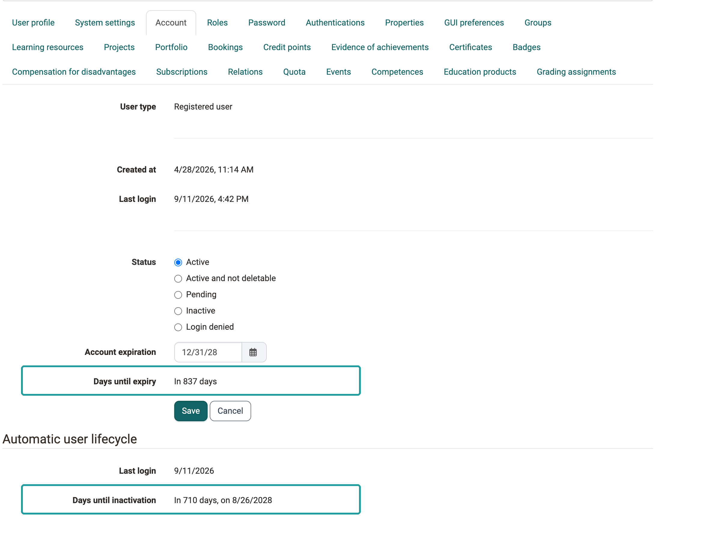
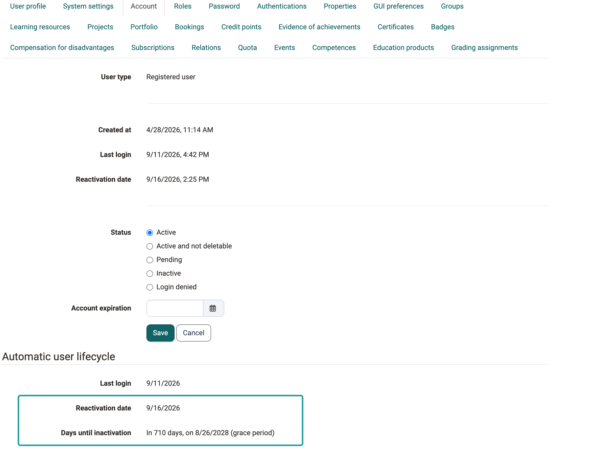
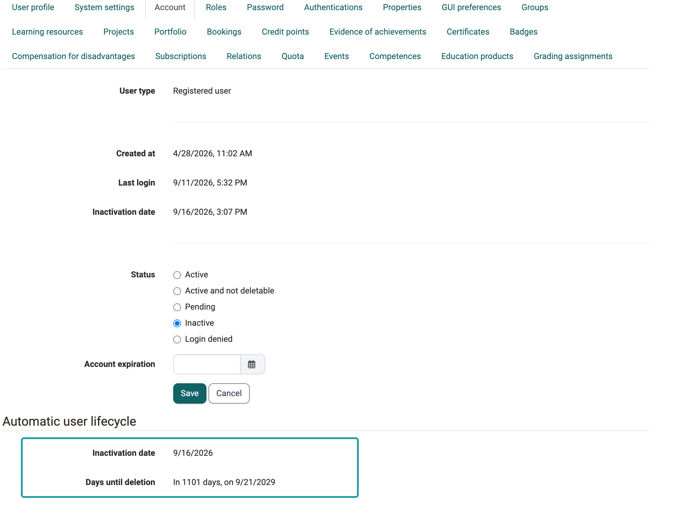
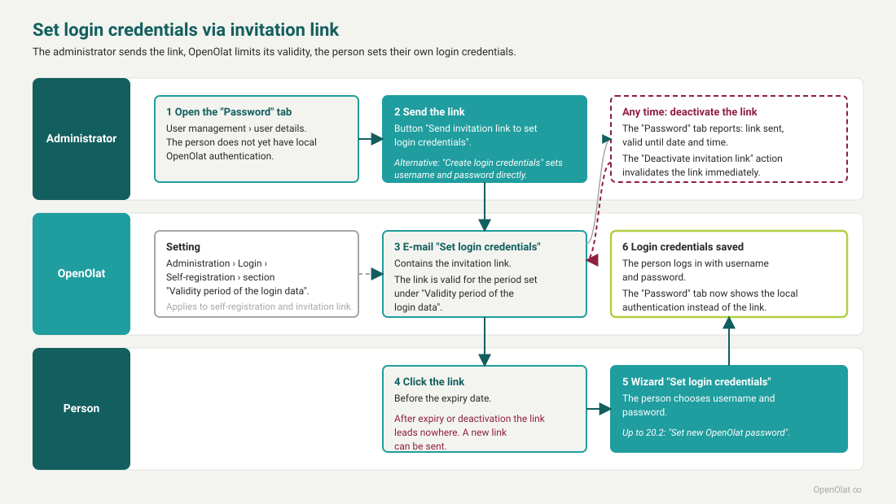
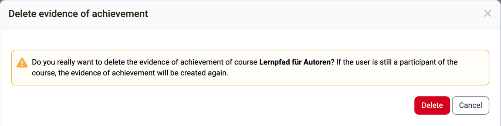
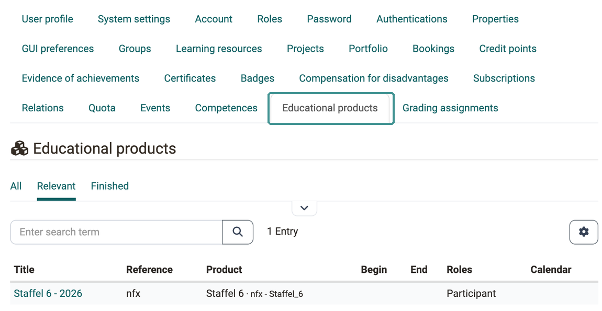

# Configure user {: #user_configuration}

If you have the right to manage users, you can search for a specific person using the user search and make further configurations for them.

A maximum of the tabs listed below are available for configuration for each user (administrator). Depending on the roles and activated modules, there may be fewer tabs.

{ class="shadow lightbox" }

The account information lists the person's organisations under "User in" and their additional roles under "Additional Roles" as clickable entries; a click opens the "Roles" tab. If the account has no additional roles, the entry is not displayed. [:octicons-tag-16:{ title="from Release 20.0.2 (OO-8515)" }](https://track.frentix.com/issue/OO-8515)

Besides that, the account information states the status of the account, the identity, the account type, the username and the email address. Above the view, the action "Export data" compiles the personal data of the account, see [Data protection](Data_protection.md). At the same place, administrators have the action "Delete" available, see [Delete user](Delete_User.md). User managers and roles managers do not see this action.

Each user account is maintained independently; accounts are not merged. What a person has achieved in OpenOlat, that is course memberships, test results, evidence of achievements, certificates and badges, remains permanently linked to the account on which it was created. This keeps every record unambiguously assigned to one login and verifiable later on, and personal data stays limited to a single account.

If the option "Unique" is activated in the system administration, no two accounts with the same email address are created. You find the option in the section "User email address" under: 
`Administration > Core functions > E-mail`, segment "Settings", see [Email Settings](../administration/E-Mail_Settings.md#email_address).

!!! tip "Two accounts of the same person"
    If two accounts of the same person exist nevertheless, decide which account is continued. Download the certificates of the second account in the "Certificates" tab with "Download certificate" and record them in the continued account with "Upload certificate". Then set the second account to inactive in the "Account" tab.

### User profile

Personal data, personal details, contact details and details of the institution are recorded in the user profile. See: `Personal Menu > Configuration >` [Profile](../../manual_user/personal_menu/Profile.md). Furthermore, the personal information entered by the user, as well as the respective business card and the selected personal picture/photo are visible. The mandatory entries in the user profile include: Login name, first name, surname and email address. If the sending of emails to this address is to be prevented, this email address can be blocked.

[To the top of the page ^](#user_configuration)

### System settings

The system settings made by the user are displayed here. See: `Personal Menu > Configuration >` [Settings](../../manual_user/personal_menu/Settings.md). 
This includes, for example, the default language and whether emails are only sent within OpenOlat or also to the address in the profile. 

If the account carries an expiry date, the tab shows it under "Account expiration". A number of remaining days is not given here; the periods are listed in the "Account" tab. For inactive accounts OpenOlat hides the entry. [:octicons-tag-16:{ title="from Release 21.1 (OO-8382)" }](https://track.frentix.com/issue/OO-8382)

[To the top of the page ^](#user_configuration)

### Account

The "Account" tab shows the state of an account and the point it has reached in the automatic user lifecycle. Here you judge whether and when OpenOlat deactivates or deletes an account automatically, and here you set it to inactive manually.

Administrators, user administrators and role administrators reach the tab. Which fields it shows depends on the role of the edited account and on the toggles of the automatic user lifecycle, see [Life cycles: Account](../administration/Life_cycles_-_Administration.md#lifecycle_accounts).

#### User type {: #account_type }

The user type distinguishes registered accounts, guest accounts and invited accounts. You convert an invited account with "Convert to registered user".

#### Created at {: #creation_date }

Date and time at which the account was created.

#### Last login {: #last_login }

Date and time of the last login. This value is the reference for the automatic user lifecycle. For guest accounts the entry is omitted.

#### Inactivation date {: #inactivation_date }

Date on which the account was deactivated. The field only appears for an account that has already been deactivated once.

#### Reactivation date {: #reactivation_date }

Date on which a deactivated account was released again. The field only appears after a reactivation.

#### Status {: #account_status }

The status controls whether the person can log in. Available are "Active", "Active and not deletable", "Pending", "Inactive" and "Login denied". For accounts with the role administrator, system administrator or role administrator the status cannot be changed.

#### Account expiration {: #account_expiration }

Here you store the date on which OpenOlat should deactivate the account. This suits fixed-term access, for example for guest lecturers or project work. For administrators, system administrators and guest accounts the field is not available.

#### Days until expiry {: #days_until_expiry }

If an expiry date is set, this field shows the remaining time in the format "In 14 days". If the date lies in the past, the number of overdue days appears in red, with the note that OpenOlat will deactivate the account in the next run. Without an expiry date the field is omitted.

#### Automatic user lifecycle {: #automatic_user_lifecycle }

This section shows how the system-wide automatic user lifecycle affects this account. It is omitted for guest accounts. OpenOlat deactivates an account that does not log in within the configured period. The interface calls this step "Inactivation", and the account then carries the status "Inactive", see [Deactivation and reactivation](../administration/Life_cycles_-_Administration.md#account_reactivation). Which entries appear depends on the state of the account:

| State | Entry | Meaning |
|-------|-------|---------|
| Active | "Last login", "Days until inactivation" | OpenOlat deactivates the account automatically after this period without a login. |
| Reactivated | additionally "Reactivation date", the period carries the addition "(grace period)" | The account was released again after a deactivation and runs in a grace period. During this time OpenOlat does not deactivate it again. |
| Inactive | "Inactivation date", "Days until deletion" | The account is deactivated and will be deleted automatically after this period. |

Besides the number of days, both periods also name the date on which the step falls due.

"Days until inactivation" only appears when the toggle "Deactivate user after inactivity" is active, "Days until deletion" only when the toggle "Delete inactive user" is active. You find both toggles in the system administration under: 
`Administration > Life cycles > User`

If the toggles are off, no automatic process takes effect and the periods are omitted.

An active account with a stored expiry date carries both periods next to each other: "Days until expiry" for the date, "Days until inactivation" for the last login.

{ class="shadow lightbox" }

After a reactivation the reactivation date is added, and the period carries the addition "(grace period)".

{ class="shadow lightbox" }

For an inactive account the inactivation date and "Days until deletion" take the place of the inactivation period.

{ class="shadow lightbox" }

[To the top of the page ^](#user_configuration)

### Roles

The roles of the user are defined in this tab. If the "Organisations" module is activated, different roles can be assigned per organizational unit. See ["Assign roles"](Assign_roles.md).

[To the top of the page ^](#user_configuration)

### Password [:octicons-tag-16:{ title="from Release 20.3.0 (OO-9139)" }](https://track.frentix.com/issue/OO-9139)

If the user does not yet have local authentication, the "Local OpenOlat Authentication" section shows two buttons. The button "Send invitation link to set login credentials" sends a link by mail; the person then sets their own login credentials. "Create login credentials" sets them directly.

If an invitation link has already been sent, a message shows its validity period. The "Deactivate invitation link" action can be used to invalidate the link at any time. After expiry or deactivation the link leads nowhere; you can then send a new invitation link.

The "Password" tab and its actions are available to administrators, user managers and roles managers. User managers do not see the tab for accounts that are themselves administrator or roles manager.

You define how long an invitation link remains valid in the system administration in the section "Validity period of the login data": 
`Administration > Login > Self-registration`, tab "Configuration", see [Self-registration](../administration/Login_Self-Registration.md#tab_configuration).

{ class="shadow lightbox" }

The "Passkeys" section is hidden if security level 1 (Password) applies as the minimum and no local authentication is available.

[To the top of the page ^](#user_configuration)

### Authentications

Here you can change the username and edit and delete authentications.  

[To the top of the page ^](#user_configuration)

### Properties

User Properties can be displayed and exported as a table.  

[To the top of the page ^](#user_configuration)

### GUI preferences

The GUI settings saved for the user(s) can be reset here.

[To the top of the page ^](#user_configuration)

### Groups

An overview of all groups in which the user is a participant or coach is displayed. 
Under this tab, the user can also be assigned to other groups or removed from a group.

[To the top of the page ^](#user_configuration)

### Learning resources [:octicons-tag-16:{ title="from Release 9.1.0 (OO-788)" }](https://track.frentix.com/issue/OO-788)

This tab generates an overview with all learning resources of the user. User administrators and administrators can remove users from the respective learning resources and call up the respective learning resources. Furthermore, the user can be registered as owner, coach or participant in further OpenOlat courses.  

The list carries single learning resources with the course and group roles of the person. Implementations of the Course Planner are listed in the "Educational products" tab instead.

[To the top of the page ^](#user_configuration)

### Projects [:octicons-tag-16:{ title="from Release 19.1.0 (OO-7417)" }](https://track.frentix.com/issue/OO-7417)

All projects in which this user is a member are listed under this tab. 

[To the top of the page ^](#user_configuration)

### Portfolio

All portfolio folders to which the user is invited are displayed here. (This user's own portfolios are not listed here).

[To the top of the page ^](#user_configuration)

### Bookings

The booking orders and pre-orders of the user are displayed here.  

[To the top of the page ^](#user_configuration)

### Credit points [:octicons-tag-16:{ title="from Release 20.1.1 (OO-8558)" }](https://track.frentix.com/issue/OO-8558)

The user's acquired credit points are displayed here. 

[To the top of the page ^](#user_configuration)

### Evidence of achievements

The evidence of achievements, score and progress of a user from courses are displayed here. The table lists "Progress", "Score" and "Passed" per course; if the grading module is active, the "Rating" column with the achieved grade is added. Use the gear "Displayed columns" to show further columns, among them the "Reference" column, which is hidden by default. [:octicons-tag-16:{ title="from Release 21.0 (OO-9581)" }](https://track.frentix.com/issue/OO-9581)

The tab is available to administrators, principals, user managers and roles managers.

#### Delete evidence of achievement {: #delete_evidence }

Via the actions menu (three dots) of a row, a single evidence of achievement can be deleted [:octicons-tag-16:{ title="from Release 21.0 (OO-9551)" }](https://track.frentix.com/issue/OO-9551). A confirmation dialog explains the effect: if the person is still a participant of the course, the evidence of achievement is automatically regenerated; if they are no longer enrolled, it is permanently deleted.

{ class="shadow lightbox" }

You delete an evidence of achievement only here in the user management; the person concerned cannot delete their own evidence of achievement. The action "Delete Statement" is available only to administrators and roles managers. Principals and user managers see the tab without this action. [:octicons-tag-16:{ title="from Release 21.0.3 (OO-9733)" }](https://track.frentix.com/issue/OO-9733)

[To the top of the page ^](#user_configuration)

### Certificates [:octicons-tag-16:{ title="from Release 20.2.0 (OO-8984)" }](https://track.frentix.com/issue/OO-8984)

This tab brings together all of the person's certificates, both those acquired in courses and those uploaded manually. For each certificate the table lists "Awarded by", "Origin", "Issued on", "Valid until", "Recertification", "Revoked on", "#Issued" and "State"; the predefined filters "All", "Valid" and "Expired" narrow down the list. Above the table on the right you can switch between tile and table view. "Upload certificate" is used to record externally acquired certificates so that the profile reflects the entire transcript of records.

{ class="shadow lightbox" }

[To the top of the page ^](#user_configuration)

### Badges

This tab displays all the badges you have purchased.

[To the top of the page ^](#user_configuration)

### Compensation for disadvantages [:octicons-tag-16:{ title="from Release 15.3 (OO-4934)" }](https://track.frentix.com/issue/OO-4934)

Disadvantage compensation entitles test takers to use more time for a test due to a restriction. Disadvantage compensation can be added and configured under this tab. The dialog "Add disadvantage compensation" requires "Approved by", "Approval date", "Extra time (minutes)" and the course. The field "Course element" narrows the compensation down to a single test of the course.

{ class="shadow lightbox" }

[To the top of the page ^](#user_configuration)

### Subscriptions [:octicons-tag-16:{ title="from Release 8.1.2 (OO-265)" }](https://track.frentix.com/issue/OO-265)

All of a user's subscriptions are displayed here. They can also be deactivated or deleted here.  

[To the top of the page ^](#user_configuration)

### Relations [:octicons-tag-16:{ title="from Release 13.2 (OO-3305)" }](https://track.frentix.com/issue/OO-3305)

In this tab, relations between the selected user and other OpenOlat users can be defined. For example, whether someone is a teacher's superior, parent, training coach or student. The prerequisite is that roles for person to person are defined in the system administration. These roles grant the linked people the rights that are set there. You find the roles under: 
`Administration > Modules > Role user to user`, see [Role user to user](../administration/Modules.md#role_user_to_user). (Cf. [User roles](index.md))

[To the top of the page ^](#user_configuration)

### Storage space -> Quota {: #quota}

If a person needs more storage space than the system-wide default value provides, for example because as an author they include many videos in their courses, you increase their quota here without changing the value for everyone else. Administrators, user managers and roles managers can access the tab.

The tab shows a table with two rows, "Personal files" and "Media Center". Each row shows "Number of files", "Size", "Quota", "Upload limit" and, under "Currently used", a bar for the occupied share of the quota. [:octicons-tag-16:{ title="from Release 18.1 (OO-7024)" }](https://track.frentix.com/issue/OO-7024)

The "Edit quota" action at the end of a row opens the dialog of the same name with the fields "Path", "Quota (KB)" and "Upload limit (KB)". Below them, the dialog lists the default values under "Default quotas" and highlights the row that applies to this person. A quota set here only applies to this person and overrides the default value. If you open the dialog from the "Media Center" row of the tab, the "Path" field contains the path of the Media Center. The new quota then only enlarges the Media Center, the personal files keep their value. With "Reset to default quota", the default value applies again.

Which default value applies depends on the role. Authors, learning resource managers and administrators receive the value for power users, all others the value for normal users. The same value applies to both the personal files and the Media Center. There is no separate default value for the Media Center only. The values and their meaning are described in [Files and Folders](../administration/Files_and_Folders.md#files_and_folders_quotas).

[To the top of the page ^](#user_configuration)

### Events

Here you will find an overview of events and absences of the user.

[To the top of the page ^](#user_configuration)

### Competences

Areas of competence can be added to the user here. They are categorized according to "Manage", "Teach", "Have" and "Target".

[To the top of the page ^](#user_configuration)

### Educational products [:octicons-tag-16:{ title="from Release 20.3.0 (OO-9288)" }](https://track.frentix.com/issue/OO-9288)

Here you will find the implementations of the user. The list shows all implementations of the person, regardless of the role they hold in them [:octicons-tag-16:{ title="from Release 21.0 (OO-9374)" }](https://track.frentix.com/issue/OO-9374){:target="_blank"}.

OpenOlat only shows the tab when the Course Planner is active. Without this module it does not appear.

The list carries implementations, not single courses. A course appears here as part of the implementation through which the person was booked, and in the "Learning resources" tab additionally as a single learning resource. The two tabs answer different questions: "Educational products" shows which educational offerings the person passes through, "Learning resources" shows which courses they are registered in. Unlike there, you neither add nor remove the person here.

{ class="shadow lightbox" }

The filter tabs available are "All", "Relevant" and "Finished", "Relevant" is preselected. Compared to the Coaching Tool, the list shows the additional column "Roles", which states for each implementation in which role the person takes part. In return, the columns "Favourite" and "Status" and the tabs "Favourites" and "Preparation" are missing. A click on the title of an implementation opens its structure with the contained courses.

What the individual tabs show is described in the section [Filtering the list](../../manual_user/area_modules/Coaching_Educational_Products.md#filter) in the user manual.

[To the top of the page ^](#user_configuration)

### Grading assignments [:octicons-tag-16:{ title="from Release 15.0 (OO-4447)" }](https://track.frentix.com/issue/OO-4447)

Here you can check which grading assignments have been assigned to this user.

[To the top of the page ^](#user_configuration)

## Further information {: #further_information}

**Mentioned on this page** 
[Data protection >](Data_protection.md) 
[Delete user >](Delete_User.md) 
[E-mail settings >](../administration/E-Mail_Settings.md) 
[User profile >](../../manual_user/personal_menu/Profile.md) 
[Settings >](../../manual_user/personal_menu/Settings.md) 
[Life cycles: Overview >](../administration/Life_cycles_-_Administration.md) 
[Assign roles >](Assign_roles.md) 
[Self-registration >](../administration/Login_Self-Registration.md) 
[Modules: Overview >](../administration/Modules.md) 
[User roles >](index.md) 
[Files and Folders >](../administration/Files_and_Folders.md) 
[Coaching: Educational products >](../../manual_user/area_modules/Coaching_Educational_Products.md)

**Further reading** 
[User search >](Search_Users.md) 
[Create user >](Create_User.md) 
[Media Center Concept >](../../manual_user/basic_concepts/Media_Center_Concept.md)

[To the top of the page ^](#user_configuration)
