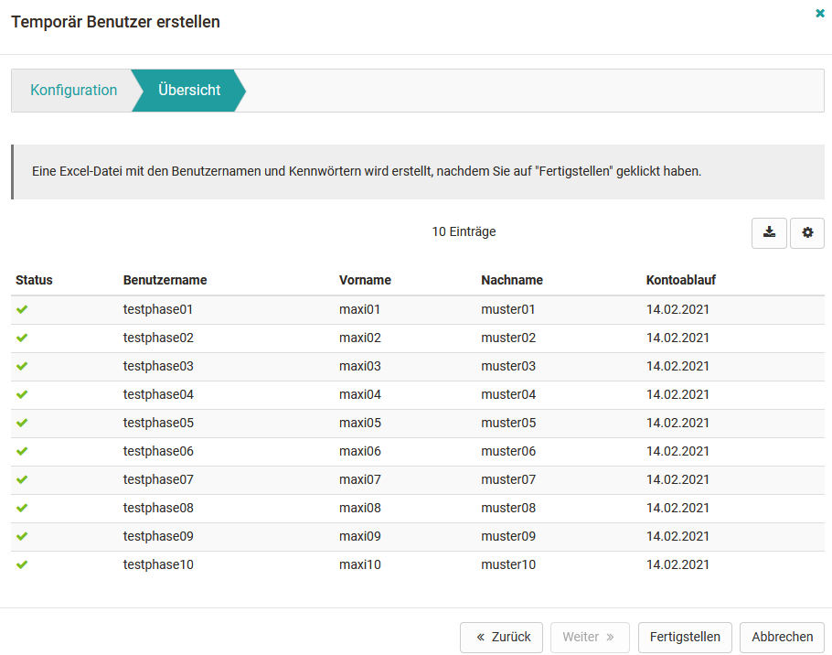

# Benutzer erstellen

Um mit OpenOlat arbeiten zu können, muss zunächst vom OpenOlat Administrator
bzw. Benutzerverwalter ein Benutzeraccount erstellt werden. Entweder geschieht
dies über ein externes Benutzerverwaltungssystem oder direkt in OpenOlat im
Tab "Benutzerverwaltung". Nur Administratoren und Benutzerverwalter können
Benutzer anlegen und löschen.

{ class="shadow lightbox" }

Ferner ist bei entsprechender Aktivierung auch eine Selbstregistrierung
möglich.

Sofern nichts anderes definiert wurde haben neu angelegte Accounts erst einmal
die Organisationsrolle "Benutzer". Weitere [Rollen](Configure_User.de.md) können im nächsten Schritt zugeordnet werden.

Sobald ein Benutzer erstellt ist, hat er Zugriff auf OpenOlat und die jeweils
für ihn zugeordneten Rechte.

## System Benutzer anlegen

Verbindliche Pflichtfelder sind dabei der Benutzername, Vorname, Nachname und
die E-Mail-Adresse. Darüber hinaus können weitere Informationen hinterlegt
werden. Über die Option "Kontoablauf", kann auch ein End- bzw. Ablaufdatum für
den Account definiert werden.

## System Benutzer importieren

Über den Button "Benutzer importieren" können Administratoren mit Hilfe eines
Wizards den "Benutzerimport starten". Der jeweils aktuell ausgewählte Bereich
der linken Navigation wird dabei als Default Einstellung für den Import
gewählt.

## Temporäre System Benutzer erstellen

Über den Button "Temporär Benutzer erstellen" kann eine bestimmte Anzahl von
Usern, z.B. für Testzwecke oder temporäre Events erstellt werden. Dabei kann
die Anzahl der zu erstellenden Benutzer angegeben, Präfixe für die relevanten
Benutzerdaten sowie das Datum für den Ablauf der temporären Benutzer definiert
werden. Auf diese Weise ist die Erstellung von vielen Accounts in kürzester
Zeit möglich.

{ class="shadow lightbox" }

## Benutzer erstellen sich selbst einen Account

Sofern in der Administration im Bereich "[Login](../administration/Login.de.md)" die
Selbstregistration aktiviert ist, können beliebige Personen sich selbst im
System registrieren. Weitere Einschränkungen können bei der
Selbstregistrierung definiert werden.

## Benutzer löschen

Über den Link "Benutzer löschen" können die Benutzer ohne Aktivität und
deaktivierte Benutzer angezeigt sowie bestimmte User ausgewählt und gelöscht
werden. Dabei wird das gesamte Benutzerkonto inklusive aller persönlichen
Daten gelöscht.

{ class="shadow lightbox" }

  

