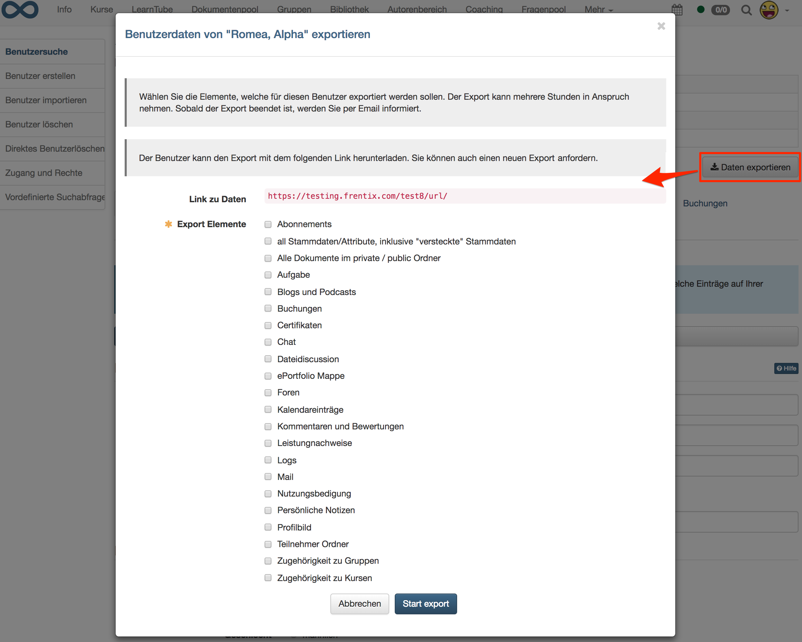
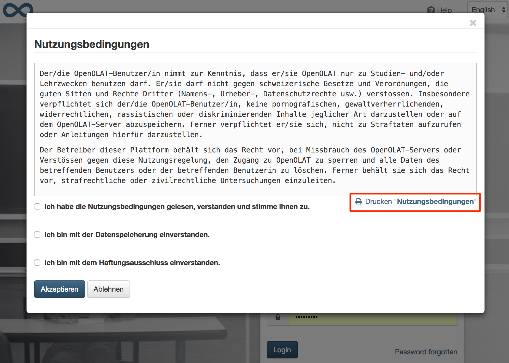
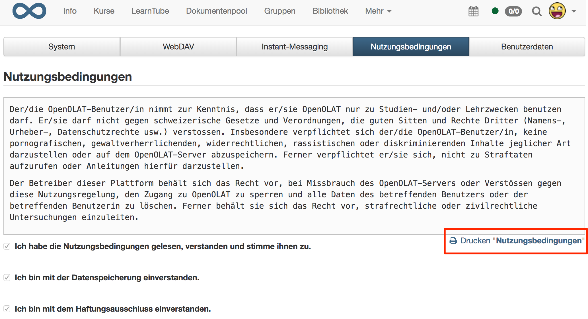

# Datenschutz {: #data_protection}

Die seit dem 25. Mai 2018 gültige Datenschutzgrundverordnung (DSGVO) der EU
regelt die Grundlagen für den Datenschutz von Benutzern. Zur Erfüllung der
Anforderungen der DSGVO bietet OpenOlat zum einen die Möglichkeit,
Benutzerdaten zu exportieren und zum anderen die Löschung von Benutzer:innen und
deren Daten.

## Löschen von Benutzer:innen und Benutzerdaten {: #delete_user}

Das Löschen von OpenOlat Benutzer:innen bewirkt folgendes:

* Für Benutzer:innen ohne Systemrolle werden alle Benutzerdaten gelöscht.
* Für Benutzer:innen mit administrativer Rolle werden alle Benutzerdaten bis auf Vor- und Nachnamen gelöscht, um eine transparente und konsistente Darstellung der administrativen Aktionen in den Logdateien (z. B. von Kursen) gewährleisten zu können. Die Daten können bei Bedarf in der [Benutzerverwaltung](../usermanagement/index.de.md) über die Aktion «Entfernen» in der Tabelle "Gelöschte Benutzer" ebenfalls gelöscht werden.
* Persönliche Daten werden aus den Log-Tabellen gelöscht. Der Benutzername wird gelöscht und in den Log-Tabellen durch eine ID ersetzt.
* Persönliche Daten werden aus dem Logfile gelöscht. Anstelle des Benutzernamens wird nur noch eine ID ins Logfile geschrieben.
* Das [Portfolio](../../manual_user/area_modules/Portfolio_General_Information.de.md) der Benutzer:innen wird gelöscht.
* Ins [Media Center](../../manual_user/basic_concepts/Media_Center_Concept.de.md) hochgeladene Medien gehören grundsätzlich einem/einer Besitzer:in. Beim Löschen des/der Besitzer:in gilt für seine/ihre Inhalte:
    * Medien mit Verwendung im ePortfolio werden gelöscht.
    * Medien ohne Verwendung in einem Kursbaustein "Seite", die nicht geteilt werden, werden gelöscht.
    * Medien mit Verwendung in einem Kursbaustein "Seite" oder solche, die geteilt wurden, werden beibehalten, sind ab dann aber ohne Besitzer:in.
    * Medien ohne Besitzer:in werden in Zukunft in der Medienverwaltung für Administrator:innen angezeigt.
* Persönliche Chat-Nachrichten der Benutzer:in werden gelöscht.
* Persönliche Forum-Posts und -Kommentare werden nach der Löschung des Nutzers anonymisiert und mit "unknown user" ausgewiesen.
* Kommentare und Bewertungen (Ratings) des Benutzers werden gelöscht. Antworten des gelöschten Benutzers auf Kommentare werden durch "User has been deleted" ersetzt.
* Die Visitenkarte des Benutzers wird nicht mehr in OpenOlat (z. B. im Forum oder bei Kommentaren) angezeigt.

[Zum Seitenanfang ^](#data_protection)

---

## Export von Benutzerdaten {: #export_user_data}

Für jeden Benutzer kann ein Export der in OpenOlat hinterlegten Benutzerdaten durchgeführt werden.

Der Export muss beim jeweiligen Benutzerverwalter angefordert werden. Der Benutzerverwalter kann über die Benutzerverwaltung den Export durchführen. Anschliessend steht der Export in den persönlichen Einstellungen des Nutzers, welcher den Export angefordert hat, im Tab "Benutzerdaten" zum Download bereit. Zusätzlich wird ein Download-Link generiert, welcher dem Nutzer vom Benutzerverwalter zur Verfügung gestellt werden kann.

Die exportierten Benutzerdaten sind nur für den Benutzer einsehbar, welcher den Export angefordert hat. Andere Benutzer und auch der Benutzerverwalter, der den Export ausgeführt hat, haben keinen Zugriff auf die exportierten Daten.

Der Export dient einzig zur Information des Nutzers, welche Daten auf OpenOlat gespeichert und verarbeitet werden. Das Wiederherstellen eines gelöschten Benutzers ist damit nicht möglich.

### Daten, die exportiert werden können

* Benutzerprofil und Stammdaten (inkl. versteckte Stammdaten) sowie persönliche Einstellungen
* Profilbild / Avatar
* Persönliche Notizen
* Dokumente des privaten und öffentlichen Ordners
* Informationen zu Nutzungsbedingungen und wann diese akzeptiert wurden
* Einträge des persönlichen Kalenders (iCal)
* Abonnements
* Kurs-Buchungsaufträge
* Leistungsnachweise
* Zugehörigkeit zu Kursen
* Zugehörigkeit zu Gruppen
* Mails
* Chat-Nachrichten
* Forum-Posts
* Kommentare und Bewertungen (Ratings)
* Blog- und Podcast-Beiträge
* Persönliche Dokumente aus Kurs Aufgaben
* Persönliche Dokumente aus Kurs Dateidiskussionen
* Persönliche Dokumente aus Kurs Teilnehmer-Ordner
* Log
* ePortfolio
* Zertifikate

{ class="shadow lightbox" }

[Zum Seitenanfang ^](#data_protection)

---

## Weitere Datenschutz-Funktionen 

### Drucken der Nutzungsbedingungen {: #print_terms_of_use}

Das Drucken der Nutzungsbedingungen ist sowohl während des Login-Prozesses im Dialog "Nutzungsbedingungen" als auch in den persönlichen Einstellungen im Tab "Nutzungsbedingungen" möglich.

{ class="shadow lightbox thumbnail-lg" }

{ class="shadow lightbox thumbnail-lg" }

### Sichtbarkeit von E-Mail-Adressen in OpenOlat {: #visibility_of_e-mail}

E-Mail Adressen anderer Benutzer:innen sind in OpenOlat nur für administrative Benutzer:innen, nicht aber für normale Benutzer:innen sichtbar.

[Zum Seitenanfang ^](#data_protection)

