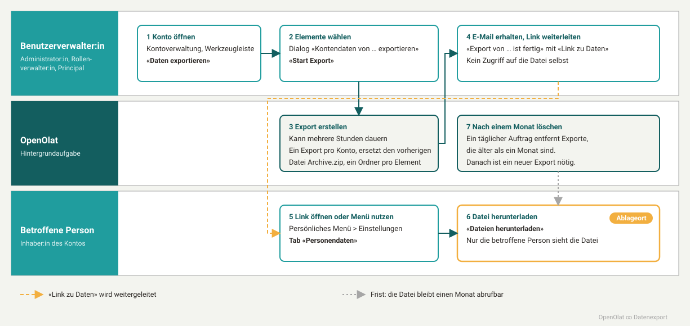
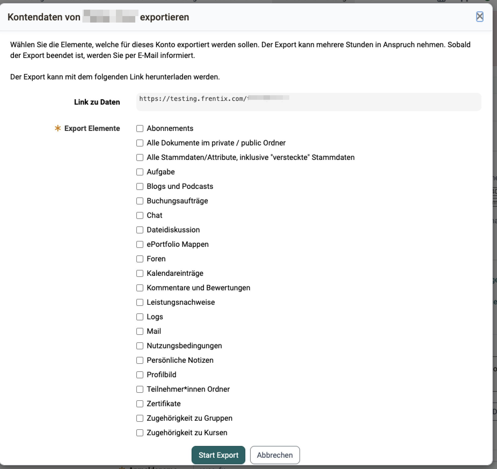
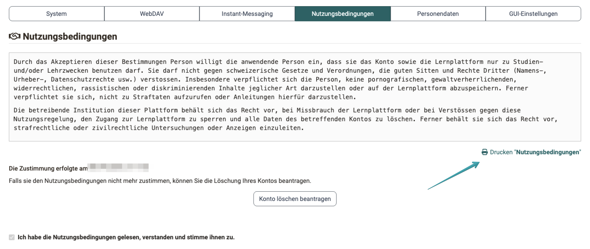

# Datenschutz {: #data_protection}

Die seit dem 25. Mai 2018 gültige Datenschutzgrundverordnung (DSGVO) der EU
regelt die Grundlagen für den Datenschutz von Benutzer:innen. Zur Erfüllung der
Anforderungen der DSGVO bietet OpenOlat zum einen die Möglichkeit,
Benutzerdaten zu exportieren und zum anderen die Löschung von Benutzer:innen und
deren Daten.

## Löschen von Benutzer:innen und Benutzerdaten {: #deletion_overview}

Konten löschen Benutzerverwalter:innen und Administrator:innen über die [Benutzerverwaltung](index.de.md). Systemadministrator:innen lösen Löschvorgänge über den Benutzerkonten-Lebenszyklus aus.

Beim Löschen wird ein Konto nicht physisch aus der Datenbank entfernt, sondern anonymisiert. Der Anmeldename wird durch eine anonyme Kennung ersetzt, die Profildaten werden geleert. Für Personen mit administrativer Rolle, für Kursbesitzer:innen und für Korrektor:innen mit Korrekturaufträgen in der Historie bleiben Vor- und Nachname erhalten, damit ihre Aktionen nachvollziehbar bleiben.

Welche Daten dabei gelöscht, anonymisiert oder erhalten werden, zeigt die Tabelle auf der Seite [Benutzer:in löschen](Delete_User.de.md#del_properties) im Detail.

[Zum Seitenanfang ^](#data_protection)

---

## Benutzerkonten-Lebenszyklus {: #account_lifecycle}

Der Benutzerkonten-Lebenszyklus ist das Instrument für die fristgerechte Löschung. Er läuft in drei Schritten: Kontoablauf, Deaktivierung und Löschung. Die Fristen und die Benachrichtigungen zu jedem Schritt legt die System-Administration fest: 
`Administration > Lebenszyklen > Konto`

Die Deaktivierung sperrt nur die Anmeldung. Das Konto bleibt mit allen Daten erhalten und lässt sich reaktivieren. Erst die Löschung anonymisiert das Konto und entfernt Daten. Die letzte Stufe läuft je nach Konfiguration automatisch ab oder wird ausschliesslich manuell ausgelöst.

[Details zum Benutzerkonten-Lebenszyklus >](../administration/Life_cycles_-_Administration.de.md#lifecycle_accounts)

[Zum Seitenanfang ^](#data_protection)

---

## Export von Benutzerdaten {: #export_user_data}

Für alle Benutzer:innen kann ein Export der in OpenOlat hinterlegten Benutzerdaten durchgeführt werden. Der Export dient einzig zur Information, welche Daten auf OpenOlat gespeichert und verarbeitet werden. Das Wiederherstellen einer gelöschten Benutzer:in ist damit nicht möglich.

Am Export sind zwei Rollen mit je eigenen Handlungen beteiligt. Die Grafik zeigt, wer was tut und wo die Datei am Ende liegt.

{ class="shadow lightbox" title="Ablauf des Datenexports nach Rollen" }

### Export auslösen {: #export_trigger}

Den Export lösen Administrator:innen, Benutzerverwalter:innen, Rollenverwalter:innen und Principals aus, jeweils für die Konten, die sie verwalten dürfen. Öffnen Sie das Konto und wählen Sie in der Werkzeugleiste **Daten exportieren**: 
`Benutzerverwaltung > Konto öffnen > Werkzeugleiste "Daten exportieren"`

Im Dialog «Kontendaten von "Vorname Nachname" exportieren» wählen Sie unter **Export Elemente** aus, was der Export enthalten soll. Mindestens ein Element ist Pflicht. Starten Sie den Lauf mit **Start Export**.

Der Export läuft im Hintergrund und kann mehrere Stunden dauern. Solange er läuft, ist kein zweiter Export für dasselbe Konto möglich. Pro Konto existiert höchstens ein Export: ein neuer Auftrag ersetzt den vorherigen.

### Benachrichtigung und Link {: #export_notification}

Sobald der Export bereit ist, erhalten Sie als auslösende Person eine E-Mail mit dem Betreff «Export von "Vorname Nachname" ist fertig». Sie enthält den Link zu den Daten, der auch im Dialog unter **Link zu Daten** steht.

Der Link führt die betroffene Person direkt zu ihrem Tab «Personendaten». Leiten Sie den Link an die Person weiter. Die betroffene Person selbst erhält keine E-Mail.

### Export abholen {: #export_download}

Die betroffene Person findet die Datei unter: 
`Persönliches Menü > Einstellungen > Tab "Personendaten"`

Dort steht die Schaltfläche **Dateien herunterladen** bereit. Die Datei heisst «Archive.zip» und enthält je gewähltem Element einen Ordner. Mehr zu diesem Tab: [Persönliche Konfiguration: Einstellungen](../../manual_user/personal_menu/Settings.de.md#tab_user_data)

!!! info "Wichtig"
    Nur die betroffene Person kann die Datei herunterladen. Wer den Export ausgelöst hat, hat keinen Zugriff darauf, auch nicht in der Rolle Benutzerverwalter:in.

Der Export bleibt einen Monat abrufbar. Danach löscht OpenOlat die Datei automatisch, und es ist ein neuer Export nötig.

Benutzer:innen können den Export nicht selbst auslösen. Im Tab «Personendaten» finden sie einen Mail-Link an den Support der Instanz, über den sie eine Übersicht ihrer Daten nach Artikel 15 DSGVO anfordern können.

### Daten, die exportiert werden können {: #exportable_data}

Der Dialog führt die Elemente alphabetisch auf. Die Auswahl umfasst:

* Abonnements
* Alle Dokumente im private / public Ordner
* Alle Stammdaten/Attribute, inklusive "versteckte" Stammdaten
* Aufgabe
* Blogs und Podcasts
* Buchungsaufträge
* Chat
* Dateidiskussion
* ePortfolio Mappen
* Foren
* Kalendareinträge
* Kommentare und Bewertungen
* Leistungsnachweise
* Logs
* Mail
* Nutzungsbedingungen
* Persönliche Notizen
* Profilbild
* Teilnehmer:innen Ordner
* Zertifikate
* Zugehörigkeit zu Gruppen
* Zugehörigkeit zu Kursen

{ class="shadow lightbox" }

[Zum Seitenanfang ^](#data_protection)

---

## Weitere Datenschutz-Funktionen

### Drucken der Nutzungsbedingungen {: #print_terms_of_use}

Das Drucken der Nutzungsbedingungen ist sowohl während des Login-Prozesses im Dialog "Nutzungsbedingungen" als auch in den persönlichen Einstellungen im Tab "Nutzungsbedingungen" möglich.

{ class="shadow lightbox" }

{ class="shadow lightbox" }

### Löschung des eigenen Kontos beantragen {: #request_account_deletion}

Im Tab «Nutzungsbedingungen» der persönlichen Einstellungen steht neben dem Zustimmungsdatum die Schaltfläche **Konto löschen beantragen**. Benutzer:innen stellen damit selbst einen Antrag, wenn sie den Nutzungsbedingungen nicht mehr zustimmen. Der Antrag geht als E-Mail an eine hinterlegte Adresse und nennt Konto-ID, Anmeldename und Namen. Löschen kann das Konto danach nur die Benutzerverwaltung, der Antrag löst keine automatische Löschung aus.

Die Schaltfläche erscheint nur, wenn die System-Administration diesen Weg freigegeben und eine Empfängeradresse hinterlegt hat: 
`Administration > Module > Anfrage Konto löschen`

Den Tab selbst beschreibt die Seite [Persönliche Konfiguration: Einstellungen](../../manual_user/personal_menu/Settings.de.md#tab_terms_of_use).

### Sichtbarkeit von E-Mail-Adressen in OpenOlat [:octicons-tag-16:{ title="ab Release 12.5 (OO-3518)" }](https://track.frentix.com/issue/OO-3518) {: #visibility_of_e-mail}

E-Mail Adressen anderer Benutzer:innen sind in OpenOlat nur für administrative Benutzer:innen, nicht aber für normale Benutzer:innen sichtbar.

[Zum Seitenanfang ^](#data_protection)

---

## Weiterführende Informationen {: #further_information}

[Benutzerverwaltung >](index.de.md) 
[Benutzer:in löschen >](Delete_User.de.md) 
[Lebenszyklen: Übersicht >](../administration/Life_cycles_-_Administration.de.md) 
[Persönliche Konfiguration: Einstellungen >](../../manual_user/personal_menu/Settings.de.md) 
[Nutzungsbedingungen >](../../manual_user/basic_concepts/Terms_Of_Use.de.md) 
[Media Center: Konzept >](../../manual_user/basic_concepts/Media_Center_Concept.de.md)

[Zum Seitenanfang ^](#data_protection)
