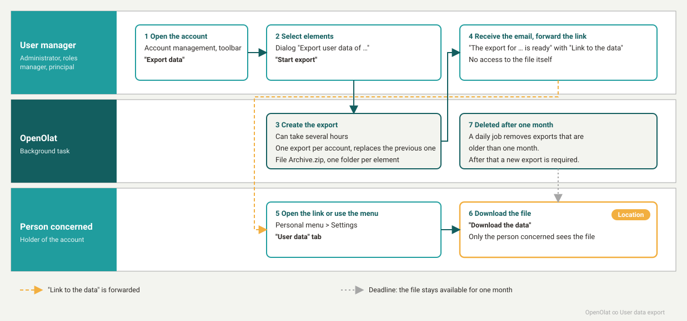
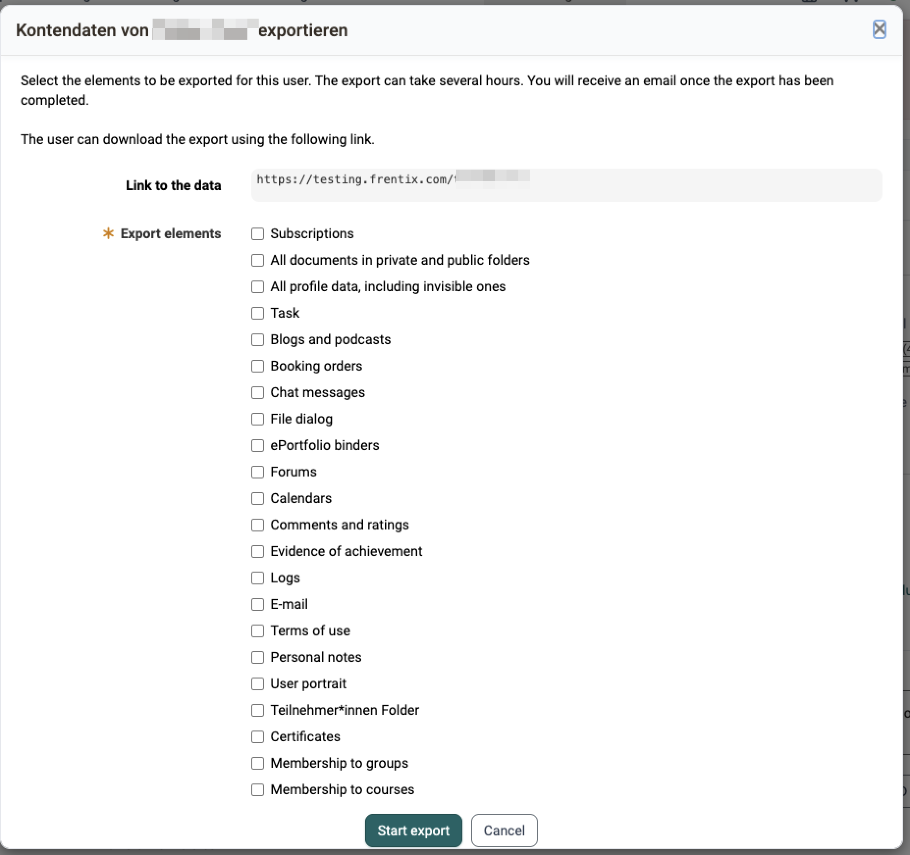
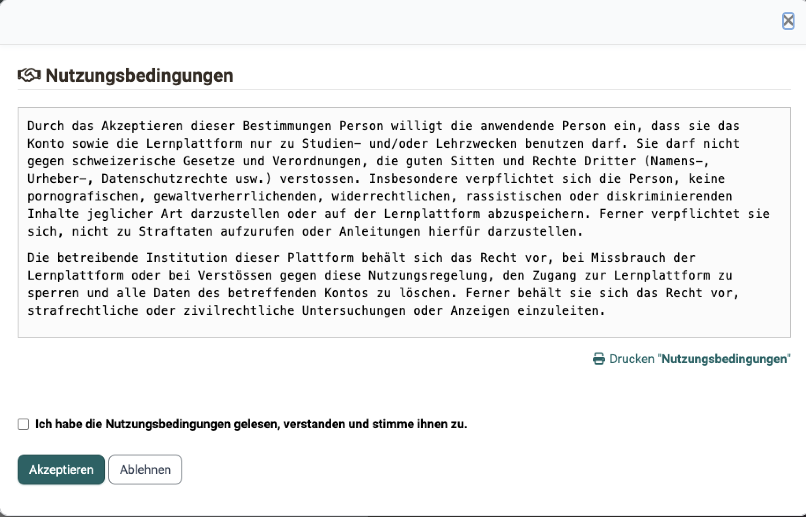
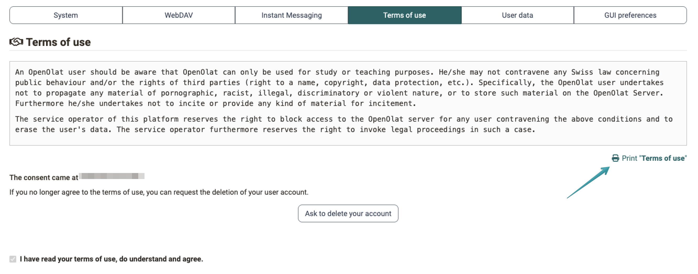

# Data protection {: #data_protection}

The EU General Data Protection Regulation (GDPR), which has been in force
since May 25, 2018, regulates the basic principles of user data protection. To
meet the requirements of the GDPR OpenOlat offers on the one hand the
possibility to export user data and on the other hand the deletion of users
and their data.

## Deleting users and user data {: #deletion_overview}

Accounts are deleted by user managers and administrators via the [user management](index.md). System administrators trigger deletions via the user account lifecycle.

When an account is deleted, it is not physically removed from the database but anonymised. The login name is replaced by an anonymous identifier and the profile data is cleared. For persons with an administrative role, for course owners and for graders with grading assignments in their history, the first and last name are retained so that their actions remain traceable.

Which data is deleted, anonymised or retained in the process is shown in detail in the table on the page [Delete user](Delete_User.md#del_properties).

[To the top of the page ^](#data_protection)

---

## User account lifecycle {: #account_lifecycle}

The user account lifecycle is the instrument for deletion within a defined period. It runs in three steps: account expiry, deactivation and deletion. The deadlines and the notifications for each step are configured in the system administration: 
`Administration > Life Cycles > Account`

Deactivation only blocks the login. The account is retained with all its data and can be reactivated. Only deletion anonymises the account and removes data. Depending on the configuration, the last step runs automatically or is triggered manually only.

[Details on the user account lifecycle >](../administration/Life_cycles_-_Administration.md#lifecycle_accounts)

[To the top of the page ^](#data_protection)

---

## Export of user data {: #export_user_data}

The user data stored in OpenOlat can be exported for all users. The export serves solely to inform the person which data is stored and processed on OpenOlat. It is not possible to restore a deleted user.

Two roles with their own actions are involved in the export. The diagram shows who does what and where the file ends up.

{ class="shadow lightbox" title="Sequence of the user data export by role" }

### Trigger the export {: #export_trigger}

The export is triggered by administrators, user managers, roles managers and principals, each for the accounts they are allowed to manage. Open the account and select **Export data** in the toolbar: 
`User management > open the account > toolbar "Export data"`

In the dialog "Export user data of "First name Last name"" select under **Export elements** what the export is to contain. At least one element is mandatory. Start the run with **Start export**.

The export runs in the background and can take several hours. While it is running, no second export is possible for the same account. There is at most one export per account: a new request replaces the previous one.

### Notification and link {: #export_notification}

As soon as the export is ready, you as the triggering person receive an email with the subject "The export for "First name Last name" is ready". It contains the link to the data, which is also shown in the dialog under **Link to the data**.

The link takes the person concerned directly to their "User data" tab. Forward the link to that person. The person concerned does not receive an email.

### Download the export {: #export_download}

The person concerned finds the file under: 
`Personal menu > Settings > "User data" tab`

The **Download the data** button is available there. The file is called "Archive.zip" and contains one folder per selected element. More about this tab: [Personal Configuration: Settings](../../manual_user/personal_menu/Settings.md#tab_user_data)

!!! info "Important"
    Only the person concerned can download the file. Whoever triggered the export has no access to it, not even in the role of user manager.

The export stays available for one month. After that OpenOlat deletes the file automatically, and a new export is required.

Users cannot trigger the export themselves. In the "User data" tab they find a mail link to the support address of the instance, through which they can request an overview of their data in accordance with Article 15 GDPR.

### Data that can be exported {: #exportable_data}

The dialog lists the elements alphabetically. The selection covers:

* All documents in private and public folders
* All profile data, including invisible ones
* Blogs and podcasts
* Booking orders
* Calendars
* Certificates
* Chat messages
* Comments and ratings
* Disclaimer
* Emails
* ePortfolio binders
* Evidence of achievement
* File dialog
* Forums
* Logs
* Membership to courses
* Membership to groups
* Notes
* Participant folders
* Profile image
* Subscriptions
* Tasks

{ class="shadow lightbox" }

[To the top of the page ^](#data_protection)

---

## Further data protection options

### Printing the Terms of Use {: #print_terms_of_use}

The terms of use can be printed both during the login process in the "Terms of Use" dialog and in the personal settings in the "Terms of Use" tab.

{ class="shadow lightbox" }

{ class="shadow lightbox" }

### Ask to delete your own account {: #request_account_deletion}

In the "Terms of Use" tab of the personal settings, the **Ask to delete your account** button is shown next to the date of consent. Users use it to file a request themselves when they no longer agree to the terms of use. The request is sent as an email to a configured address and states the account ID, the login name and the name. Only the user management can delete the account afterwards; the request does not trigger an automatic deletion.

The button only appears if the system administration has enabled this option and configured a recipient address: 
`Administration > Modules > Request account deletion`

The tab itself is described on the page [Personal Configuration: Settings](../../manual_user/personal_menu/Settings.md#tab_terms_of_use).

### Visibility of email addresses in OpenOlat [:octicons-tag-16:{ title="from Release 12.5 (OO-3518)" }](https://track.frentix.com/issue/OO-3518) {: #visibility_of_e-mail}

Email addresses of other users are only visible in OpenOlat for administrative users, not for normal users.

[To the top of the page ^](#data_protection)

---

## Further information {: #further_information}

[User management >](index.md) 
[Delete user >](Delete_User.md) 
[Life cycles - Overview >](../administration/Life_cycles_-_Administration.md) 
[Personal Configuration: Settings >](../../manual_user/personal_menu/Settings.md) 
[Terms of Use >](../../manual_user/basic_concepts/Terms_Of_Use.md) 
[Media Center Concept >](../../manual_user/basic_concepts/Media_Center_Concept.md)

[To the top of the page ^](#data_protection)
