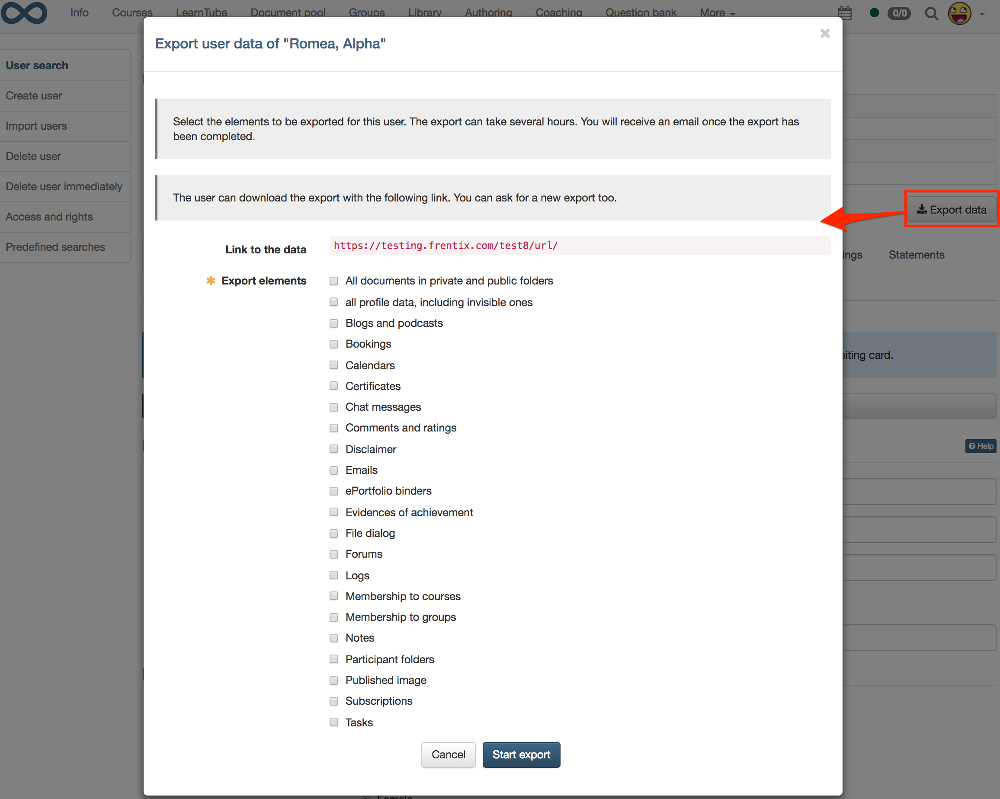

# Data protection {: #data_protection}

The EU General Data Protection Regulation (GDPR), which has been in force
since May 25, 2018, regulates the basic principles of user data protection. To
meet the requirements of the GDPR OpenOlat offers on the one hand the
possibility to export user data and on the other hand the deletion of users
and their data.

## Deleting users and user data {: #delete_user}

Deleting OpenOlat users has the following effect:

* For users without a system role, all user data is deleted.
* For users with administrative roles, all user data except first and last name is deleted to ensure a transparent and consistent display of administrative actions in the log files (e.g. of courses). If required, the data can also be deleted in the [user management](../usermanagement/index.md) via the “Clear” action in the "Deleted Users" table.
* Personal data is deleted from the log tables. The username is deleted and replaced by an ID in the log tables.
* Personal data is deleted from the log file. Instead of the username, only one ID is written into the log file.
* The user’s [portfolio](../../manual_user/area_modules/Portfolio_General_Information.md) is deleted.
* Media uploaded to the [Media Center](../../manual_user/basic_concepts/Media_Center_Concept.md) always belong to one owner. If the owner deletes his/her content, this applies to his/her content:
  * Media used in the ePortfolio will be deleted.
  * Media not used in a "Page" course element that are not shared are deleted.
  * Media used in a "Page" course element or those that have been shared are retained, but are then without an owner.
  * Media without an owner will be displayed in the media management for administrators in future.
* The user’s personal chat messages are deleted.
* Personal forum posts and comments will be anonymized after the deletion of the user and identified as "unknown user".
* Comments and ratings of the user are deleted. Replies of the deleted user to comments are replaced by "User has been deleted".
* The user’s visiting card is no longer displayed in OpenOlat (e.g. in the forum or for comments).

[To the top of the page ^](#data_protection)

---

## Export of user data {: #export_user_data}

The user data stored in OpenOlat can be exported for each user.

The export must be requested from the respective user administrator. The user administrator can perform the export via the user management. The export is then available for download in the personal settings of the user who requested the export in the "User data" tab. In addition, a download link is generated, which can be made available to the user by the user administrator.

The exported user data can only be viewed by the user who requested the export. Other users and the user administrator who executed the export do not have access to the exported data.

The export serves solely to inform the user which data is stored and processed on OpenOlat. It is not possible to restore a deleted user.

### Data that can be exported

* User profile data (incl. invisible data) as well as personal settings
* Published image (profile picture)
* Personal notes
* Documents in private and public folders
* Information on terms of use and when they were accepted
* Entries of the personal calendar (iCal)
* Subscriptions
* Course bookings
* Evidences of achievement
* Membership to couses
* Membership to groups
* E-mails
* Chat messages
* Forum posts
* Comments and ratings
* Blog and Podcast posts
* Personal documents from course tasks
* Personal documents from course file dialog
* Personal documents from course participant folder
* Log
* ePortfolio
* Certifications

{ class="shadow lightbox" }

[To the top of the page ^](#data_protection)

---

## Further data protection options

### Printing the Terms of Use {: #print_terms_of_use}

The terms of use can be printed both during the login process in the "Terms of Use" dialog and in the personal settings in the "Terms of Use" tab.

{ class="shadow lightbox thumbnail-lg" }

{ class="shadow lightbox thumbnail-lg" }

### Visibility of e-mail addresses in OpenOlat {: #visibility_of_e-mail}

E-mail addresses of other users are only visible in OpenOlat for administrative users, not for normal users.

[To the top of the page ^](#data_protection)

