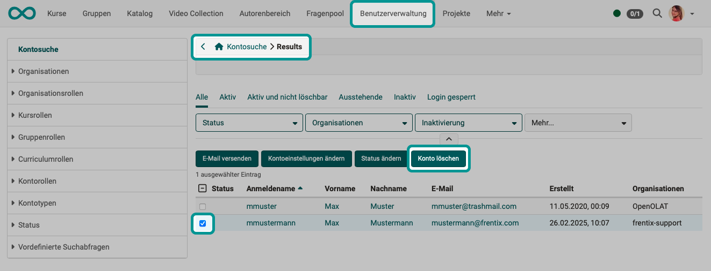
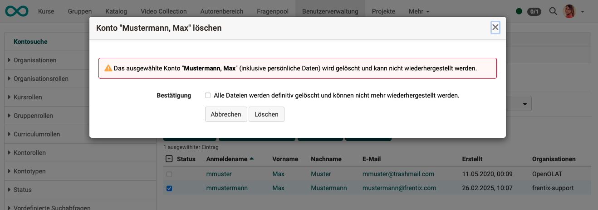
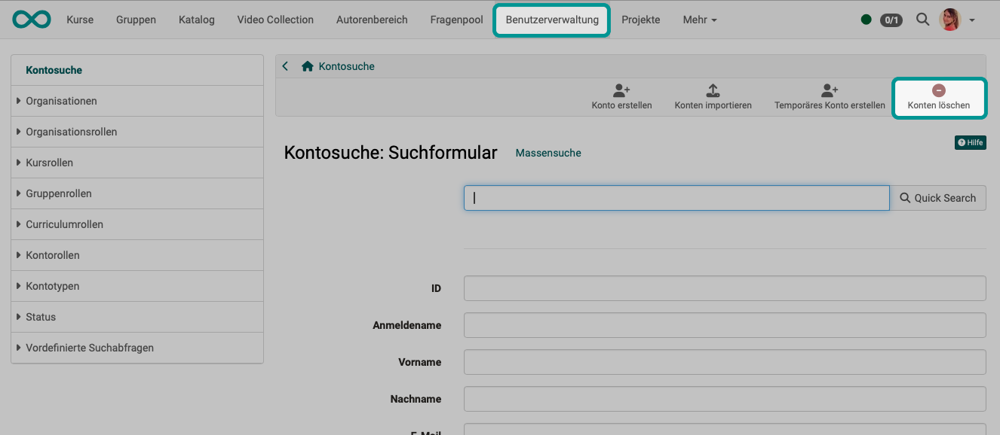
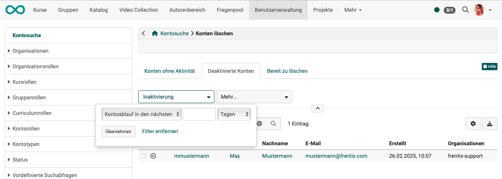
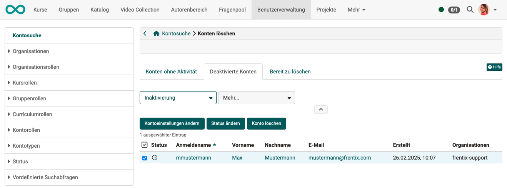

# Benutzer:in löschen {: #delete_user}

## Was geschieht beim Löschen eines Kontos?

Wird das Konto eines/einer Benutzer:in gelöscht, ist diese Person in Zukunft nicht mehr als registriert in OpenOlat bekannt und auffindbar.

Für die Arbeitsergebnisse dieser Person gelten beim Löschen ihres Kontos eigene Regeln. Siehe unten: [Was wird gelöscht?](#del_properties), [Was wird nicht gelöscht?](#none_del_properties)

## Variante 1 {: #delete_user_var1}

**Schritt 1:** 
Suchen Sie in der Benutzerverwaltung mit der Kontensuche die Benutzer:innen, deren Konten gelöscht werden sollen.

**Schritt 2:** 
Markieren Sie im Suchergebnis die zu löschenden Benutzer:innen in der Checkbox am Anfang der Zeile. Sobald mindestens 1 Person markiert ist, erscheint u.a. der Button "Konto löschen" über der Liste.

{ class="shadow lightbox" }

**Schritt 3:** 
Nach Klick auf diesen Button erscheint nochmals eine Sicherheitsabfrage, die Sie bestätigen müssen.

{ class="shadow lightbox" } 

[Zum Seitenanfang ^](#delete_user)

---

## Variante 2 {: #delete_user_var2}

**Schritt 1:** 
Auch über den Link "Konten löschen" können Benutzer:innen ausgewählt und deren OpenOlat-Konten gelöscht werden.

{ class="shadow lightbox" }

**Schritt 2:** 
Hier finden Sie zunächst die potenziellen Kanditat:innen für eine Löschung in 3 Tabs vorsortiert. Sie finden so schneller alle Benutzer:innen ohne Aktivität oder bereits deaktivierte Benutzer:innen.

**Tab "Konten ohne Aktivität":** Hier werden alle Benutzer:innen angezeigt, die über einen bestimmten Zeitraum nicht mehr in OpenOlat aktiv waren. Der Zeitraum, der zu einer Auflistung hier führt, kann von Administrator:innen festgelegt werden. 

**Tab "Deaktivierte Konten":** Hier werden alle Benutzer:innen angezeigt, deren Konto bereits automatisch oder manuell deaktiviert wurden. Sie können sich auch Konten anzeigen lassen, deren Inaktivierung in einer bestimmten Zeit ansteht.

**Tab "Bereit zu löschen":** tbd

{ class="shadow lightbox" }

**Schritt 3:** 
Markieren Sie die zu löschenden Benutzer:innen in der Checkbox am Anfang der Zeile. Sobald mindestens 1 Person markiert ist, erscheint u.a. der Button "Konto löschen" über der Liste.

{ class="shadow lightbox" }

**Schritt 4:** 
Nach Klick auf diesen Button erscheint nochmals eine Sicherheitsabfrage, die Sie bestätigen müssen.

[Zum Seitenanfang ^](#delete_user)

---

## Was wird gelöscht? {: #del_properties}

:octicons-flame-24: Alle **persönlichen Daten** werden gelöscht (Telefonnummer, Zugehörigkeit zu einer Institution, usw.)

:octicons-flame-24: Erworbene **Zertifikate** werden gelöscht. Auch im Bewertungswerkzeug des/der Kursbetreuer:in sind die Zertifkate nicht mehr gelistet.
Es ist sinnvoll, deshalb die zu löschenden Benutzer:innen vorher darauf hinzuweisen, dass sie im persönlichen Menü ihre erworbenen Zertifikate herunterladen.

:octicons-flame-24: **Kurs-Badges** werden gelöscht. Es ist sinnvoll, deshalb die zu löschenden Benutzer:innen vorher darauf hinzuweisen, dass sie im persönlichen Menü ihre erworbenen Badges herunterladen.

:octicons-flame-24: Mit dem Löschen eines/einer Benutzer:in werden auch **Mitgliedschaften in Kursen** gelöscht. Auch wenn die Rolle in diesem Kurs "Besitzer:in" und "Betreuer:in" war. Wenn der/die gelöschte Benutzer:in Ersteller:in und einziger Besitzer/einzige Besitzer:in war, wird ersatzweise ein/eine Administrator:in als Besitzer:in des Kurses eingetragen.

:octicons-flame-24: Gelöschte Benutzer:innen sind in den **Statistiken** besuchter Kurse nicht mehr berücksichtigt.

:octicons-flame-24: **Mitgliedschaften in Gruppen** werden gelöscht. (Die Gruppen selbst werden nicht gelöscht, auch wenn sie von dem/der gelöschten Benutzer:in erstellt wurden und er/sie einziges Mitglied ist.)

:octicons-flame-24: Die **Mitgliedschaft in Projekten** wird gelöscht und die Person ist nicht mehr in der Liste der Projektmitglieder zu finden. (Von dem/der gelöschten Benutzer:in in einem Projekt erstellte To-dos bleiben jedoch erhalten.)

:octicons-flame-24: Von der gelöschten Person **erzielte Testresultate** werden ebenfalls gelöscht und sind im Bewertungswerkzeug eines Kuraes nicht mher berücksichtigt.

:octicons-flame-24: War der/die gelöschte Benutzer:in potenzieller/potenzielle **Empfänger:in einer Erinnerungsmail**, wird die Mail nicht mehr an die gelöschte Person geschickt. (Die Empfängerliste wird zum Zeitpunkt der Prüfung der Regeln erstellt, deshalb erscheint eine gelöschte Person gar nicht mehr auf der Versandliste.)

:octicons-flame-24: In einem **ePortfolio** erstellte **Mappen, Bereiche und Einträge** werden gelöscht. Wenn Mappen an andere Benutzer:innen frei gegeben wurden, sind sie auch dort nicht mehr zur abrufbar.

:octicons-flame-24: Werden Konten **externer Korrektor:innen** gelöscht, so werden diese in den Listen nicht mehr namentlich aufgeführt. Die Korrekturaufträge bleiben jedoch erhalten (siehe unten).

[Zum Seitenanfang ^](#delete_user)

---

## Was wird nicht gelöscht? {: #none_del_properties}

:octicons-pin-24: Wurden **Globale Badges** vergeben, wird in der Liste der vergebenen globalen Badges (durch Administrator:innen abrufbar unter Administration > e-Assessment > OpenBadges > Tab "Vergebene globale Badges") an Stelle des Namens des Empfängers/der Empfängerin nur noch "unknown user" angezeigt. Es bleibt so noch ersichtlich, wann und durch wen ein globaler Badge einmal vergeben wurde. Auch wenn durch Klick auf "Widerrufen" der Badge entzogen wird, bleibt er als Listeneintrag mit dem Status "Widerrufen" in der Liste der vergebenen globalen Badges erhalten. 

:octicons-pin-24: Die **To-dos** eines/einer gelöschten Benutzer:in bleiben erhalten, sind dann allerdings niemandem mehr zugewiesen.
Auch bereits erledigte To-dos bleiben erhalten (ohne Angabe des/der Benutzer:in, die dieses To-do zu erledigen hatte). Der Ablauf von Projekten bleibt so weiter ersichtlich. Unerledigte To-dos müssen aber neu zugeordnet werden. 

:octicons-pin-24: **Gruppen**, die von der gelöschten Person angelegt wurden, werden nicht gelöscht. Es wird lediglich die gelöschte Benutzer:in als Gruppenmitglied entfernt.
Wenn die gelöschte Benutzer:in der/die einzige Gruppenbetreuer:in war, wird ersatzweise der/die Administrator:in als Gruppenbetreuer:in eingetragen.

:octicons-pin-24: **Lernressourcen und Kurse** werden nicht gelöscht, wenn deren Besitzer:in gelöscht wird.
Wenn die gelöschte Benutzer:in der/die einzige Besitzer:in war, wird ersatzweise der/die Administrator:in als Besitzer:in eingetragen.

:octicons-pin-24: Auch wenn der/die Besitzer:in einer **Test-Lernressource** aus der Benutzerverwaltung gelöscht wird, werden die von diesem/dieser Benutzer:in erstellte Test-Lernressourcen nicht gelöscht. Unabhängig davon, ob die Lernressource publiziert oder mit anderen Autoren geteilt oder nirgends referenziert/verwendet wurde. Wenn die gelöschte Benutzer:in der/die einzige Besitzer:in war, wird ersatzweise der/die Administrator:in als Besitzer:in eingetragen.

:octicons-pin-24: Auch die **im Fragenpool enthaltenen Fragen** gelöschter Besitzer:innen werden nicht gelöscht und stehen weiter zur Verwendung. Unter den Metadaten der Fragen im Dropdown "Rechte" wird der/die Angabe des/der Autor:in gelöscht und die Frage hat dann keine Autor:in mehr.

:octicons-pin-24: Im **Media Center erstellte Elemente** werden nicht gelöscht, wenn der/die Ersteller:in als Benutzer:in aus OpenOlat gelöscht wird. Die erstellten Elemente haben dann keine Angabe zu einem/einer Autor:in mehr. Sie können aber mit dem Suchbegriff "ohne Autor:in" gefiltert und gesucht werden.

:octicons-pin-24: Werden Benutzer:innen gelöscht, die **Korrekturaufträge** als externer/externe Korrektor:in hatten, so gelten folgende Regeln: 
\- **Bereits erledigte Korrekturaufträge** erscheinen entsprechend zugeordnet im Bewertungswerkzeug des/der Kursbesitzer:in. 
\- **Noch nicht erledigte Korrekturaufträge** erscheinen auf der Liste "Offene Bewertungen" im Bewertungswerkzeug des/der Kursbesitzer:in. 
\- Die Kursbesitzer:innen können nach Anwahl des betreffenden Test-Kursbausteins und eines Teilnehmers/einer Teilnehmerin im **Änderungsverlauf** (Link am unteren Rand des Screens) nachsehen, wer eine Korrektur vorgenommen hat. Es sind dort auch die Namen inzwischen gelöschter Benutzer:innen noch ersichtlich.

:octicons-pin-24: Wird für Curricula bezahlt, werden **Buchungsaufträge** erstellt. Beim Löschen von Benutzer:innen werden die Namen in ihren Buchungsaufträgen entfernt, die Buchungsaufträge selbst bleiben jedoch erhalten.

:octicons-pin-24: Zu Buchungaufträgen (bezahlte Curricula) wird jeweils eine **Rechnungsadresse** benötigt. Um Zahlungen nachvollziehen zu können (z.B. für Steuerbehörden), bleiben die Rechnungsadressen erhalten.

:octicons-pin-24: Umfrageergebnisse aus dem Qualitätsmanagement 

!!! warning "Attention"

    This article is still under construction.

[Zum Seitenanfang ^](#delete_user)

---

## Wann kann ein/eine Benutzer:in nicht gelöscht werden? {: #none_deleted_user}

!!! warning "Attention"

    This article is still under construction.

[Zum Seitenanfang ^](#delete_user)

