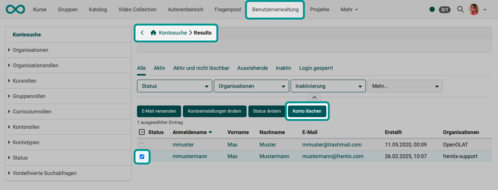
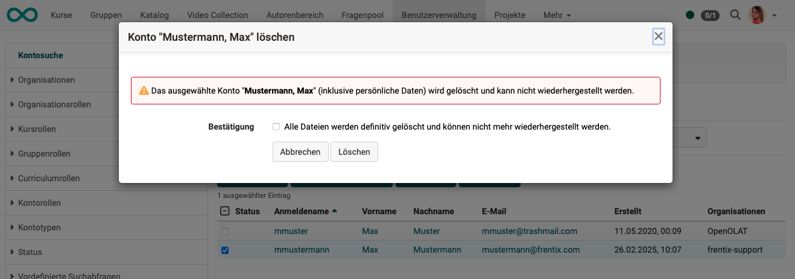
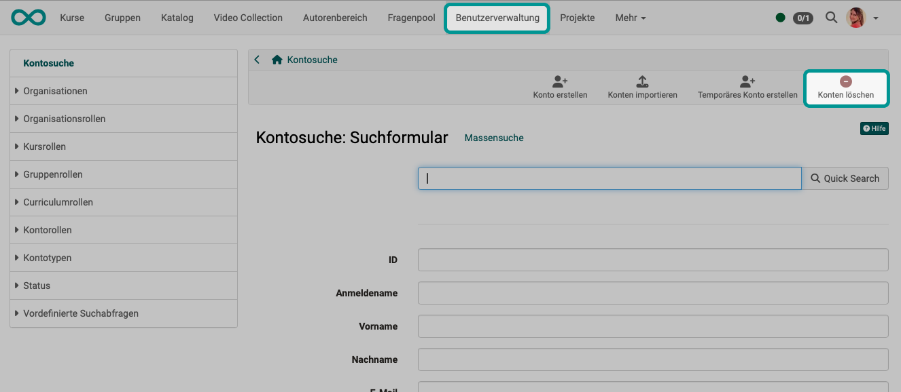
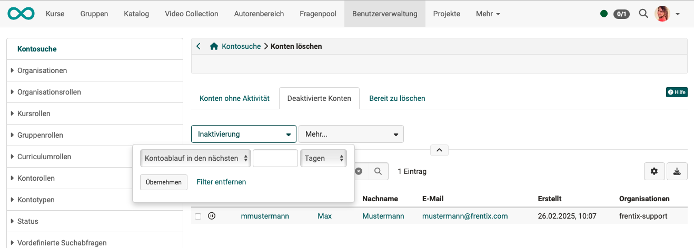
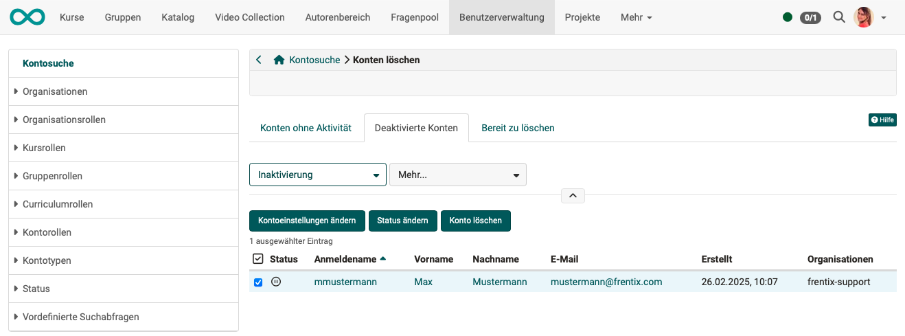

# Delete user {: #delete_user}

!!! warning "Attention"

    This article is still under construction.

## What happens when an account is deleted?

When a user's account is deleted, that person is no longer known as a registered user in OpenOlat and can no longer be found.

**Work results** created by that person are subject to their own rules when the account is deleted. See below: [What is deleted?](#del_properties)

## Who may delete user accounts?

To delete an account, access to user management is required. The following roles have this access:

* User manager
* Administrator
* System administrator (no direct access to user management, but can trigger deletions via the account lifecycle)

[To top of page ^](#delete_user)

---

## Option 1 {: #delete_user_var1}

**Step 1:** 
In the user management, use the account search to find the users whose accounts are to be deleted.

**Step 2:** 
In the search results, mark the users to be deleted using the checkbox at the beginning of the row. As soon as at least 1 person is marked, the "Delete account" button appears above the list.

{ class="shadow lightbox" }

**Step 3:** 
After clicking this button, a confirmation dialog appears which you must confirm.

{ class="shadow lightbox" }

[To top of page ^](#delete_user)

---

## Option 2: Search for inactive / deactivated accounts {: #delete_user_var2}

**Step 1:** 
Users can also be selected and their OpenOlat accounts deleted via the "Delete accounts" link.

{ class="shadow lightbox" }

**Step 2:** 
Candidates for deletion are pre-sorted into 3 tabs — corresponding to the phases of the user account lifecycle:

**Tab "Accounts without activity":** Users who have not been active for a configured period of time. The inactivity period is set by the administration.

**Tab "Deactivated accounts":** Users whose account has already been deactivated automatically or manually, as well as accounts with upcoming deactivation.

**Tab "Ready to delete":** Users whose account has exceeded the configured deactivation period and is ready for permanent deletion.

!!! info "Configuration of the user account lifecycle"
    The lifecycle runs in three phases: **Account expiry**, **Deactivation** and **Deletion**. The applicable deadlines and notifications are configured under Administration > Life Cycles > Account. 
    [Details on the user account lifecycle](../administration/Life_cycles_-_Administration.md#lifecycle_accounts)

{ class="shadow lightbox" }

**Step 3:** 
Mark the users to be deleted using the checkbox at the beginning of the row. As soon as at least 1 person is marked, the "Delete account" button appears above the list.

{ class="shadow lightbox" }

**Step 4:** 
After clicking this button, a confirmation dialog appears which you must confirm.

[To top of page ^](#delete_user)

---

## Option 3: Automatic deletion {: #delete_user_var3}

Users can also be deleted fully automatically by an activated user lifecycle.

[Details on the user lifecycle >](../../manual_admin/administration/Life_cycles_-_Administration.md#lifecycle_accounts) 
[How do I manage lifecycles of groups, courses or user accounts? >](../../manual_how-to/lifecycle/lifecycle.md#user_account_lifecycle)

[To top of page ^](#delete_user)

---

!!! warning "Attention"

    This article is still under construction.

## What is deleted? {: #del_properties}

When a user is deleted:

* some information must be irreversibly deleted (e.g. phone number)
* some information can/should be retained without a name (e.g. a forum post without which a discussion thread would lose its meaning)
* some information must be retained (e.g. billing address → retention obligation)

It must be taken into account that information is technically linked to different objects:

:octicons-person-24: = Information is directly linked to the **person** 
:octicons-package-24: = Information is stored together with a **course/group/etc.** 
:octicons-infinity-24: = Information is stored in the **OpenOlat system**

|Information|What happens to it?|
|---| ---------------------------------------- |
|User management > **Profile** :octicons-person-24: |**Deleted:** Login name, first name, last name, email, email signature, date of birth, gender, private phone, mobile phone, business phone, Skype ID, XING profile name, ICQ, homepage, street, address supplement, PO box, postal code, region/canton, city, country, institution, institution number (matriculation number), institution email, organisational unit, study group, field of study, personal text "About me", personal profile picture. **Exceptions:** For persons with administrative permissions, first and last name are retained so that actions can continue to be traced.|
|User management > **Business card** :octicons-person-24:|All details on the business card are taken from the profile, so after the profile is deleted they are no longer available for the business card either. The user's business card is no longer displayed in OpenOlat (e.g. in forums or comments).|
|User management > **System settings** :octicons-person-24: |All system settings are deleted: general system settings (e.g. language), special system settings (e.g. the start page) and personal tools.|
|User management > **Account** :octicons-person-24:| Account type, account creation date, last login and account expiry are deleted. The account is set to the status "deleted". |
|**Roles** :octicons-person-24: :octicons-package-24: | The roles and permissions assigned in user management are deleted. |
|User management > **Password** :octicons-person-24: | The password of deleted users is irreversibly deleted.|
|User management > **Authentications** :octicons-person-24: | All authentication options are deleted.|
|User management > **Properties** :octicons-person-24: | Properties are completely deleted.|
|User management > **GUI settings** :octicons-person-24: | GUI settings are completely deleted.|
|**Booking orders** :octicons-person-24: :octicons-package-24: :octicons-infinity-24: |If booking orders exist, the names of users are removed from their booking orders when they are deleted, but the booking orders themselves are retained. **Exception:** Booking orders of the type "Invoice" are retained without a name.|
|**Billing address** :octicons-person-24: :octicons-package-24: :octicons-infinity-24: |To be able to trace payments (e.g. for tax authorities), billing addresses are retained.|
|**Reasonable adjustments** :octicons-person-24: | tbd |
|**Subscriptions** :octicons-person-24: | All subscriptions are deleted.|
|**Relationships** :octicons-person-24: | tbd|
|**Organisational membership** :octicons-person-24: | tbd |
|**Quota** :octicons-person-24: | tbd |
|**Lectures** :octicons-person-24: | Participation in lectures/absences is deleted.|
|**Competences** :octicons-person-24: | Competences are deleted.|
|User management > **Course Planner roles** :octicons-person-24: | tbd |
|**Personal calendar** :octicons-person-24: | The personal calendar is deleted.|
|**Chat history** :octicons-person-24: | Chats (messages, settings) are anonymised.|
|**Personal folder** :octicons-person-24: |The personal folder is deleted.|
|**Portfolio** :octicons-person-24: | Binders, sections and entries created in an ePortfolio are deleted. If binders were shared with other users, they are no longer accessible there either.|
|**Personal to-dos** :octicons-person-24: | tbd (to-dos in projects: see below) |
|**Mailbox** :octicons-person-24: |Emails listed in the mailbox of the personal menu are deleted. (The internal email inbox is completely deleted.)|
|**Recipient of a reminder email** :octicons-package-24: |If the deleted user was a potential recipient of a reminder email, the email will no longer be sent to the deleted person. (The recipient list is created at the time the rules are checked, so a deleted person no longer appears on the mailing list.)|
|**Group membership** :octicons-person-24: :octicons-package-24: | Group memberships are deleted. (The groups themselves are not deleted, even if they were created by the deleted user and they were the only member. Only the deleted user is removed as a group member. If the deleted user was the only group coach, an administrator is entered as a substitute group coach. As a rule, groups without members will then be deleted at a later point in time by the Group Life Cycle process.)|
|**Project membership** :octicons-person-24: :octicons-package-24: |Project membership is deleted and the person is no longer found in the list of project members. (To-dos created by the deleted user in a project are retained, however.)|
|**To-dos in projects** :octicons-person-24: |In projects, the to-dos of a deleted user are retained but are no longer assigned to anyone. Completed to-dos are also retained (without specifying the user who was supposed to complete the to-do). The progress of projects remains visible. Uncompleted to-dos must be reassigned.|
|**Course membership** :octicons-person-24: | Course memberships are deleted, even if the role in that course was "Owner" or "Coach". If the deleted user was the creator and sole owner, an administrator is entered as a substitute owner.|
|**Data in the course element Task** :octicons-person-24: :octicons-package-24: |Documents created and uploaded within a task by the deleted person are deleted (e.g. draw.io, Word, Excel, ppt).|
|**Peer review data in the course element Task** :octicons-person-24: :octicons-package-24: | tbd |
|**Data in the course element Participant folder** :octicons-person-24: :octicons-package-24: | tbd |
|**Data in the course element Forum** :octicons-person-24: :octicons-package-24: |Personal forum posts and comments are anonymised after the user is deleted and displayed as "unknown user".|
|**Data in the course element BBB** :octicons-person-24: :octicons-package-24: |Participants in BBB meetings are deleted.|
|**Data in the course element Adobe Connect** :octicons-person-24: :octicons-package-24: |All data stored by OpenOlat in the background is deleted.|
|**Data in the course element Vitero** :octicons-person-24: :octicons-package-24: |All data stored by OpenOlat in the background is deleted.|
|**Office for the web** :octicons-person-24: :octicons-package-24: |All data stored by OpenOlat in the background is deleted.|
|**Test results** :octicons-person-24: | tbd |
|**Evidence of achievements** :octicons-person-24: | tbd |
|**Certificates** :octicons-person-24: | Certificates with a QR code (with the variable "certificateVerificationUrl") are not deleted so that a certificate can still be verified via URL using the host-based verification method. However, the certificates are no longer listed in the assessment tool of the course coach. It is advisable to inform users whose accounts are to be deleted in advance so that they can download their earned certificates from the personal menu before their account is deleted. (tbd: difference between certificates with/without QR?)|
|**Externally acquired certificates** :octicons-person-24: |OpenOlat users can also upload externally acquired certificates to OpenOlat to complete their profile. These externally acquired certificates will ... tbd upon account deletion.|
|User management > **Badges** :octicons-person-24: | Badges are retained so that authenticity can be confirmed (host-based verification, signed verification). It is nevertheless advisable to inform users whose accounts are to be deleted in advance so that they can download their earned badges from the personal menu. If **global badges** were awarded, the recipient's name is replaced by "unknown user" in the list of awarded global badges (accessible by administrators under Administration > e-Assessment > OpenBadges > tab "Awarded global badges"). It remains visible when and by whom a global badge was once awarded. Even if the badge is revoked by clicking "Revoke", it remains as a list entry with the status "Revoked" in the list of awarded global badges. |
|**Owner role in learning resources and courses** :octicons-package-24: | Learning resources and courses are not deleted when their owner is deleted, regardless of whether the learning resource was published, shared with other authors, or not referenced/used anywhere. If the deleted user was the sole owner, an administrator is entered as a substitute owner. This also applies to test learning resources.|
|**Questions in the question bank** :octicons-person-24: :octicons-package-24:| tbd |
|**Elements created in the Media Center** :octicons-person-24: :octicons-package-24: | If a media item in the Media Center was used in a course, it is not deleted.  If it was not used anywhere, it is deleted. (Even if it was shared but then not used.) |
|**External graders** :octicons-package-24:| If accounts of external graders are deleted, they are no longer listed by name. The grading orders are retained, however.|
|**Grading orders** :octicons-person-24: :octicons-package-24: | If users who had grading orders as external graders are deleted, the following rules apply: 1) **Already completed grading orders** appear accordingly assigned in the course owner's assessment tool. 2) **Not yet completed grading orders** appear on the "Open assessments" list in the course owner's assessment tool. 3) Course owners can check in the **change log** (link at the bottom of the screen) who performed a correction after selecting the relevant test course element and a participant. The names of users who have since been deleted are still visible there.|
|**Statistics** :octicons-infinity-24: |Deleted users are no longer included in the statistics of visited courses.|
|**Survey results from quality management** :octicons-infinity-24: |Forms completed as part of quality management are stored anonymously and therefore do not need to be deleted when a user account is deleted.|
|**Log tables** :octicons-infinity-24:| tbd |

[To top of page ^](#delete_user)

---

## When can a user not be deleted? {: #none_deleted_user}

!!! warning "Attention"

    This article is still under construction.

* Users who still have outstanding grading orders to complete cannot be deleted.

* Users cannot be deleted if there are still outstanding invoices (e.g. for grading orders).

[To top of page ^](#delete_user)
