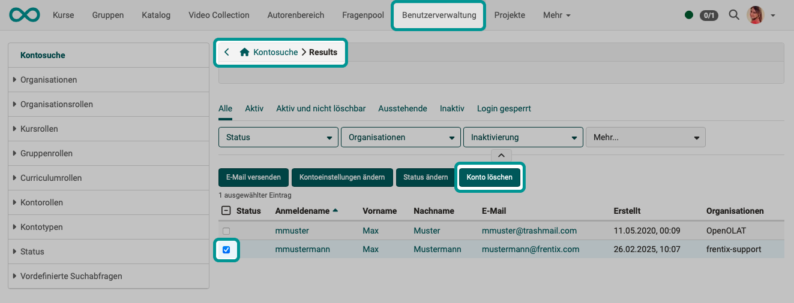
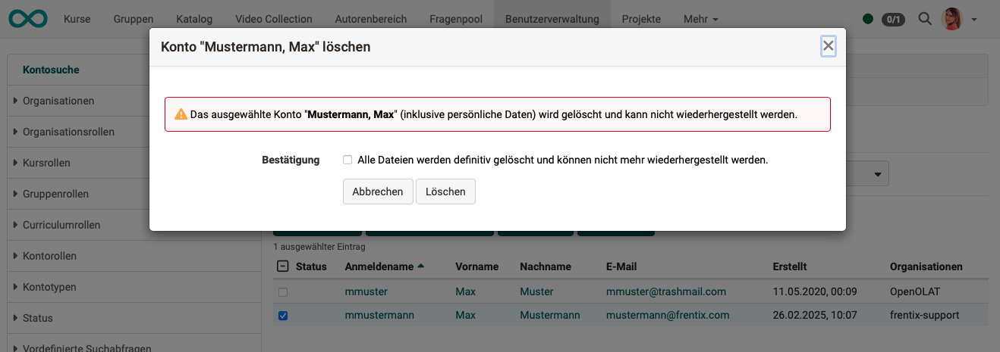
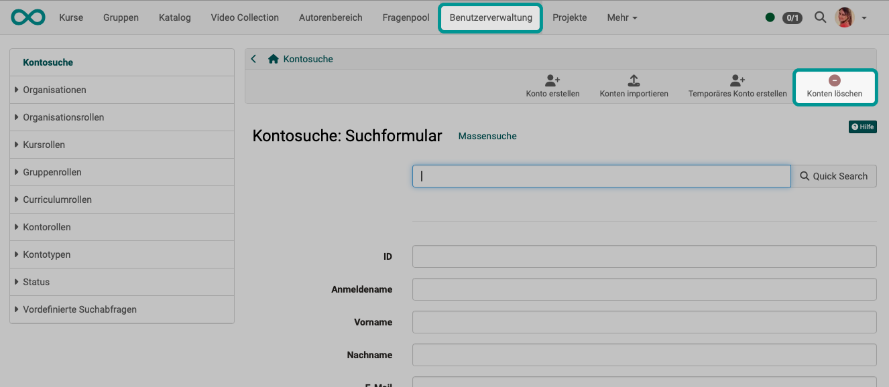
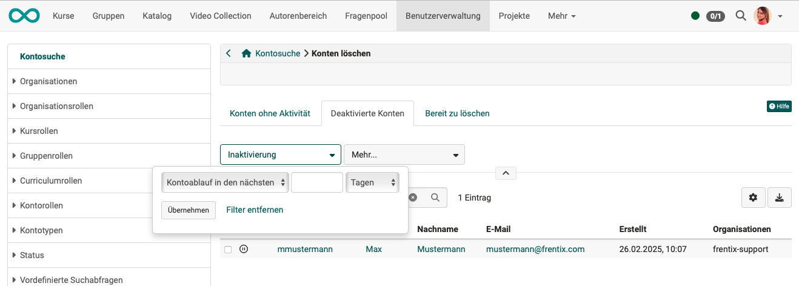
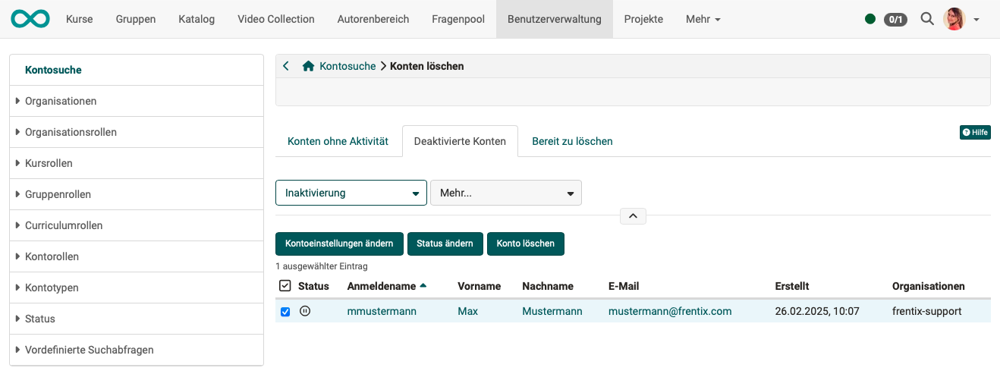

# Delete user {: #delete_user}

## What happens when an account is deleted?

When a user's account is deleted, that person is no longer known as a registered user in OpenOlat and can no longer be found.

When an account is deleted, it is not physically removed from the database but **anonymised**: the login name is replaced by an anonymous identifier and the profile data is cleared. Objects that are technically linked to the account (e.g. posts, certificates, booking orders) therefore remain, but only refer to the anonymised account, which can no longer be resolved. The table below therefore distinguishes between **deleted**, **anonymised** and **retained/orphaned**.

**Work results** created by that person are subject to their own rules when the account is deleted. See below: [What is deleted?](#del_properties)

## Who may delete user accounts?

To delete an account, access to user management is required. The following roles have this access:

* User manager
* Administrator
* System administrator (no direct access to user management, but can trigger deletions via the account lifecycle)

[To the top of the page ^](#delete_user)

---

## Option 1 {: #delete_user_var1}

**Step 1:** 
In the user management, use the account search to find the users whose accounts are to be deleted.

**Step 2:** 
In the search results, mark the users to be deleted using the checkbox at the beginning of the row. As soon as at least 1 person is marked, the "Delete account" button appears above the list.

{ class="shadow lightbox" }

**Step 3:** 
After clicking this button, a confirmation dialog appears which you must confirm.

{ class="shadow lightbox" }

[To the top of the page ^](#delete_user)

---

## Option 2: Search for inactive / deactivated accounts [:octicons-tag-16:{ title="from Release 15.1 (OO-4460)" }](https://track.frentix.com/issue/OO-4460){:target="_blank"} {: #delete_user_var2}

**Step 1:** 
Users can also be selected and their OpenOlat accounts deleted via the "Delete accounts" link.

{ class="shadow lightbox" }

**Step 2:** 
Candidates for deletion are pre-sorted into 3 tabs, corresponding to the phases of the user account lifecycle:

**Tab "Accounts without activity":** Users who have not been active for a configured period of time. The inactivity period is set by the administration.

**Tab "Deactivated accounts":** Users whose account has already been deactivated automatically or manually, as well as accounts with upcoming deactivation.

**Tab "Ready to delete":** Users whose account has exceeded the configured deactivation period and is ready for permanent deletion.

On all three tabs, the **Inactivation** filter narrows the list by period, either to "Account expiry in the next" or to "Inactive for the last", in days, weeks, months or years.

!!! info "Configuration of the user account lifecycle"
    The lifecycle runs in three phases: **Account expiry**, **Deactivation** and **Deletion**. The applicable deadlines and notifications are configured under Administration > Life Cycles > Account. 
    [Details on the user account lifecycle](../administration/Life_cycles_-_Administration.md#lifecycle_accounts)

{ class="shadow lightbox" }

**Step 3:** 
Mark the users to be deleted using the checkbox at the beginning of the row. As soon as at least 1 person is marked, the "Delete account" button appears above the list.

{ class="shadow lightbox" }

**Step 4:** 
After clicking this button, a confirmation dialog appears which you must confirm.

[To the top of the page ^](#delete_user)

---

## Option 3: Automatic deletion {: #delete_user_var3}

Users can also be deleted fully automatically by an activated user account lifecycle.

[Details on the user account lifecycle >](../../manual_admin/administration/Life_cycles_-_Administration.md#lifecycle_accounts) 
[How do I manage lifecycles of groups, courses or user accounts? >](../../manual_how-to/lifecycle/lifecycle.md#user_account_lifecycle)

[To the top of the page ^](#delete_user)

---

## What is deleted? {: #del_properties}

When a user is deleted:

* some information must be irreversibly deleted (e.g. phone number)
* some information can/should be retained without a name (e.g. a forum post without which a discussion thread would lose its meaning)
* some information must be retained (e.g. billing address → retention obligation)

It must be taken into account that information is technically linked to different objects:

:octicons-person-24: = Information is directly linked to the **person** 
:octicons-package-24: = Information is stored together with a **course/group/etc.** 
:octicons-infinity-24: = Information is stored in the **OpenOlat system**

The most frequent question concerns the media items in the Media Center. There, a single question decides the fate of a media item, and the diagram shows it with both of its outcomes.

{ class="shadow lightbox" title="Media items when an account is deleted" }

|Information|What happens to it?|
|---| ---------------------------------------- |
|User management > **Profile** :octicons-person-24: |**Deleted:** Login name, first name, last name, email, email signature, date of birth, gender, private phone, mobile phone, business phone, Skype ID, XING profile name, ICQ, homepage, street, address supplement, PO box, postal code, region/canton, city, country, institution, institution number (matriculation number), institution email, organisational unit, study group, field of study, personal text "About me", personal profile picture. **Exceptions:** For persons with administrative permissions, first and last name are retained so that actions can continue to be traced.|
|User management > **Business card** :octicons-person-24:|All details on the business card are taken from the profile, so after the profile is deleted they are no longer available for the business card either. The user's business card is no longer displayed in OpenOlat (e.g. in forums or comments).|
|User management > **System settings** :octicons-person-24: |All system settings are deleted: general system settings (e.g. language), special system settings (e.g. the start page) and personal tools.|
|User management > **Account** :octicons-person-24:| Account type, account creation date, last login and account expiry are deleted. The account is set to the status "deleted". |
|**Roles** :octicons-person-24: :octicons-package-24: | The roles and permissions assigned in user management are deleted. |
|User management > **Password** :octicons-person-24: | The password of deleted users is irreversibly deleted.|
|User management > **Authentications** :octicons-person-24: | All authentication options are deleted.|
|User management > **Properties** :octicons-person-24: | Properties are completely deleted.|
|User management > **GUI settings** :octicons-person-24: | GUI settings are completely deleted.|
|**Booking orders** :octicons-person-24: :octicons-package-24: :octicons-infinity-24: |Booking orders are retained, including those of the type "Invoice". The name is not stored separately in the booking order but comes from the profile; after deletion it is therefore anonymised.|
|**Billing address** :octicons-person-24: :octicons-package-24: :octicons-infinity-24: |To be able to trace payments (e.g. for tax authorities), billing addresses are retained.|
|**Reasonable adjustments** :octicons-person-24: | Recorded reasonable adjustments are not deleted; they remain linked to the anonymised account. |
|**Subscriptions** :octicons-person-24: | All subscriptions are deleted.|
|**Relationships** :octicons-person-24: | Relationships to other users are not dissolved. They remain and refer to the anonymised account.|
|**Organisational membership** :octicons-person-24: | Membership in organisations is deleted. |
|**Quota** :octicons-person-24: | The personal storage space (quota) and its associated settings are deleted. |
|**Lectures** :octicons-person-24: | Participation in lectures/absences is deleted.|
|**Competences** :octicons-person-24: | Competences are deleted.|
|User management > **Course Planner roles** :octicons-person-24: | The Course Planner / Curriculum roles are deleted together with the account, as they are memberships. |
|**Personal calendar** :octicons-person-24: | The personal calendar is deleted.|
|**Chat history** :octicons-person-24: | The chat messages of the person are deleted, as are the roster entry and the chat settings. Only the posts written by this person are removed. The posts of the other participants in the same conversations remain.|
|**Personal folder** :octicons-person-24: |The personal folder is deleted.|
|**Portfolio** :octicons-person-24: | Binders, sections and entries created in an ePortfolio are deleted. If binders were shared with other users, they are no longer accessible there either.|
|**Personal to-dos** :octicons-person-24: | The assignment to the deleted account is removed; the to-do entry itself remains but is then no longer assigned to anyone. (to-dos in projects: see below) |
|**Mailbox** :octicons-person-24: |Emails listed in the mailbox of the personal menu are deleted. (The internal email inbox is completely deleted.)|
|**Recipient of a reminder email** :octicons-package-24: |If the deleted user was a potential recipient of a reminder email, the email will no longer be sent to the deleted person. (The recipient list is created at the time the rules are checked, so a deleted person no longer appears on the mailing list.)|
|**Group membership** :octicons-person-24: :octicons-package-24: | Group memberships are deleted. (The groups themselves are not deleted, even if they were created by the deleted user and they were the only member. Only the deleted user is removed as a group member. If the deleted user was the only group coach, an administrator is entered as a substitute group coach. As a rule, groups without members will then be deleted at a later point in time by the Group Life Cycle process.)|
|**Project membership** :octicons-person-24: :octicons-package-24: |Project membership is deleted and the person is no longer found in the list of project members. (To-dos created by the deleted user in a project are retained, however.)|
|**To-dos in projects** :octicons-person-24: |In projects, the to-dos of a deleted user are retained but are no longer assigned to anyone. Completed to-dos are also retained (without specifying the user who was supposed to complete the to-do). The progress of projects remains visible. Uncompleted to-dos must be reassigned.|
|**Course membership** :octicons-person-24: | Course memberships are deleted, even if the role in that course was "Owner" or "Coach". If the deleted user was the creator and sole owner, an administrator is entered as a substitute owner.|
|**Data in the course element Task** :octicons-person-24: :octicons-package-24: |Documents created and uploaded within a task by the deleted person are deleted (e.g. draw.io, Word, Excel, ppt).|
|**Peer review data in the course element Task** :octicons-person-24: :octicons-package-24: | The files submitted or uploaded by the person are deleted. The peer review records (assignments, assessments) are retained and refer to the anonymised account. |
|**Data in the course element Participant folder** :octicons-person-24: :octicons-package-24: | The person's files in the Participant folder course element are deleted. |
|**Data in the course element Forum** :octicons-person-24: :octicons-package-24: |Personal forum posts and comments are anonymised after the user is deleted and displayed as "unknown user".|
|**Data in the course element BBB** :octicons-person-24: :octicons-package-24: |Participants in BBB meetings are deleted.|
|**Data in the course element Adobe Connect** :octicons-person-24: :octicons-package-24: |All data stored by OpenOlat in the background is deleted.|
|**Data in the course element Vitero** :octicons-person-24: :octicons-package-24: |All data stored by OpenOlat in the background is deleted.|
|**Office for the web** :octicons-person-24: :octicons-package-24: |All data stored by OpenOlat in the background is deleted.|
|**Test results** :octicons-person-24: | All test results (test sessions including answers and results) are deleted. |
|**Evidence of achievements** :octicons-person-24: | All evidence of achievements of the person is deleted. |
|**Certificates** :octicons-person-24: | Certificates are not deleted when an account is deleted, regardless of whether they carry a QR code or a verification URL. They are retained and refer to the anonymised account, so that their authenticity can still be confirmed (host-based / signed verification). It is nevertheless advisable to inform users whose accounts are to be deleted in advance so that they can download their earned certificates from the personal menu before their account is deleted.|
|**Externally acquired certificates** :octicons-person-24: |OpenOlat users can also upload externally acquired certificates to OpenOlat to complete their profile. These certificates uploaded by the person themselves are likewise not deleted when the account is deleted and are retained.|
|User management > **Badges** :octicons-person-24: | Badges are retained so that authenticity can be confirmed (host-based verification, signed verification). It is nevertheless advisable to inform users whose accounts are to be deleted in advance so that they can download their earned badges from the personal menu. If **global badges** were awarded, the recipient's name is replaced by "unknown user" in the list of awarded global badges (accessible by administrators under Administration > e-Assessment > OpenBadges > tab "Awarded global badges"). It remains visible when and by whom a global badge was once awarded. Even if the badge is revoked by clicking "Revoke", it remains as a list entry with the status "Revoked" in the list of awarded global badges. |
|**Owner role in learning resources and courses** :octicons-package-24: | Learning resources and courses are not deleted when their owner is deleted, regardless of whether the learning resource was published, shared with other authors, or not referenced/used anywhere. If the deleted user was the sole owner, an administrator is entered as a substitute owner. This also applies to test learning resources.|
|**Questions in the question bank** :octicons-person-24: :octicons-package-24:| Questions from the question bank are only deleted if the person is their sole author and the setting "Delete questions when author deleted" is enabled. Questions with additional authors, as well as all questions when the setting is disabled, are retained. |
|**Elements created in the Media Center** :octicons-person-24: :octicons-package-24: | What matters is whether the media item is embedded in a page. This applies to the "Page" course element as well as to ePortfolio pages. If the media item is embedded, it is retained and is no longer assigned to anyone. If it is not embedded anywhere, it is permanently deleted. Sharing a media item in the Media Center does not protect it. Please note: the person's own ePortfolio binders are deleted beforehand, provided that the person is their only owner. Media items that were embedded only there lose their embedding and are therefore deleted as well. Administrators and learn resource managers find the retained media items under `Personal menu > Media Center > "Media management" segment`.  It makes sense to ask the person concerned to download any media items they need before their account is deleted. If a media item is to remain in the system, it must be embedded in a page beforehand. |
|**External graders** :octicons-package-24:| If accounts of external graders are deleted, they are no longer listed by name. The associated grading assignment records are removed; the data relevant for remuneration (grading time, close date) is retained in the "Archive" worksheet of the Excel report. [:octicons-tag-16:{ title="from Release 21.0 (OO-6914)" }](https://track.frentix.com/issue/OO-6914)|
|**Grading assignments** :octicons-person-24: :octicons-package-24: | If users who had grading assignments as external graders are deleted, the following rules apply: 1) **Already completed grading assignments** appear accordingly assigned in the course owner's assessment tool. 2) **Not yet completed grading assignments** appear on the "Open assessments" list in the course owner's assessment tool. 3) Course owners can check in the **change log** (link at the bottom of the screen) who performed a correction after selecting the relevant test course element and a participant. The names of users who have since been deleted are still visible there.  The grading assignment records themselves are removed on deletion; the data relevant for remuneration (grading time, close date) is retained in the "Archive" worksheet of the Excel report (see [Test settings, Correction workflow](../../manual_user/learningresources/Test_settings.md#correction-workflow)).|
|**Statistics** :octicons-infinity-24: |Deleted users are no longer included in the statistics of visited courses.|
|**Survey results from quality management** :octicons-infinity-24: |Forms completed as part of quality management are stored anonymously and therefore do not need to be deleted when a user account is deleted.|
|**Log tables** :octicons-infinity-24:| Log entries are not changed on deletion. They contain no name, only the internal user ID; whether logging is personalised or anonymous depends on the server setting for anonymous logging. |

[To the top of the page ^](#delete_user)

---

## When can a user not be deleted? {: #none_deleted_user}

Accounts with the status **"Active and not deletable"** cannot be deleted, neither manually nor automatically. They are not even offered for deletion in the account search. This status is typically assigned to system accounts such as the administrator account.

For **automatic deletion** via the user account lifecycle, an additional safeguard against mass deletion applies: if the proportion of accounts to be deleted at once would exceed a configured percentage, the automatic deletion run is aborted completely.

[To the top of the page ^](#delete_user)

---

## Further information {: #further_information}

[Life cycles - Overview >](../administration/Life_cycles_-_Administration.md) 
[How do I manage lifecycles of groups, courses or user accounts? >](../../manual_how-to/lifecycle/lifecycle.md) 
[Test settings - Administration >](../../manual_user/learningresources/Test_settings.md) 
[Data protection >](Data_protection.md) 
[Media Center Concept >](../../manual_user/basic_concepts/Media_Center_Concept.md) 
[User management >](index.md)

[To the top of the page ^](#delete_user)
