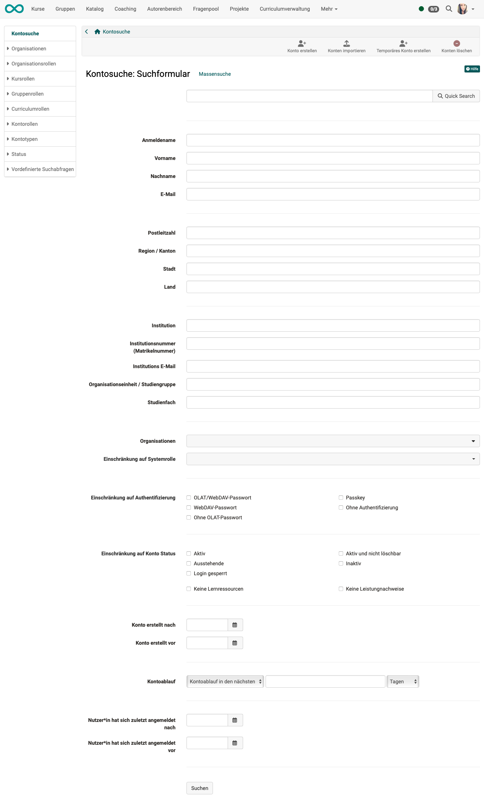
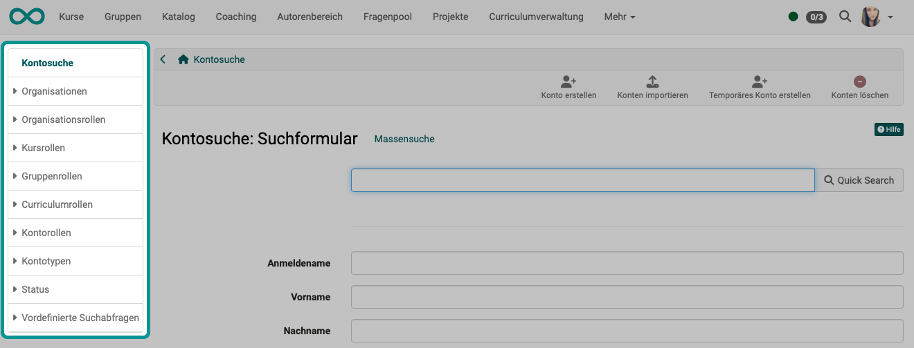
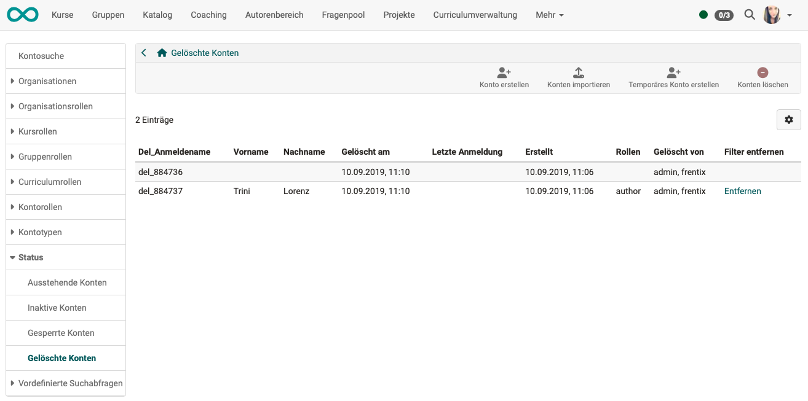
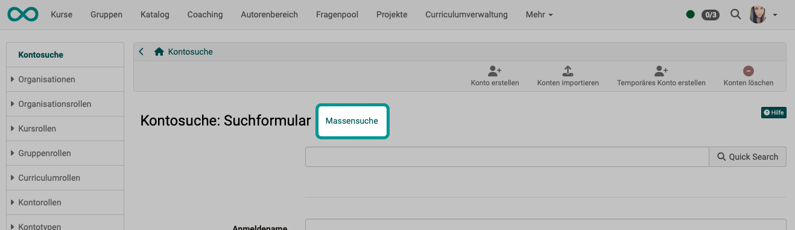
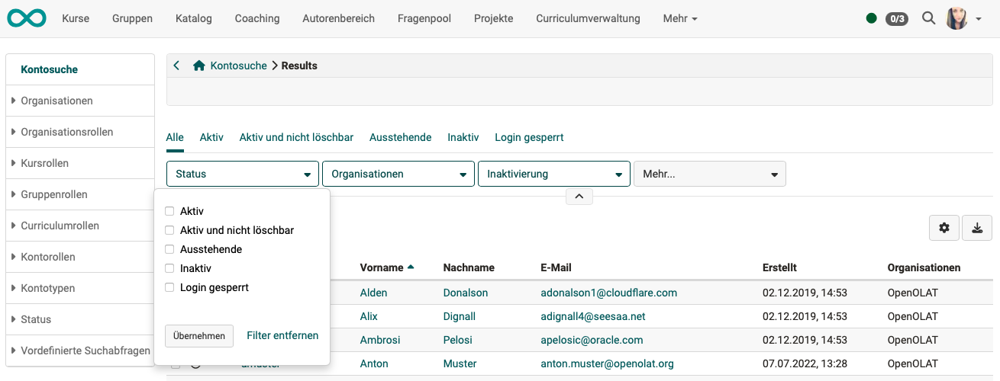

# User search / Account search {: #search_user}

User administrators and administrators can search for specific users/accounts in different ways:

!!! note "Quick Links"

    * [Enter criteria in the search form](#search_user_form)
    * [Display users according to different roles and assignments](#search_user_roles)
    * [Quicksearch](#search_user_quick_search)
    * [Mass search](#search_user_bulk_search)
    * [Filter search results](#search_user_filter_searchresults)

## Enter criteria in the search form {: #search_user_form}

Enter your relevant search criteria and confirm with the "Return" key or by clicking on the "Search" button.

{ class="shadow lightbox" }

[To the top of the page ^](#search_user)

## Display users according to different roles and assignments {: #search_user_roles}

Select one of the relevant search criteria in the menu on the left and narrow it down.

{ class="shadow lightbox" }

### Organizations

If an OpenOlat instance uses several "organizations", the users can be
displayed here sorted accordingly.

### Organizational Roles

The following organizational roles are distinguished and can be used for a filtered display:

* All system users
* Authors
* Group managers
* Lesson block managers
* Project managers
* Quality managers
* Pool managers
* User managers
* Role managers
* Curriculum managers
* Learning resource managers
* Line managers
* Principals
* Administrators
* System administrators

### Course Roles

We distiguish three course roles:

  * Course owners,
  * [Course coaches](../../manual_user/basic_concepts/Roles_Rights.md#course-rights-and-roles) and
  * Course participants.

The members of the respective roles can be displayed and edited here.

### Group Roles

There are two group roles, which can be displayed and edited: 

* [Group coaches](../../manual_user/groups/Group_Administration.md) and 
* Group participants. 

### Curriculum Roles

If an OpenOlat instance uses the curriculum, there are other roles available in addition to the usual course roles, whose members can be displayed and edited.

* Curriculum owners
* Curriculum element owners
* Head teachers
* Course owners
* Course coaches
* Course participants

### Account rolls 
(Before version 19.0: User roles)

Depending on the configuration in the administration in the "[Modules](../administration/Modules.md)" area → "User to user", further roles are available here that can be filtered, displayed and defined:

* Supervisor
* Subordinate
* Expert
* User to be assessed

### Account types

Here you can search within pre-selected account types. 

* External accounts
* Registrated accounts
* Anonymous accounts

### Status

The following can be displayed here:

* Pending user accounts
* Inactive accounts
* Blocked accounts
* Deleted accounts

{ class="shadow lightbox" }

The "**Deleted users**" table in the user administration contains the following
information (column titles) that is relevant in the user deletion process:

  *  **Del_Loginname:**  In the deletion process, the user name of the deleted user is replaced by an ID.
  *  **First name / Last name:**  If the deleted user is an administrative user, the first name and surname are displayed here. If required, this data can also be deleted using the "Remove" action.
  *  **Deleted on:** Date of deletion
  *  **Last login:** Date of last login
  *  **Created:** Date of account creation
  *  **Roles:**  Display of the administrative roles of the person who was deleted
  *  **Deleted by:** Person who carried out the deletion
  *  **Remove filters:**  Action to delete the first and last name of administrative users.

!!! tip "Show column titles"

    If a column is not displayed, you can show it using the gear icon on the right above the table.

### Predefined search queries

Under the menu "**Predefined search queries**" you will find frequently used search queries:

* Accounts without groups
* Missing authentication
* Users, who joined within the last week
* Users, who joined within the last month
* Users, who joined within the last six month
* New accounts

[To the top of the page ^](#search_user)

## Quick search {: #search_user_quick_search}

For a quick search, simply enter a term or part of a term in the "Quick Search" field.

{ class="shadow lightbox" }

[To the top of the page ^](#search_user)

## Bulk search {: #search_user_bulk_search}

{ class="shadow lightbox" }

[To the top of the page ^](#search_user)

## Filter search results {: #search_user_filter_searchresults}

If a list of search results is displayed after a search action, filters can be used to further specify the selection in a second step. 
**Example**: 
In the first step, you search for all users who belong to a specific organizational unit.
In the second step, you filter out all inactive users of this organizational unit in the results.
 
{ class="shadow lightbox" }

[To the top of the page ^](#search_user)

