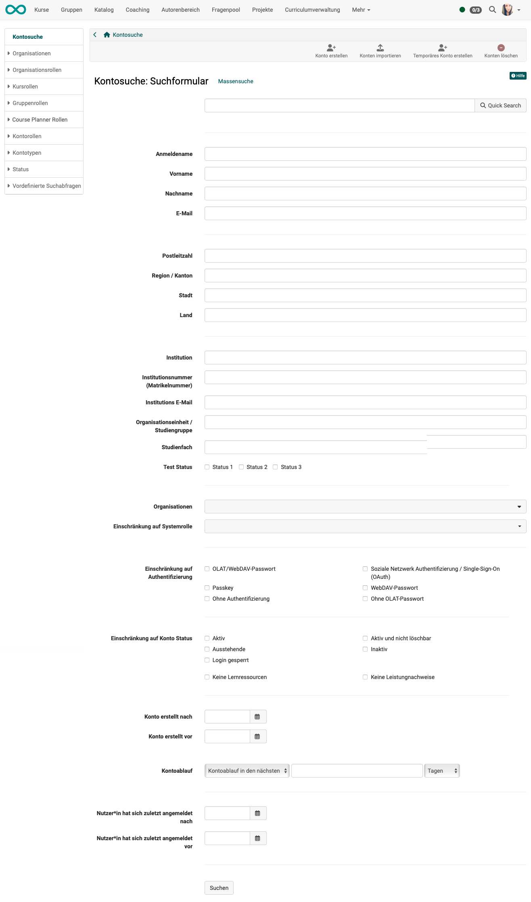
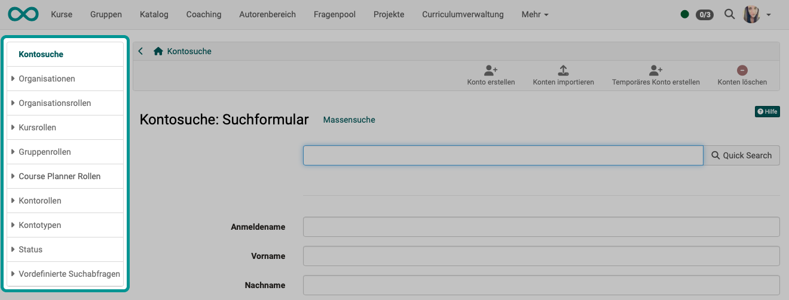
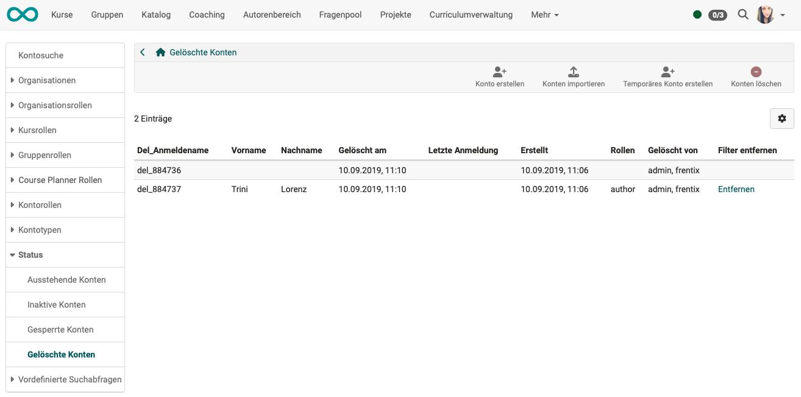
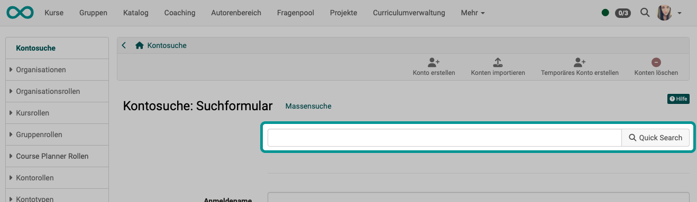
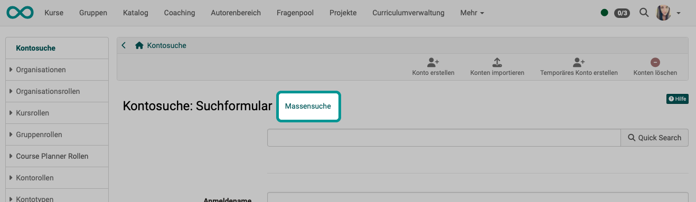
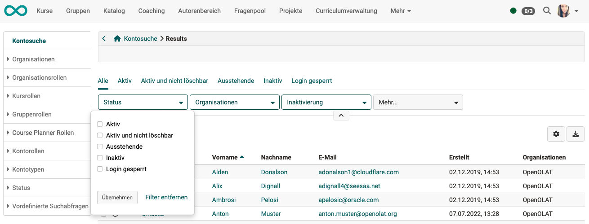

# User search / Account search {: #search_user}

User administrators and administrators can search for specific users/accounts in different ways:

!!! note "Quick Links"

    * [Enter criteria in the search form](#search_user_form)
    * [Display users according to different roles and assignments](#search_user_roles)
    * [Quick Search](#search_user_quick_search)
    * [Mass search](#search_user_bulk_search)
    * [Filter search results](#search_user_filter_searchresults)
    * [Columns of the result table](#search_user_result_columns)

## Enter criteria in the search form {: #search_user_form}

Enter your relevant search criteria and confirm with the "Return" key or by clicking on the "Search" button.

{ class="shadow lightbox" }

Above the view you find the actions "Create user", "Import users", "Create temp. users" and "Delete user".

The field "Account expiration" searches by the expiry date of the accounts. The selection on the left determines the direction: "Account expiration within the next" finds accounts that expire shortly, "Inactive since the last" finds accounts whose expiry lies in the past. On the right you enter the number and the unit, for example 30 days.

[To the top of the page ^](#search_user)

## Display users according to different roles and assignments {: #search_user_roles}

Select one of the relevant search criteria in the menu on the left and narrow it down.

{ class="shadow lightbox" }

### Organizations

If an OpenOlat instance uses several "organizations", the users can be
displayed here sorted accordingly.

### Organizational Roles

The following organizational roles are distinguished and can be used for a filtered display:

* All system users
* Authors
* Group administrator
* Absence managers
* Project managers
* Quality managers
* Question bank managers
* User managers
* Roles managers
* Course planners
* Learning resource managers
* Line managers
* Education managers
* Principals
* Administrators
* System administrators

### Course Roles

We distiguish three course roles:

  * Course owners
  * [Course coaches](../../manual_user/basic_concepts/Roles_Rights.md#course-rights-and-roles) and
  * Course participants

The members of the respective roles can be displayed and edited here.

### Group Roles

There are two group roles, which can be displayed and edited:

* [Group coaches](../../manual_user/groups/Group_Administration.md) and
* Group participants

### Course Planner Roles

If an OpenOlat instance uses the Course Planner, there are other roles available in addition to the usual course roles, whose members can be displayed and edited.

* Product owners
* Element owners
* Head teachers
* Course owners
* Course coaches
* Course participants

### Account roles

Depending on the configuration, further roles are available here that can be filtered, displayed and defined. You set them up in the system administration under: 
`Administration > Modules > User to user`, see [Modules](../administration/Modules.md)

For example:

* Coach
* Subordinate
* Apprentice manager
* Apprentice
* Expert
* Mentor
* Mentee
* User to be assessed
* ...

### Account types

Here you can search within pre-selected account types.

* External accounts
* Registrated accounts
* Anonymous accounts

### Status

The following can be displayed here:

* Pending user accounts
* Inactive accounts
* Blocked accounts
* Deleted accounts

{ class="shadow lightbox" }

The "**Deleted users**" table in the user administration contains the following
information (column titles) that is relevant in the user deletion process:

  *  **Del_Loginname:**  In the deletion process, the user name of the deleted user is replaced by an ID.
  *  **First name / Last name:**  If the deleted user is an administrative user, the first name and surname are displayed here. If required, this data can also be deleted using the "Remove" action.
  *  **Deleted on:** Date of deletion
  *  **Last login:** Date of last login
  *  **Created:** Date of account creation
  *  **Roles:**  Display of the administrative roles of the person who was deleted
  *  **Deleted by:** Person who carried out the deletion
  *  **Remove filters:**  Action to delete the first and last name of administrative users.

!!! tip "Show column titles"

    If a column is not displayed, you can show it using the gear icon on the right above the table.

### Predefined search queries

Under the menu "**Predefined search queries**" you will find frequently used search queries:

* Accounts without groups
* Missing authentication
* Users, who joined within the last week
* Users, who joined within the last month
* Users, who joined within the last six month
* New accounts

[To the top of the page ^](#search_user)

## Quick Search {: #search_user_quick_search}

For a quick search, simply enter a term or part of a term in the "Quick Search" field.

{ class="shadow lightbox" }

[To the top of the page ^](#search_user)

## Bulk search {: #search_user_bulk_search}

{ class="shadow lightbox" }

[To the top of the page ^](#search_user)

## Filter search results {: #search_user_filter_searchresults}

If a list of search results is displayed after a search action, filters can be used to further specify the selection in a second step. 
**Example**: 
In the first step, you search for all users who belong to a specific organizational unit.
In the second step, you filter out all inactive users of this organizational unit in the results.

{ class="shadow lightbox" }

Above the result list you find the filter tabs "All", "Active", "Active and not deletable", "Pending", "Inactive" and "Login denied" as well as the filters "Status", "Organisations" and "Inactivation". The filter "Inactivation" narrows the list to a period in which accounts were deactivated or will be deactivated.

[To the top of the page ^](#search_user)

## Columns of the result table {: #search_user_result_columns}

Besides the personal data, the result list carries five columns on the lifecycle of an account. They stand in this order and answer the question when OpenOlat deactivates or deletes an account automatically. [:octicons-tag-16:{ title="from Release 21.1 (OO-8382)" }](https://track.frentix.com/issue/OO-8382)

OpenOlat deactivates an account that does not log in within the configured period. The interface calls this step "Inactivation", and the account then carries the status "Inactive", see [Deactivation and reactivation](../administration/Life_cycles_-_Administration.md#account_reactivation).

| Column | Meaning |
|--------|---------|
| Account expiration | The expiry date stored per account. |
| Days until expiry | Remaining days until this date. |
| Days until inactivation | Remaining days until OpenOlat deactivates the account. Only present when the toggle "Deactivate user after inactivity" is active. |
| Inactivation date | Date on which the account was deactivated. |
| Days until deletion | Remaining days until the automatic deletion. Only present when the toggle "Delete inactive user" is active. |

You set both toggles in the system administration under: 
`Administration > Life cycles > User`, see [Life cycles: Account](../administration/Life_cycles_-_Administration.md#lifecycle_accounts)

All five columns are hidden by default. Show them with the gear symbol above the table on the right.

The "Account" tab of a single person carries the same periods, see [Configure user](Configure_User.md#automatic_user_lifecycle).

[To the top of the page ^](#search_user)

## Further information {: #further_information}

**Mentioned on this page** 
[Roles and rights >](../../manual_user/basic_concepts/Roles_Rights.md) 
[Group administration >](../../manual_user/groups/Group_Administration.md) 
[Modules >](../administration/Modules.md) 
[Life cycles: Administration >](../administration/Life_cycles_-_Administration.md) 
[Configure user >](Configure_User.md)

**Further reading** 
[Create user >](Create_User.md) 
[Delete user >](Delete_User.md)

[To the top of the page ^](#search_user)
