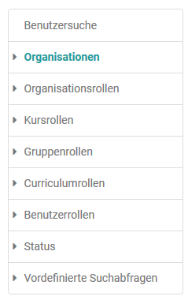
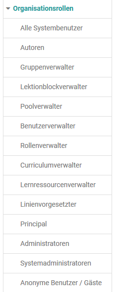
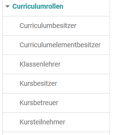
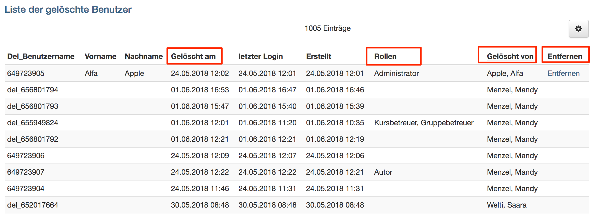

# Benutzerverwaltung

{ class="shadow lightbox aside-right-lg" }

Die Benutzerverwaltung ist ein separater Tab im OpenOlat Menü. Hier hat man
Zugriff auf die Rollen in unterschiedlichen Kontexten. Benutzerverwalter und
Administratoren können ...

  * nach bestehenden Benutzern suchen
  * neue Benutzer erstellen
  * neue Benutzer importieren
  * Benutzer löschen (nur Administrator)
  * Benutzer konfigurieren
  * Benutzer nach unterschiedlichen Rollen und Zuordnungen anzeigen lassen

## Organisationen

Verwendet eine OpenOlat Instanz mehrere "Organisationen" können die Benutzer
hier entsprechend sortiert dargestellt werden.

## Organisationsrollen

{ class="shadow lightbox aside-right" }

Folgende Organisationsrollen werden unterschieden und können für eine
gefilterte Darstellung verwendet werden:

## Kursrollen

Es werden drei Kursrollen unterschieden:

  * Kursbesitzer,
  * [Kursbetreuer ](../../manual_user/general/Coach.de.md) und
  * Kursteilnehmer.

Die Mitglieder der jeweiligen Rollen können hier angezeigt und bearbeitet
werden.

## Gruppenrollen

Es existieren zwei Gruppenrollen: [Gruppenbetreuer](../../manual_user/groups/Group_Administration.de.md)
und Gruppenteilnehmer. Diese können jeweils angezeigt und bearbeitet werden.

<clear />
## Curriculumrollen

{ class="shadow lightbox aside-right" }

Nutzt eine OpenOlat Instanz das Curriculum stehen neben üblichen Kursrollen
noch weitere Rollen zur Verfügung, deren Mitglieder angezeigt und bearbeitet
werden können.

## Benutzerrollen

Je nach Konfiguration in der Administration im Bereich
"[Modules](../administration/Modules.de.md)" → "Benutzer zu Benutzer" stehen hier weitere Rollen
zur Verfügung, die gefiltert angezeigt und definiert werden können.

## Status

Hier können ausstehende Benutzer, inaktive, gesperrte Benutzer und gelöschte
Benutzer der OpenOlat Instanz angezeigt werden.

{ class="shadow lightbox" }

Die Tabelle «Gelöschte Benutzer» in der Benutzerverwaltung enthält folgende
Informationen, die im Prozess der Benutzer-Löschung relevant sind:

  *  **Del_Benutzername:**  Im Lösch-Prozess wird der Benutzername des gelöschten Nutzers durch eine ID ersetzt.
  *  **Vorname / Nachname:**  Handelt es sich bei dem gelöschten um einen administrativen Benutzer, so werden Vor- und Nachname hier angezeigt. Diese Daten können bei Bedarf über die Aktion «Entfernen» ebenfalls gelöscht werden.
  *  **Gelöscht am:** Datum der Löschung
  *  **Rollen:**  Anzeige der administrativen Rollen der Person, die gelöscht wurde
  *  **Gelöscht von:** Person, die die Löschung vorgenommen hat
  *  **Entfernen:**  Aktion zur Löschung des Vor- und Nachnamens von administrativen Benutzern.

## Vordefinierte Suchabfragen

Unter dem Menü Vordefinierte Suchabfragen finden Sie oft benutzte
Suchabfragen, z.B. Benutzer, welche in der letzten Woche, im letzten Monat
oder im letzten Halbjahr neu dazugekommen sind oder eine Übersicht der
Benutzer, welche in keiner Gruppe sind.

