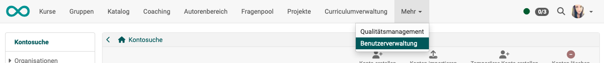

# Benutzerverwaltung

Benutzerverwalter:innen und Administrator:innen bekommen in der Hauptnavigation den Bereich "**Benutzerverwaltung**" angezeigt.

{ class="shadow lightbox" }

Sie haben das Recht ...

  * nach bestehenden Benutzer:innen zu suchen und Informationen abzufragen 
  [Zu den Details >](Search_Users.de.md)

  * neue Benutzerkonten zu erstellen 
  [Zu den Details >](Create_User.de.md)

  * neue Benutzer:innen zu importieren 
  [Zu den Details >](Create_User.de.md)

  * Benutzer:innen unterschiedliche Rollen zuzuweisen 
  [Zu den Details >](Assign_roles.de.md)

  * Benutzerkonten zu konfigurieren 
  [Zu den Details >](Configure_User.de.md)

  * Benutzerkonten zu löschen (nur Administrator:innen) 
  [Zu den Details >](Delete_User.de.md)

  * Benutzerdaten gemäss dem Datenschutz zu löschen oder zu exportieren 
  [Zu den Details >](Data_protection.de.md)

