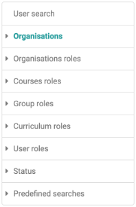
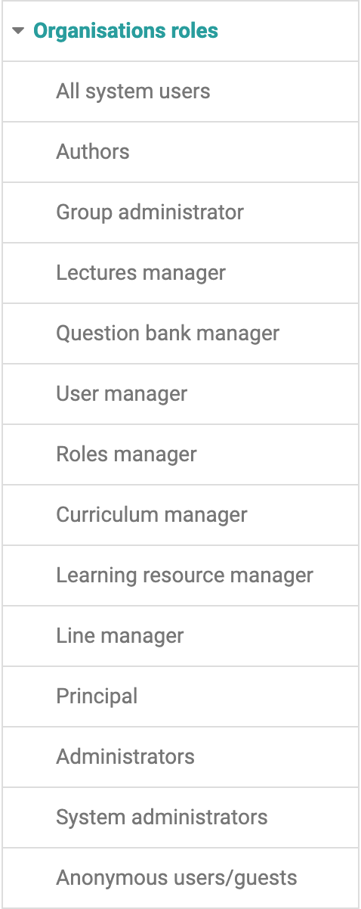
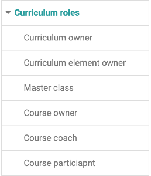
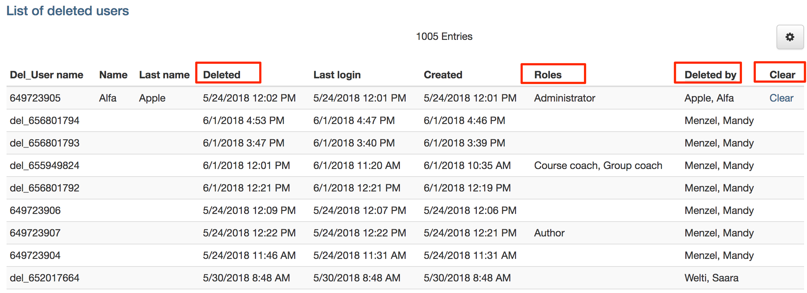

# User management

{ class="shadow lightbox aside-right" }

The user administration is a separate tab in the OpenOlat menu. Here you have
access to the roles in different contexts. User administrators and
administrators can

  * search for existing users
  * create new users
  * Import new users
  * delete user (administrator only)
  * configure user
  * displaying users according to different roles and assignments

## Organizations

If an OpenOlat instance uses several "organizations", the users can be
displayed here sorted accordingly.

## Organizational Roles

{ class="shadow lightbox aside-right" }

The following organizational roles are distinguished and can be used for a
filtered display:

## Course roles

Three course roles are distinguished: course owner, [course coach](../../manual_user/general/Coach.md)
and course participant. The members of the respective roles can be displayed
and edited here.

## Group Roles

There are two group roles: [group coach](../../manual_user/groups/Group_Administration.md) and group
participants. These can be displayed and edited.

<clear />
## Curriculum Roles

{ class="shadow lightbox aside-right" }

If an OpenOlat instance uses the curriculum, there are other roles available
in addition to the usual course roles, whose members can be displayed and
edited.

## User roles

Depending on the configuration in the administration in the "Modules" area →
"User to user", additional roles are available here that can be configured and
displayed filtered.

## Status

Pending users, inactive users, blocked users and deleted users of the OpenOlat
instance can be displayed here.

{ class="shadow lightbox" }

The "Deleted Users" table in the user management contains the following
information that is relevant to the user deletion process:

  *  **Del_Username:** In the delete process the username of the deleted user is replaced by an ID.
  *  **Name / Last name:** If the deleted user is an administrative user, first and last name are displayed here. If necessary, this data can also be deleted using the "Clear" action.
  *  **Deleted:** When was the user deleted.
  *  **Roles:** Displays the administrative roles of the person who was deleted.
  *  **Deleted by:** Who deleted the user.
  *  **Clear:** Action to delete the first and last names of administrative users.

## Predefined searches

In the "Predefined search" queries menu you will find frequently used search
queries, e.g. users who have been added in the last week, month or half-year
or an overview of users who are not in a group.

