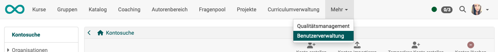

# User management

User managers and administrators can find in their top main menu the option "**User management**".

{ class="shadow lightbox }

They have the right ...

  * to search for existing users and request information 
  [See details >](Search_Users.de.md)

  * to create new user accounts 
  [See details >](Create_User.de.md)

  * to assign different roles to users 
  [See details >](Assign_roles.de.md)

  * to configure user accounts 
  [See details >](Configure_User.de.md)

  * to import new users 
  [See details >](Search_Users.de.md)

  * to delete user accounts (administrators only) 
  [See details >](Search_Users.de.md)

  * to delete or export user data in accordance with data protection regulations 
  [See details >](Data_protection.de.md)

